# RickdiculouslyEasy靶机实战

## 信息收集

> netdiscover -r IP地址             找出靶机IP

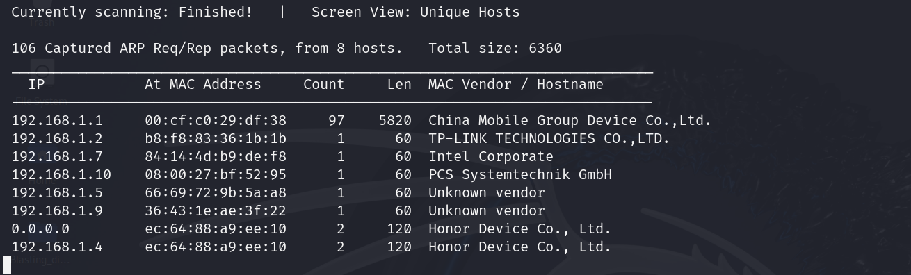

根据靶机的MAC地址，可以得到靶机IP是192.168.1.10

扫描靶机

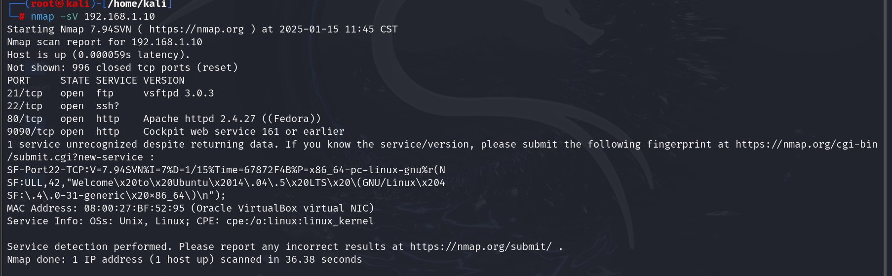

> nmap -T4 -A -p- 192.168.1.10

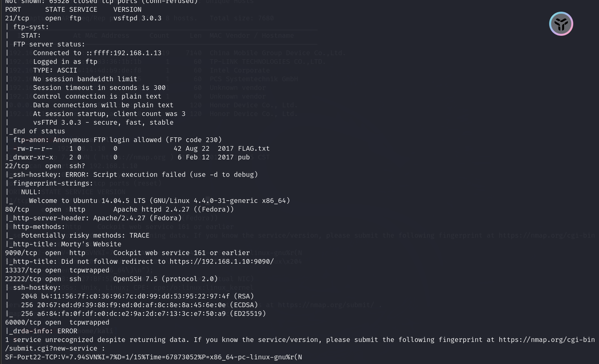

扫描所有开放的端口可以发现靶机开放了一堆端口

21、22、80、9090、13337、22222、60000端口均开放

且开放了ftp协议、ssh服务、http协议

## 探测敏感信息

因为开放了http协议，可以使用浏览器登录，然后扫描目录看看有木有有用信息

80端口和9090端口都是http协议常见的端口

### 9090端口

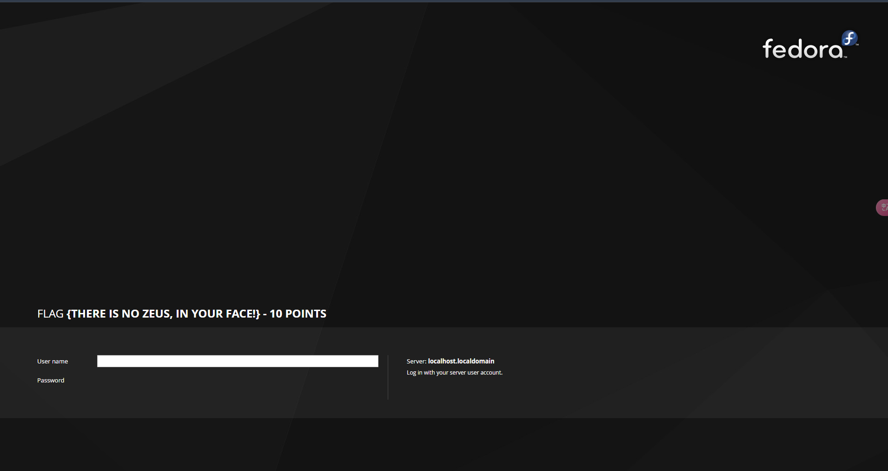

拿到了第一个flag

> FLAG **{There is no Zeus, in your face!} - 10 Points**

扫描目录看看

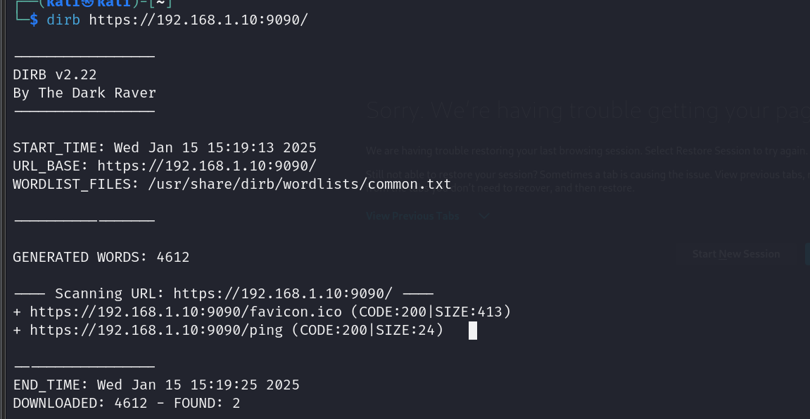

没有啥有用信息

### 80端口

初始界面倒是没有什么有用信息，我们继续探测看看

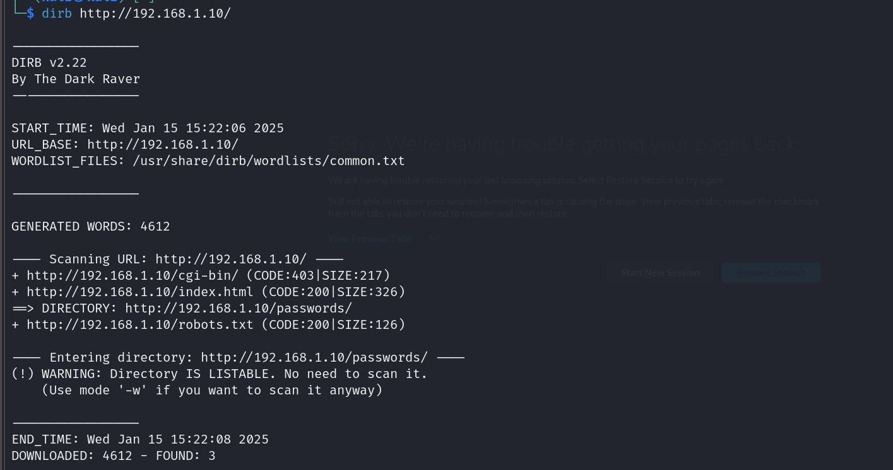

有四个子目录，我们可以都看看

#### passwords

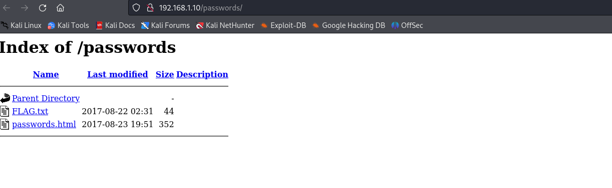

在passwords这个目录下找到了我们想要的flag！！

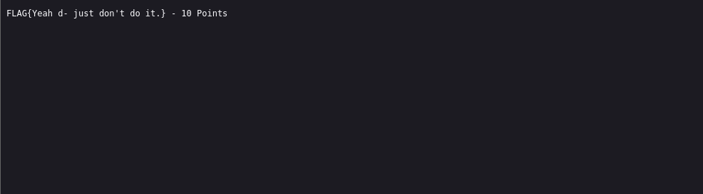

> 第二个flag    FLAG{Yeah d- just don't do it.} - 10 Points
>

然后访问passwords.html，出现

我们查看一下源代码：

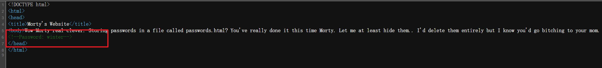

发现一个密码：winter

记住它，后续可能会用到。

#### robots.txt

我们访问robots.txt目录发现

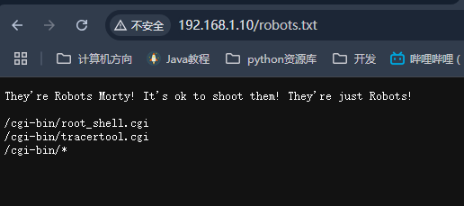

又出现了三个界面，肯定有可以利用的界面，一个个访问看看

发现http://192.168.1.10//cgi-bin/tracertool.cgi这个路径下出现了：

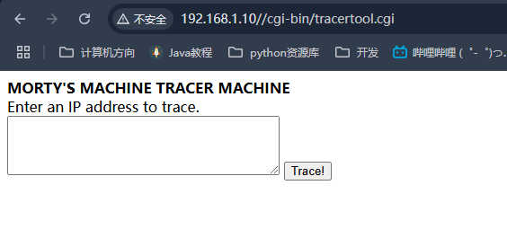

可以追踪输入的IP地址，好熟悉的操作，之前遇到过的命令执行漏洞，几乎全是这种形式。

试着输入127.0.0.1; 

有回显如下

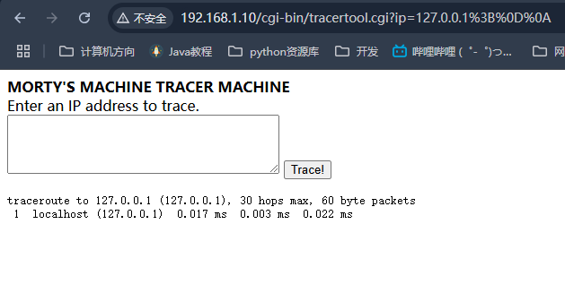

那么我们可以在后面IP地址的后面加上我们需要爆出的信息，以达成目的

> 输入127.0.0.1;ls /

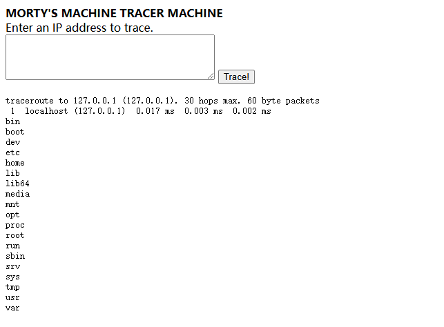

说明的确存在命令执行漏洞

因此我们可以初步尝试探测一些敏感信息，比如包含每个用户基本信息的/etc/passwd

> 输入cat /etc/passwd 

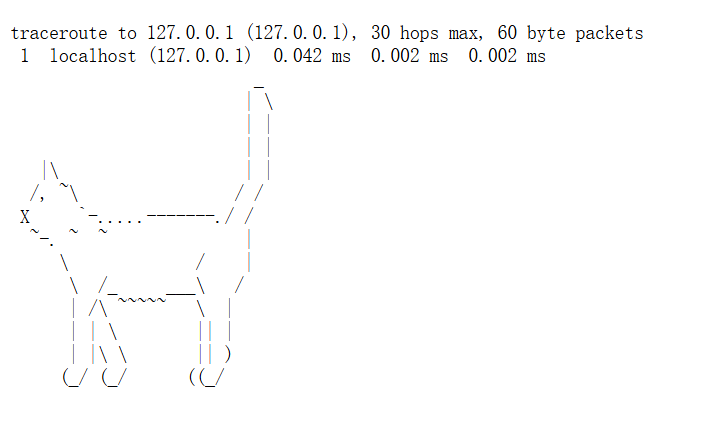

猜测可能是cat被过滤掉了，我们用more替换

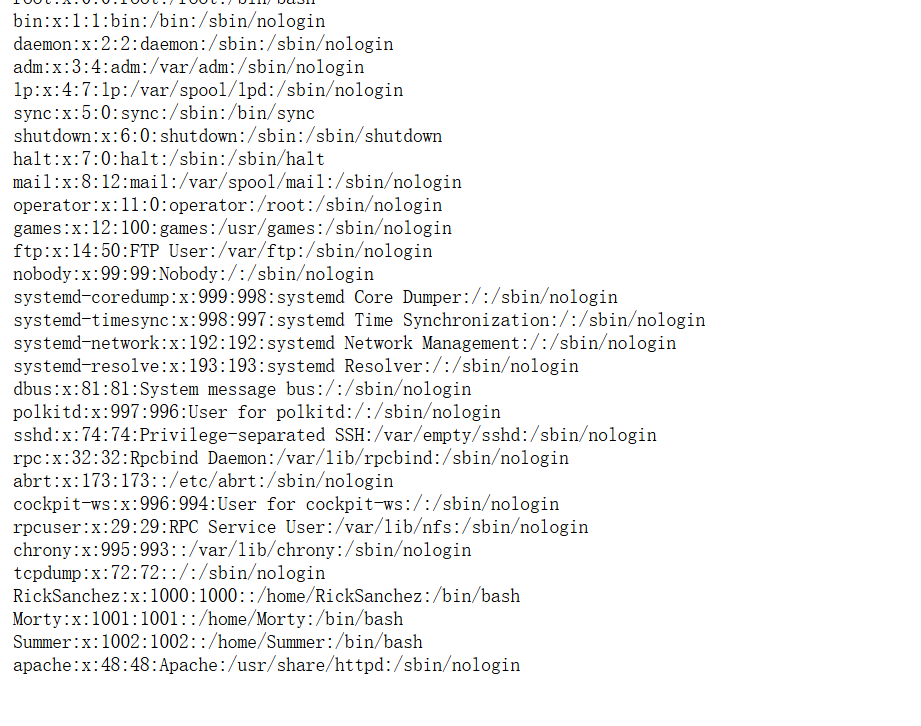

成功查看到用户信息，我们找有用的信息

看到一个Summer，联想到刚才的密码winter，是否有关联？

还记得靶机开启了ssh服务吗？并且服务开在了22222端口，那么我们尝试以Summer用户名远程登录一下

密码winter成功登录进去啦，接下来就看看有没有flag！！！

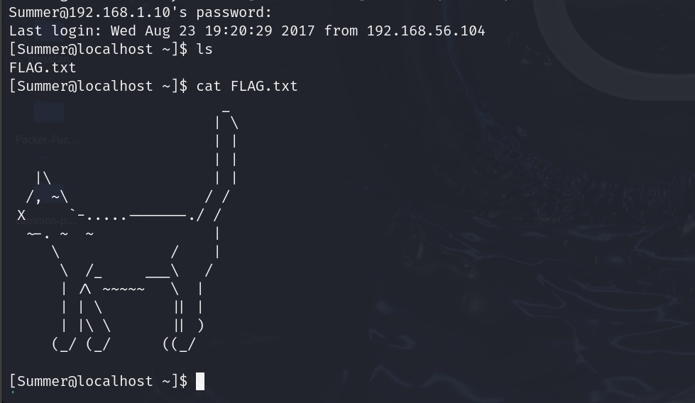

忘记了，cat被过滤惹，用more看看

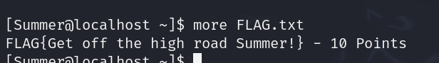

> 找到了第三个flag      FLAG{Get off the high road Summer!} - 10 Points

## 深度挖掘信息

(1)对于大端口非http服务	nc探测端口号的banner信息   => nc IP地址  端口号

(2)对于大端口http服务          使用浏览器页面查看源代码，寻找flag值

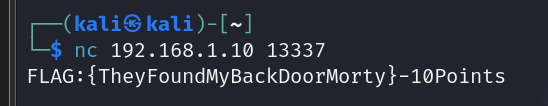

nc探测13337端口，找到了本题的第三个flag

> 第四个flag    FLAG:{TheyFoundMyBackDoorMorty}-10Points

探测60000端口时，发现我们进入了 shell命令行

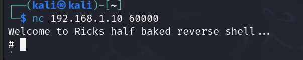

我们直接查看所有文件看看

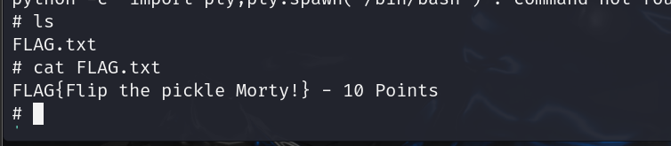

找到了flag

> 第五个flag     FLAG{Flip the pickle Morty!} - 10 Points

探测22222端口无可用信息，只能知道ssh服务是运行在这个端口上的

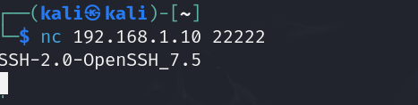

## ftp服务

靶机上运行了vsftpd服务器，开启了ftp服务，因此我们可以尝试通过ftp服务的匿名访问看看有没有泄露的信息。

> 匿名访问不需要用户名和密码，默认用户名是anonymous，密码字段可以为空或者任何值
>
> 是通过vsftpd的配置文件/etc/vsftpd.conf实现的

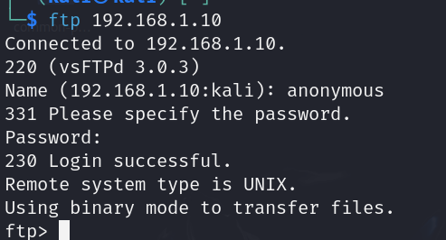

成功进入

查看ftp下的共享文件，看看有没有flag

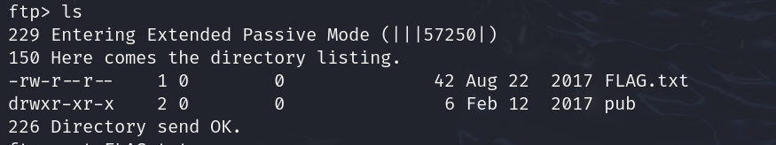

找到了FLAG.txt

> get 文件名 下载文件

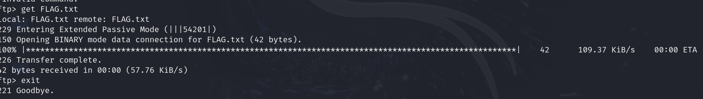

下载成功后查看该文件

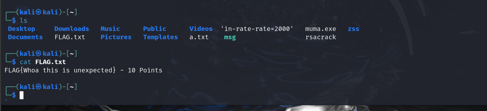

拿到了我们的FLAG

> 第六个FLAG      FLAG{Whoa this is unexpected} - 10 Points

## 第七个FLAG

总的有七个FLAG，说明漏掉了一个，善用了一下搜索，发现是在ssh服务那里，在其他用户下有其他的信息

先回到Summer用户登录那里

发现还有其他两个用户，都查看一下有没有有用的

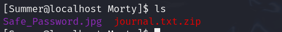

Morty文件下有两个文件，一个图片一个压缩包

通过python开启一个临时的http服务

> python -m SimpleHTTPServer

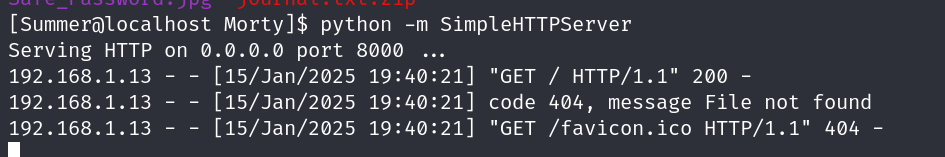

默认运行在8000端口，我们访问http://192.168.1.10:8000/

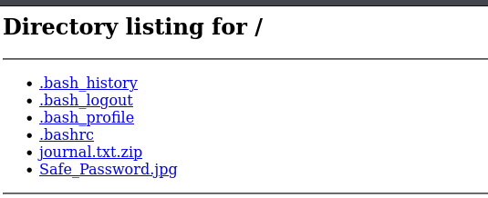

就可以下载了

下载了压缩包发现解压需要密码，猜测密码在这个Safe_Password.jpg上

用记事本编辑打开图片

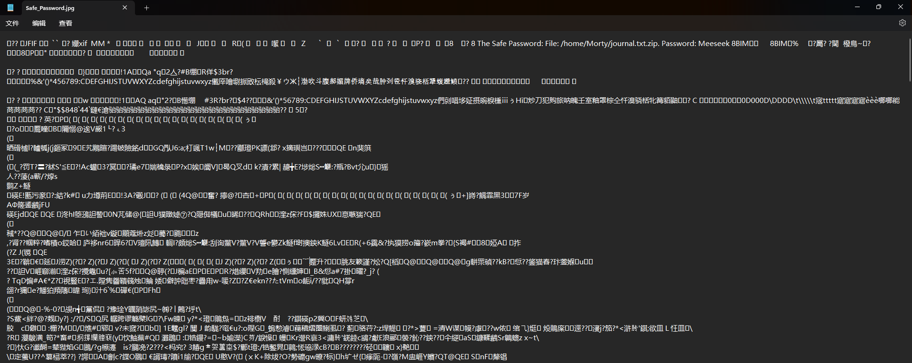

一堆乱码，但是捕捉到了一个信息：8 The Safe Password: File: /home/Morty/journal.txt.zip. Password: Meeseek

得到了密码Meeseek，然后我们解压压缩包得到journal.txt

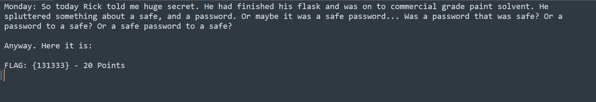

拿到了第七个flag

> 第七个FLAG     FLAG: {131333} - 20 Points 

 本着刚才漏掉这个flag的教训，我们再查看一下另一个文件夹

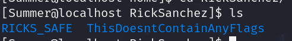

直接告诉我们了，这里没有任何的flag，那就不管了

结束！一共有七个flag。这个靶机我要多练几次hhh。找flag的过程有点像探案找线索，解压压缩包出现的解压密码更是有趣！这个靶机挺好玩的！喜欢！

