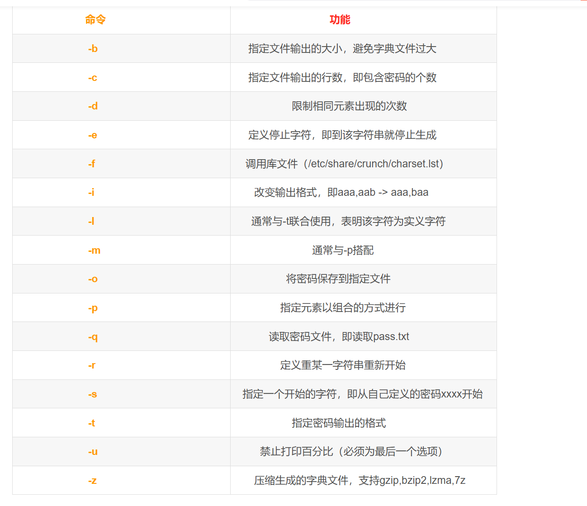
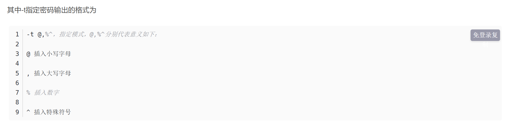

# 使用John进行密码爆破

## john工具简单应用

### unshadow

unshadow命令基本上会结合/etc/passwd和/etc/shadow的数据，创建一个含有用户名和密码详细信息的文件

> unshadow /etc/passwd /etc/shadow > cracked  
>
> 表示生成一个名为cracked的密码文件

### unique

unique工具可以从一个密码字典中去掉重复行，为我们使用密码字典进行爆破提供了较大的便利

### john

john the ripper 是一款本地密码破解工具，可以从我们生成的cracked文件中破解出密码

1. 使用密码字段进行爆破

   > john --wordlist=/usr/share/john/password.lst --rules cracked

2. 不指定字典直接爆破

   > john cracked

## 注意事项

john工具对于同一个shadow文件只会进行一次爆破，如果第二次执行john shadow是不会得到结果的.

如果想查看上一次爆破的结果，可以使用以下命令。

> john --show cracked


#Crunch字典生成工具

> crunch是一个kali自带生成字典的一个工具，一种创建密码字典工具，该字典通常用于暴力破解。使用Crunch工具生成的密码可以发送到终端、文件或另一个程序。
>
> crunch <min-len> <max-len> [<charset string>][options]
>
> min-len crunch：要开始的最小长度字符串。必须使用
> max-len crunch：要开始的最大长度字符串。必须使用
> charset string ：指定字符集设置，否则将使用缺省的字符集设置。缺省的设置为小写字符集，大写字符集，数字和特殊字符(符号)，如果不按照这个顺序，你将得到自己指定结果。必须指定字符类型或加号的值。

## 常用的命令





## 使用实例

```
crunch 1 8
生成最小1位，最大8位，默认位26个小写字母为元素的所有组合
```

```
crunch 1 6 abcdefg
生成最小1位，最大6位，以adcdef开头，以字符串gggggg为结束的所有字符组合
```


