# 低难度靶机

## 信息收集

kali ：192.168.1.15

靶机：192.168.1.11

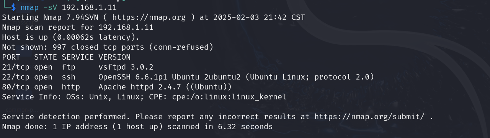

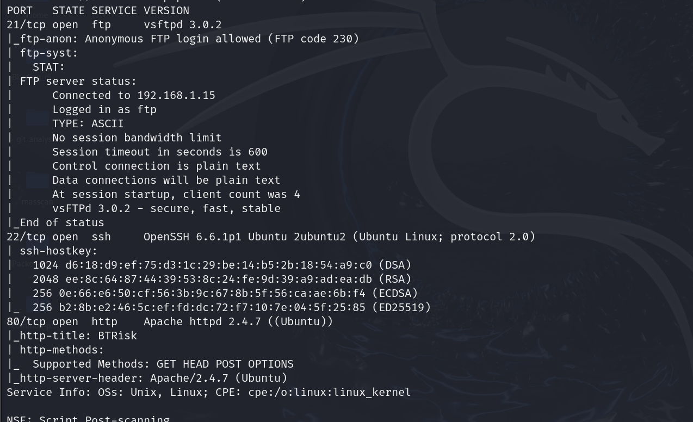

开放了ftp\ssh\http服务，分别运行在21端口、22端口和80端口

## FTP服务利用

先用nc监听了一下21端口

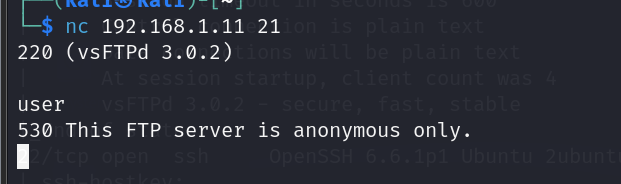

告诉我们可以匿名登录

那我们就直接使用anonymous和空口令看看能不能登录

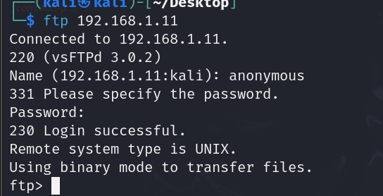

成功登录。

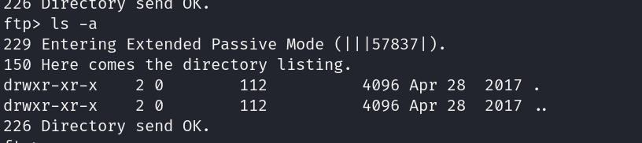

但是我并没有查看到任何文件，不知道是不是权限不够，先放着吧

## 目录扫描

靶机还开放了80端口的http服务

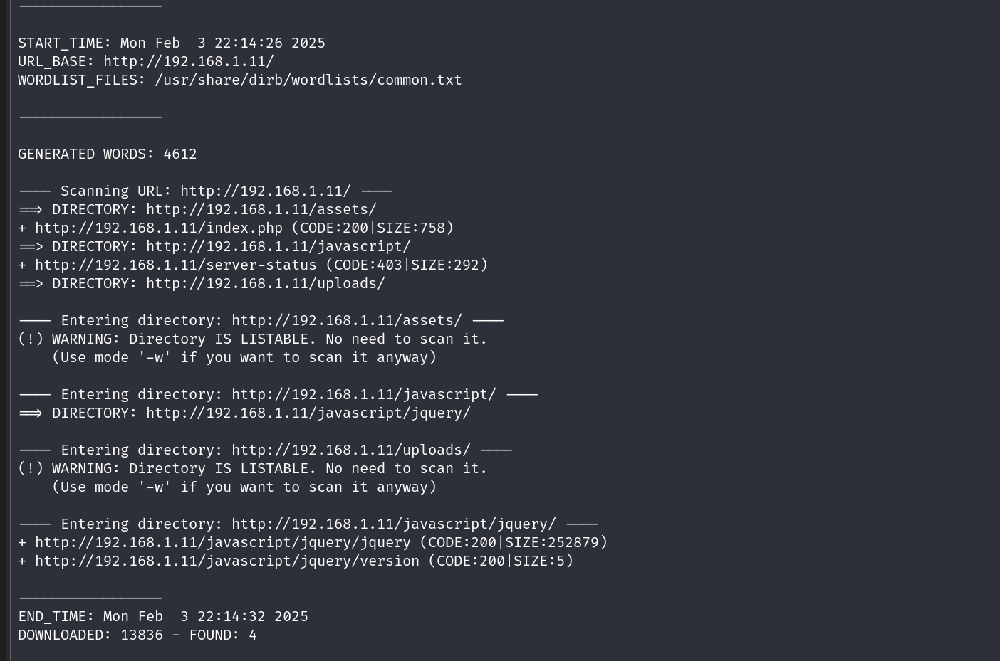

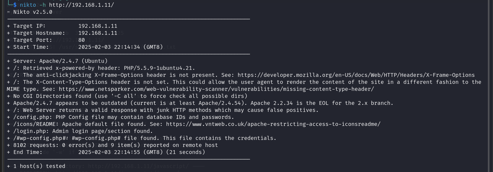

查看了config.php但是啥也没有

查看login.php成功进入一个登录界面

查看源代码发现：

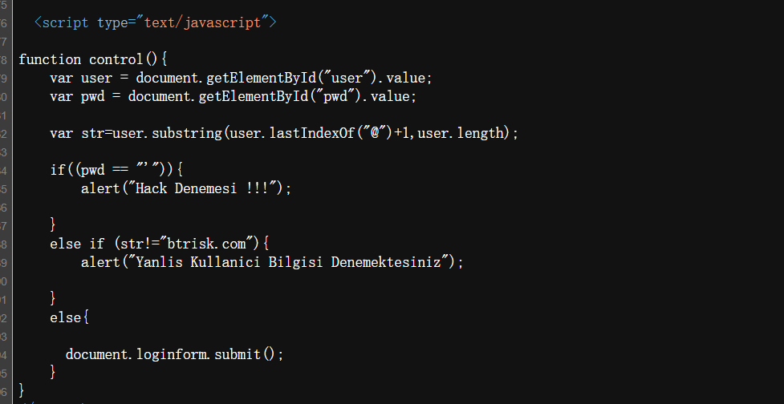

告诉我们用户名要以btrisk.com结尾，即xxx@btrisk.com

密码中不能带有单引号

可能存在SQL注入漏洞？

## 漏洞查找

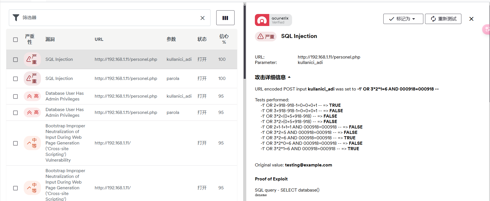

显然存在严重的SQL注入风险

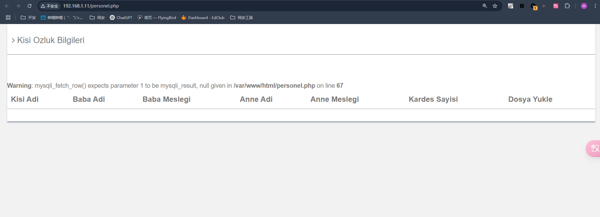

查看该页面的源代码：

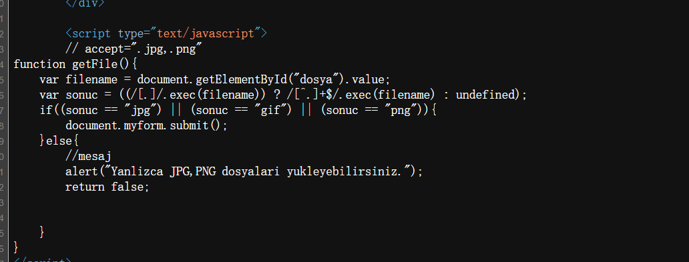

似乎还存在着文件上传漏洞，但我并没有看到注入点。。。

## SQL注入

用户名：test@btrisk.com

漏洞扫描结果表示:该注入点为字符型注入，尝试构造万能密码进行登录

> payload : 1' or 1=1 #

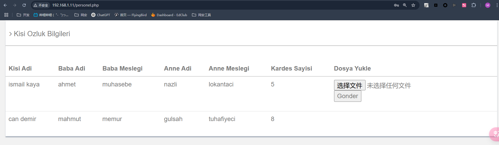

成功进入并且发现了文件上传漏洞的注入点

## 文件上传漏洞

再看看源代码

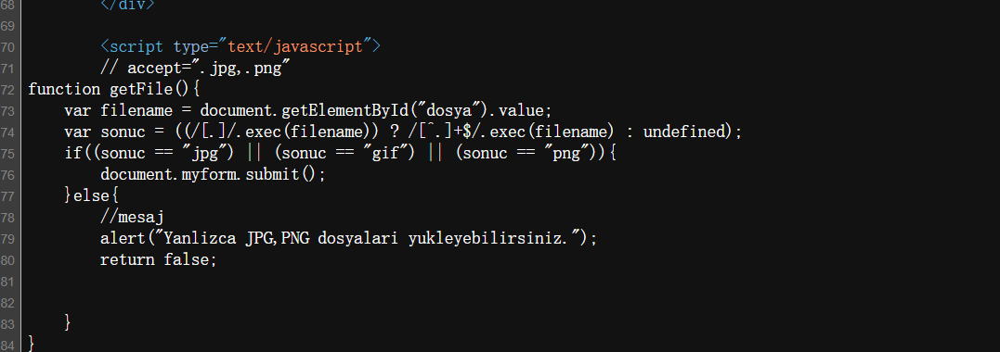

### 代码审计

从input框中获取filename进行检查，input标签使用accpet属性限定上传的文件类型

### 上传木马

首先要知道上传的文件会保存在：

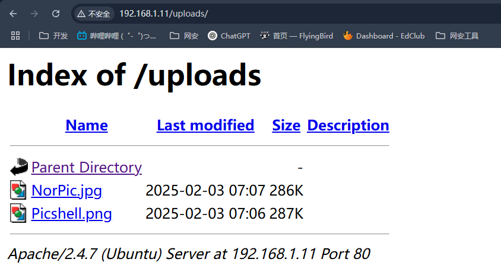

直接使用kali中/usr/share/webshells/php/php-reverse-shell.php

修改IP和端口并将后缀名修改为jpg绕过前端检查

上传到网站前抓包将文件名修改为php并放包即可在/uploads目录下查看到该木马

### 开启监听

上传成功后，运行木马并开启监听

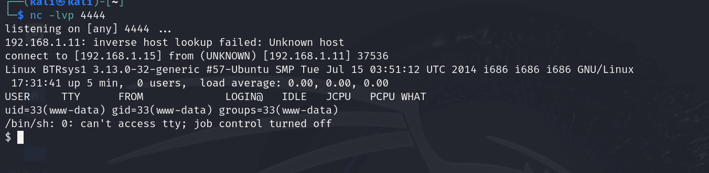

成功拿到sh

> python -c "import pty;pty.spawn('/bin/bash')"美化界面

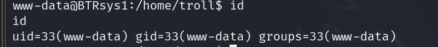

当前并非root权限，要进行提权

## 提权

**内核溢出提权**

### 查看系统版本信息

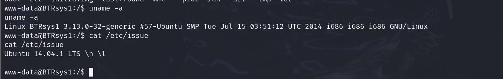

版本为：Ubuntu 14.04.1

### searchsploit寻找对应的exp

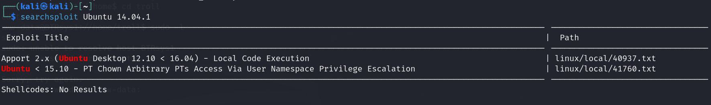

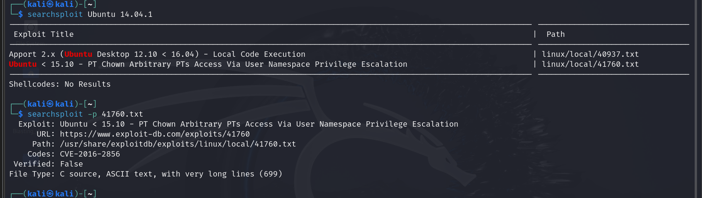

### 

## 数据库提权

### 查看数据库

/var/www/html/config.php中存放了连接数据库使用的用户名和密码，我们可以登录数据库查看敏感信息

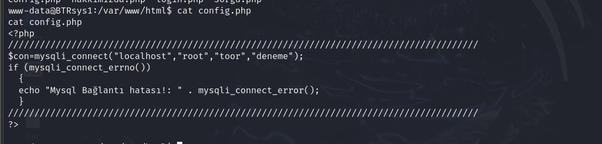

### 获取数据库信息

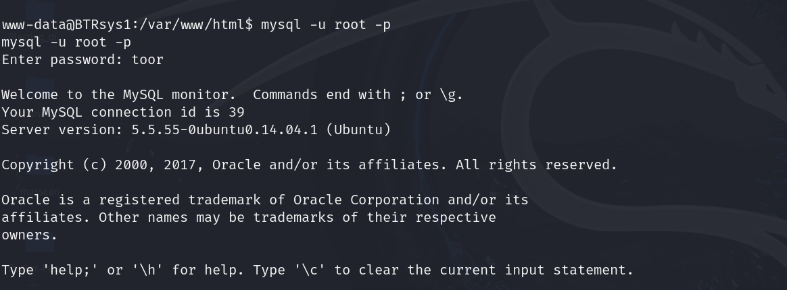

成功连接后获取我们想要的信息

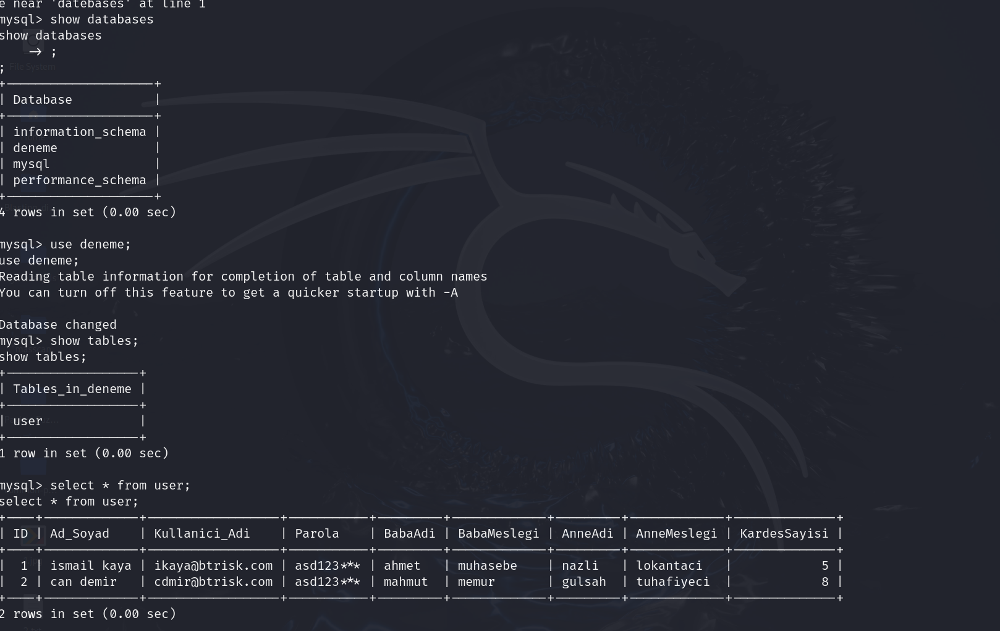

刚才我们在登入界面的时候，密码框的value值是Parola，因此我们猜测密码就是这个字段

也就是asd123*** 

### 尝试登录

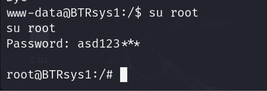

提权成功！

