# 《从0到1CTFer成长之路》

## 信息收集-敏感备份文件

### 扫描目录

使用御剑扫描，或者使用kali中的工具，我用了dirb+url进行扫描，找到两个可疑文件

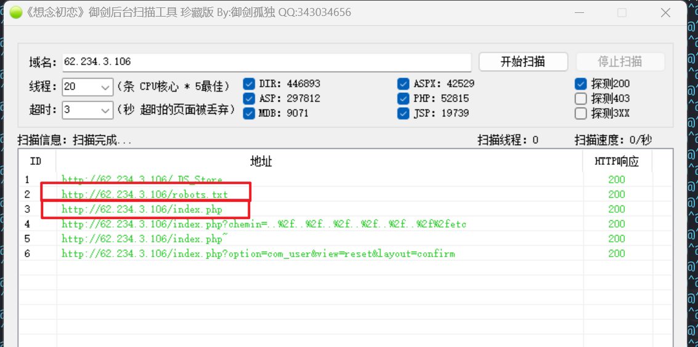

### 攻击

（1）robots.txt

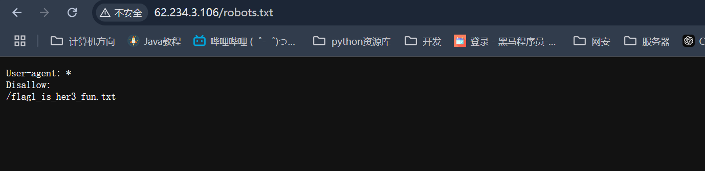

得到flag的第一部分

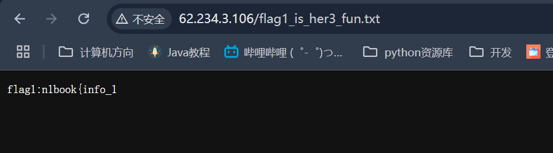

```
flag1:n1book{info_1
```

(2)index.php

直接访问就是首页，不存在什么flag

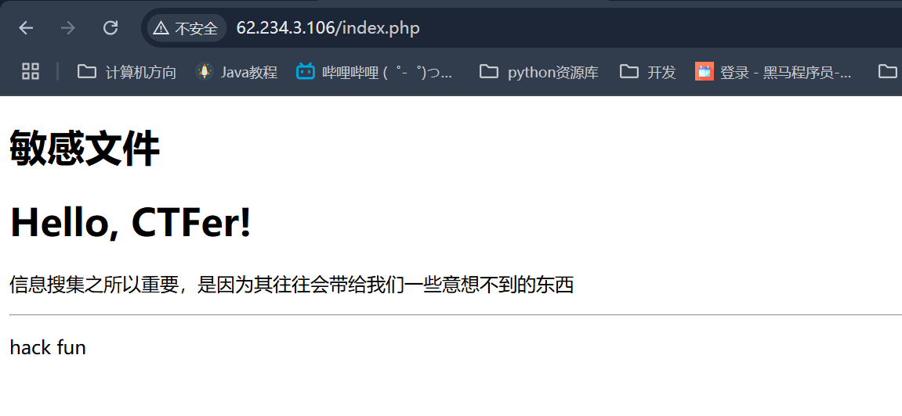

联想到书里写的敏感备份文件

> 1.gedit备份文件：Linux中，用gedit编辑器保存后，当前目录会产生一个后缀为“~”的文件，即为备份文件
>
> 2.vim备份文件：用户在vim编辑文件但以外推出时，会在当前目录下产生一个备份文件“.flag.swp”，文件名前也有一个点

因此尝试访问index~和.index.swp

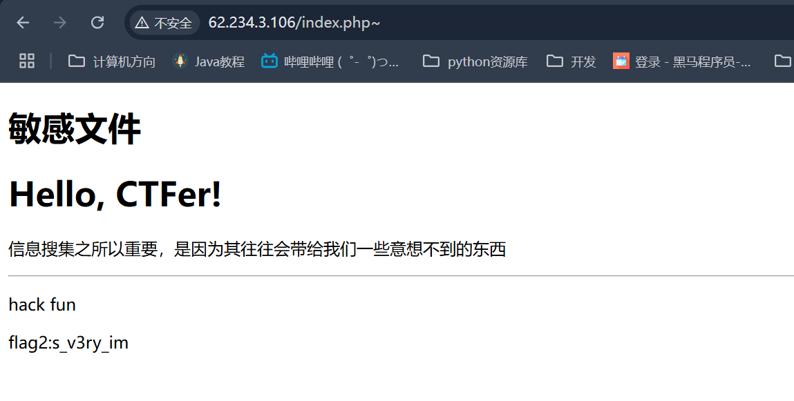

得到第二部分

```
flag2:s_v3ry_im
```

访问http://62.234.3.106/.index.php.swp

会下载一个swp文件，在vim编辑器中查看

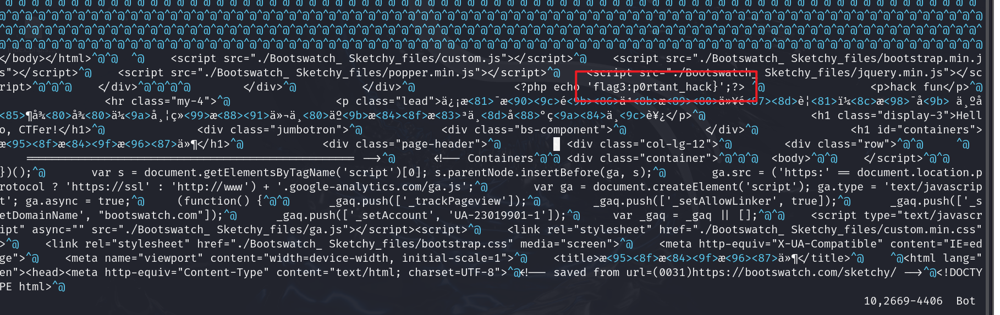

得到第三部分

```
p0rtant_hack}
```

### 得到flag

> n1book{info_1s_v3ry_imp0rtant_hack}

## 信息收集-git信息泄露

### 扫描目录

直接用dirb扫描目录，很容易扫描出.git目录

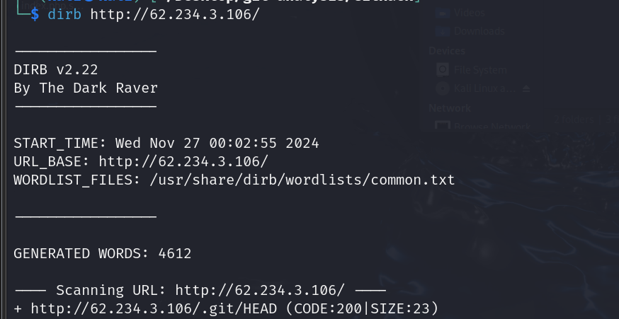

### 使用git-dumper工具查看git日志

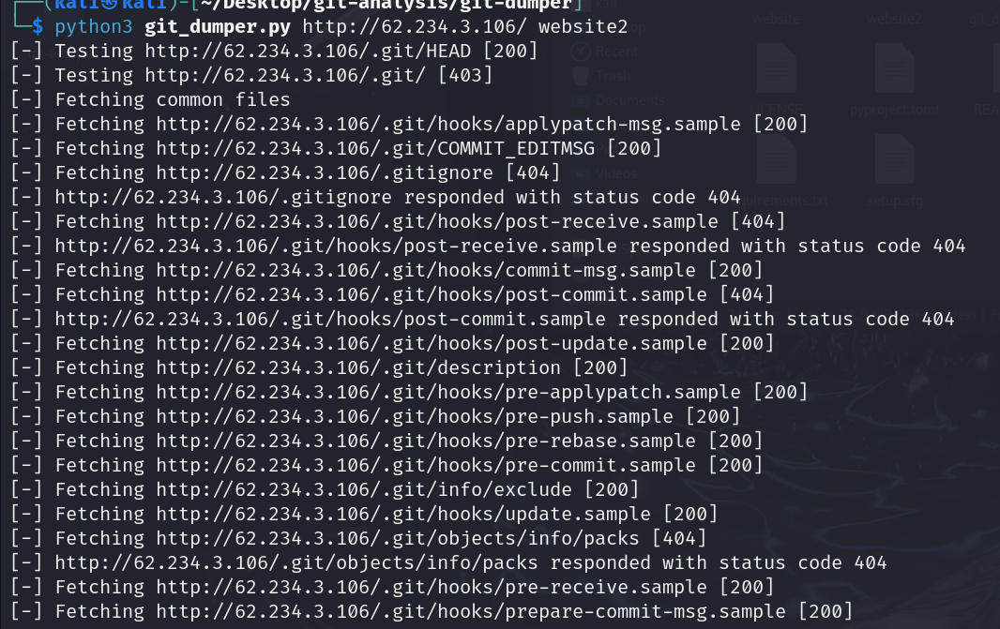

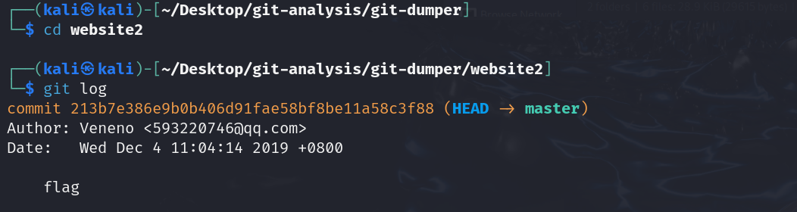

可以发现只提交了一次，且出现了flag

git show 213b7e386e9b0b406d91fae58bf8be11a58c3f88

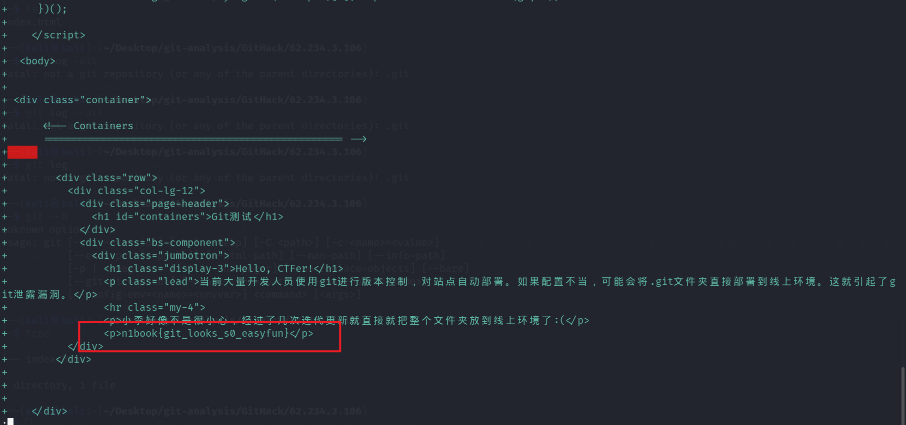

找到了flag

### 附

其实刚才用GitHack已经很接近答案了，只是我没想到会那么简单。。。

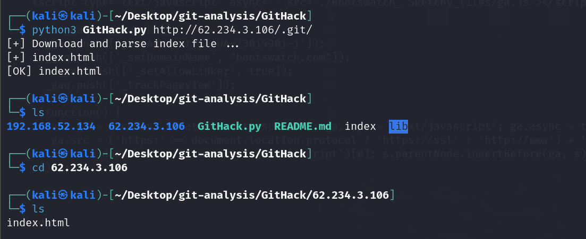

可以直接查看index.html

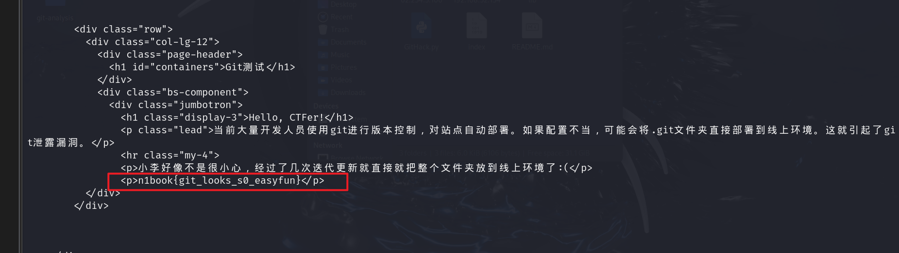

就找到了flag

