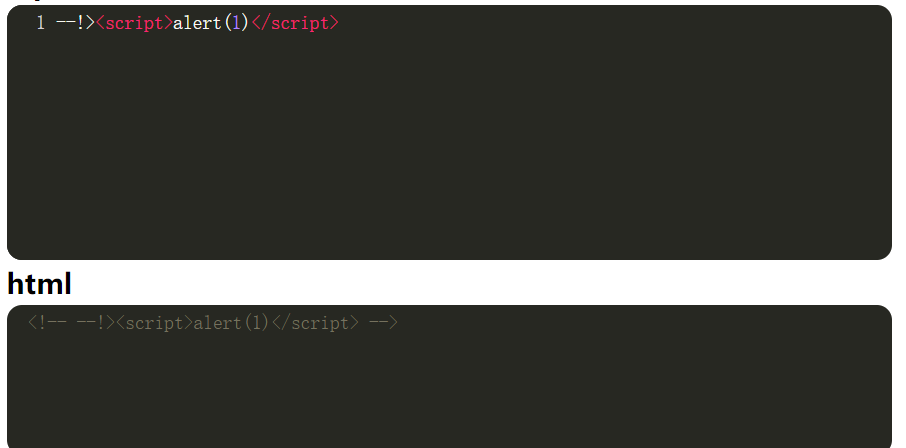
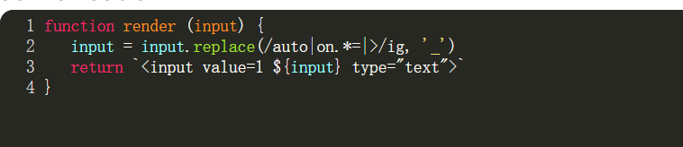
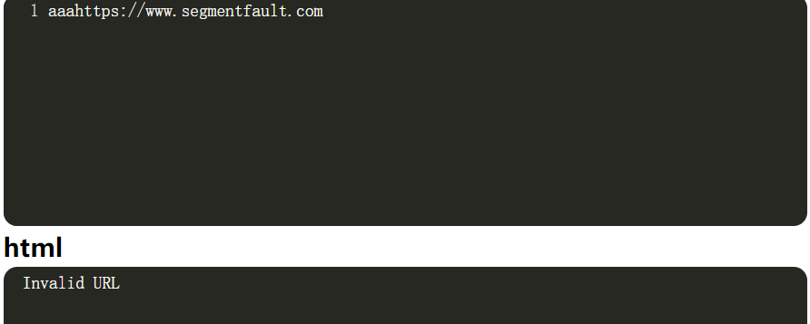

XSS漏洞-https://xss.haozi.me/靶场练习

## 0x00

代码审计：

​	啥过滤也没有，可以直接输出

> Payload：

## 0x01

代码审计:

​	输出被放在文本标签内了，需要先闭合前面的文本标签，然后自己构造script标签进行弹窗

> Payload：</textarea>

## 0x02

代码审计：

​	输出作为input标签的属性值存在，可以先闭合value，然后使用onmouseover属性进行弹窗

> Payload：" onmouseover="alert(1)

还有一种解法

> Payload：">
> 

## 0x03

代码审计：

​	发现代码过滤掉了小括号，因此需要绕过小括号

> 用``代替()正常输出，通关

## 0x04

代码审计：

​	还是使用正则表达式过滤，但是`也被过滤了

> 这里可以使用encode编码，编码只能在html标签中使用

## 0x05

代码审计：

在输入框中输入-->都会被过滤掉（也就是过滤掉了这个注释），但是html中还可以使用--!>这个形式的注释

> 构造payload:--!>

## 0x06

代码审计：

​	input框中的内容是被包在另一个input中的，可以猜到此处应该是要写html里的属性

​	过滤的正则表达式的意思为：

​	

onmouseover和=放在一起符合匹配，会被替换成下划线，因为*和.不包括换行符，所以先使用换行符，再=+命令

因为是onmouseover，所以鼠标需要点击一下input才能看到效果

## 0x07

代码审计：

​	

由于html兼容性强，不需要闭合也可以解析

> Payload:<body onload="alert(1)"

## 0x08

代码审计：

​	很明显是一段css类型的输出，再分析正则表达式，意思是不能出现</style>，否则会被过滤成后面这段注释？

试探了一下，确实如此，要想办法绕过去，可以加上空格，如下

很明显，被绕过去了，并且闭合了上面的style标签

> payload:</style >
>

成功！！！！

##0x09 

代码审计：

​	此时的输出是作为src路径注入的，并且输出必须带有www.segmentfault.com这个URL

试探一下：

可以输出，但是如果随意在头身修改一下这个url：

都会输出Invalid URL

因此这个url是必备条件

利用onerror=>事件请求失败触发的报错来进行注入

> Payload:https://www.segmentfault.com" onerror="alert(1)

## 0x0A

代码审计：

​	1.输入的input必须含有完整的https://www.segmentfault.com

​	2.escapeHtml函数会将输入的input里的& ' " <  > 转化为实体

> 此时可以使用http协议的基本概念：url前面可以添加身份验证信息
>
> 例如:www.baidu.com@www.qq.com实际上跳转的是后面的qq网页

但是url必须是完整的https://www.segmentfault.com，所以把它当成身份验证信息，在后面加上@+js文件

有两种方式：直接使用网站提供的j.js  或者 使用自己写的js文件搭建服务器

> 1、使用网站提供的js文件
>

> Payload:https://www.segmentfault.com.haozi.me/j.js
>

直接调用网站提供的js文件

> 2、使用php搭建本地服务器

**首先**学习如何使用php搭建本地服务器

- cmd进入php文件夹

- 在文件夹中新建一个htdocs文件夹作为站点的根目录

- 在文件夹中添加服务器的文件，这里直接放入一个js.j文件，内容为:alert(1)

- 接下来php -S localhost:8080 -t `D:\CTFtools\php-8.3.11-nts-Win32-vs16-x64\htdocs`(文件路径名)

  

  显示如上，则搭建成功

  ​

- 在浏览器中输入

  

  说明已经成功搭建出自己的服务器惹！！！！

**接着**在靶场中直接使用我们自己搭建的服务器即可，使用方法同上

成功通关！！！

还有一个小疑问：其他博主使用@+url可以成功通关，为啥我只能使用.来连接？？？

## 0x0B

代码审计：

​	会把输入的内容转化为大写

> HTML不区分大小写，javascript区分大小写，协议和域名都不区分大小写，但是文件名区分大小写

靶场自带J.JS文件

直接在h1中使用script标签

> Payload:

通关！！！！

## 0x0C

代码审计：

​	输入的内容中若含有script(不区分大小写)都会被过滤为空字符，且输入内容会被转化为大写

验证一下确实如此

尝试在上题的基础上使用双写绕过script过滤：

> Payload:<scscriptript src="https://xss.haozi.me/J.JS"></scscriptript>

通关！！！

如果不使用script标签，而改为使用html标签呢？

因为js代码区分大小写，因此使用html编码进行绕过即可：

> Payload:<body onload="&#97;&#108;&#101;&#114;&#116;&#40;&#49;&#41;">

## 0x0D

代码审计：

​	熟悉又陌生的正则表达式。。。符号< / " ' 都会被过滤成空字符

​	alert是作为注释存在的。

//是单行注释符，因此我们可以先换行

换行后会发现后面还跟了')，我们可以再次换行，在第三行把它注释掉

通关！！！（妈呀，这个我真的想不到诶！！！很新奇的思路，但是又合情合理，牛哇！！！）

## 0x0E

代码审计:

​	正则表达式：

也就是括号括起来的算是一组，且第一位为第一组=>$1，以此类推。。。

替换规则如下：

既然<后的字母会被替换掉，那么可以使用**特殊字符**替换，这里用的是古英文的s（？？？这是怎么想到的？？百思不得其解）绕过之后就没啥难点了

> Payload:<ſcript src="https://xss.haozi.me/j.js" ></ſcript> 

## 0x0F

代码审计：

​	符号会被替换成实体html，因为`输入点是在标签符号内，所以编码的也可以识别`

> Payload:    ');alert('1

通关！！！

**发现一个很致命的问题，我不知道哪里可以识别编码，哪里不行，以及大小写（不过这个稍微好一点了）**

## 0x10

代码审计：

​	蛮简单的，甚至没有进行过滤，只需要把window.data这个语句闭合，然后输出alert(1)即可

> Payload: "";alert(1)

通关！！！！

## 0x11

代码审计：

​	函数无非就是对s这个字符串的内容进行转义

​	script标签中通过js语句输出的字符串s作为url，在页面body标签下创建a标签，且a标签的跳转链接为这个url，然后自动调用click()函数点击a标签进行跳转。

> Payload：");alert(1);("

即通关！！！

官方的方法是利用函数的解转义，但是我有点没懂。。。。

函数**每赋值一次都是进行一次解转义**，因此最终url赋值到a标签上时，已经不再需要理会转义字符了。

> Payload：");alert("1

构造上面的payload也能够成功弹窗

## 0x12

代码审计:

​	字符串s中的双引号会被转义，返回script标签

首先先试看看能不能闭合？

但是发现前面的双引号被转义，变成数据，闭合不上啦！

因此再添加一个转移符号，使得\变成数据（应该可以这么理解吧），就能够成功闭合了

> Payload：\");alert(1);//

