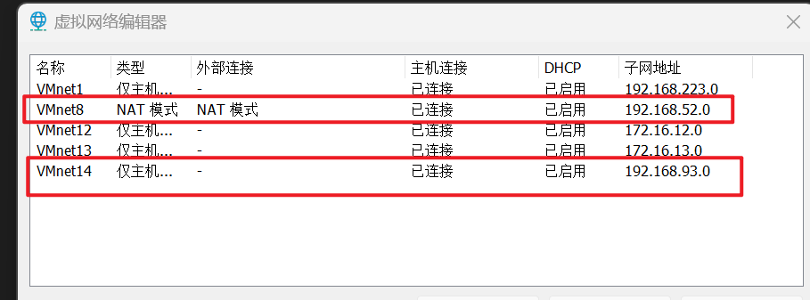
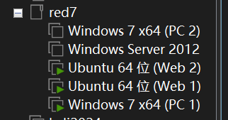

## 前期工作

### 五个虚拟机+kali的网卡配置

虚拟网络编辑器配置两个：VMnet8和VMnet14

IP分别是192.168.52.0和192.168.93.0

五个虚拟机

PC2/Windows Server 2012 => VM14

 PC1/Web2 => VM14&VM8

Web => VM8/桥接模式

kali => 桥接模式(桥接模式想要上网，必须连个人热点，不能连校园网，不然是上不了网的)

